# CVC 靜態 Code Review — 中文導讀、風險地圖與修正優先序

> 這份文件不是 `REVIEW.md` 的逐段翻譯，而是針對中文讀者重新編排的**技術導讀與決策摘要**。  
> 完整逐檔、逐缺陷技術論證仍以 [`REVIEW.md`](./REVIEW.md) 為主；本篇重點是讓讀者快速理解：**這個實作真正做了什麼、哪裡做得好、風險集中在哪裡、為什麼測試全綠仍不足以證明 Windows failure-safety，以及修正順序應該怎麼排。**

---

## 0. 先講結論

這份 CVC 不是 mock，也不是把資料夾複製幾份就自稱 VCS 的簡化作品。

它確實做出了：

- content-addressed loose object store；
- canonical `blob / tree / commit / symlink` serialization；
- SHA-256 object identity；
- flat snapshot → canonical tree 重建；
- branch/ref 與 commit graph；
- Win32 `LockFileEx` reader/writer lock；
- handwritten JSON / glob / UTF / Myers diff；
- three-way merge、merge-base、conflict state；
- merge `FINALIZING` retry state；
- working-tree materialization + rollback journal；
- repository verifier；
- 一套規模不小的 Windows acceptance tests。

所以它的問題不是「功能沒寫」。

真正的問題是：**核心模型完成度已經很高，但 Windows filesystem 邊界與 failure-path hardening 明顯落後於核心功能。**

換句話說，這個專案目前比較像：

> **一個架構成熟、功能很多、正常路徑相當完整的 VCS 實作，
> 但還不能把它當成在異常 I/O、reparse point、Unicode alias、crash/power-loss、type transition 下可信任的儲存系統。**

本次靜態 review 共整理：

| 嚴重度 | 數量 | 意義 |
|---|---:|---|
| **CRITICAL** | 2 | memory safety / filesystem boundary 等級，可能產生嚴重副作用 |
| **HIGH** | 9 | 會破壞正確性、durability、working-tree state 或 verifier 信賴度 |
| **MEDIUM** | 8 | 真實 robustness / canonicality / recovery 問題 |
| **LOW / QUALITY** | 4 | maintainability、契約與文件品質問題 |

最重要的不是「總共有幾個 bug」，而是它們**集中在同一類邊界**：

- Win32 path handling；
- reparse / symlink；
- enumeration failure；
- durable publication；
- file ↔ directory type transition；
- Windows Unicode identity；
- verifier 與 corruption boundary；
- large-input memory behavior。

---

# 1. 先看懂這個 CVC 實際是怎麼運作的

如果只看 CLI，很容易低估這份實作。

它內部其實可以拆成六層：

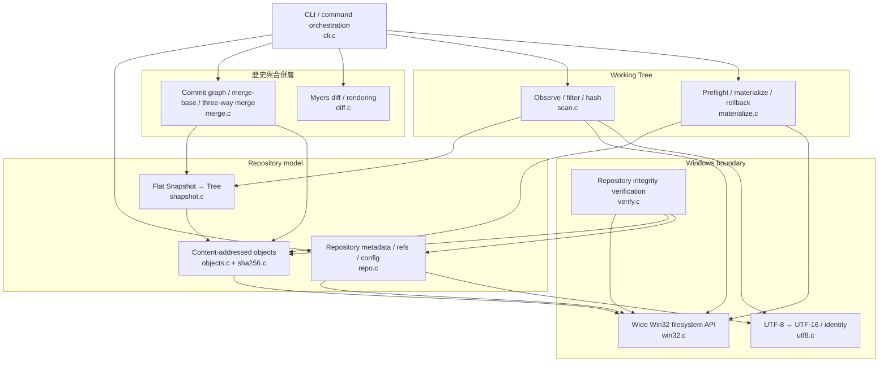

這個分層本身是合理的。

而且從 code 來看，很多重要觀念作者確實有理解：

1. **commit 不是資料夾 copy**；內容存在 immutable object store。
2. **ref 是 mutable pointer，object 是 immutable content**。
3. working tree 不直接等於 repository model，中間透過 `Snapshot` 做 abstraction。
4. switch / rollback / merge 不是單純覆蓋檔案，而是有 materialization layer。
5. merge 有 persisted state，而不是 process memory 裡的一次性狀態。
6. Windows lock 不是「lock file 存在就代表鎖住」，而是真的使用 byte-range `LockFileEx`。

所以本次 review 的高嚴重度問題，多數不是演算法根本沒寫，而是：

> **兩個本身看起來合理的 subsystem，在交界處沒有維持同一套 invariant。**

---

# 2. 一張圖看正常的 `save` 安全鏈

理想情況下，一次新的 save / commit，大致應該滿足這條鏈：

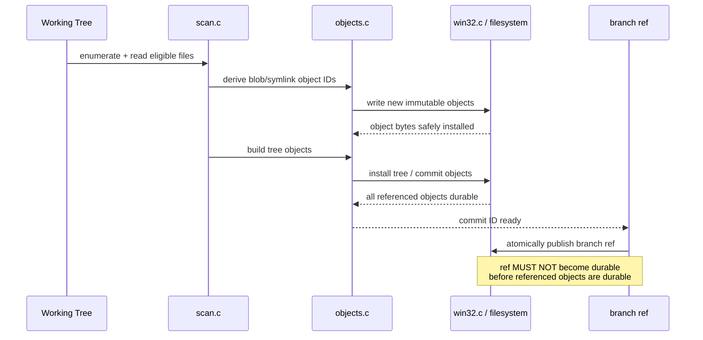

這裡要區分兩件事：

- **atomic visibility**：使用者不會看到「半個檔案」；
- **durability ordering**：突然斷電後，不會留下「ref 已經指向新 commit，但 commit/blob 還沒真的落盤」。

目前 CVC 的 `w_write_file_atomic()` 對前者做得比後者好。

這也是為什麼「有 temp file + rename」並不等於「crash-safe VCS」。

---

# 3. 這份實作最值得肯定的地方

## 3.1 Object model 是真的

`objects.c` 的 object ID 是：

```text
SHA-256(<type> <length>\0<payload>)
```

而不是：

- 檔名 hash；
- timestamp hash；
- directory copy ID；
- 假的 incremental counter。

Tree 與 Commit 也有明確 binary canonical format，不依賴 compiler struct layout。

這點很重要，因為代表後面的 merge、verify、snapshot 都是在一個真正的 VCS model 上運作。

---

## 3.2 Snapshot abstraction 很成功

工作目錄先被壓成：

```text
path + type + object-id
```

的 flat sorted leaves，再由 `snapshot.c` 重建 Tree。

這讓：

- scan；
- compare；
- merge；
- materialize；

可以共享同一種語意模型。

這是一個很好的架構選擇。

---

## 3.3 Windows lock 設計是認真的

`.cvc/lock` 保持 zero-byte ordinary file，真正的 active lock 是：

- reader：shared byte-range lock；
- writer：exclusive byte-range lock；
- nonblocking；
- process 終止後 OS 自動釋放。

這比 PID lock file 或「lock 檔案存在即 busy」成熟很多。

---

## 3.4 Symlink readback 的方向正確

程式用：

- `FILE_FLAG_OPEN_REPARSE_POINT`；
- `FSCTL_GET_REPARSE_POINT`；
- `IO_REPARSE_TAG_SYMLINK`；

去讀 link 本身，而不是 dereference target。

這是 Windows VCS 對 symlink 正確的思考方向。

---

## 3.5 Merge state machine 是本專案的亮點之一

尤其 `FINALIZING` phase：

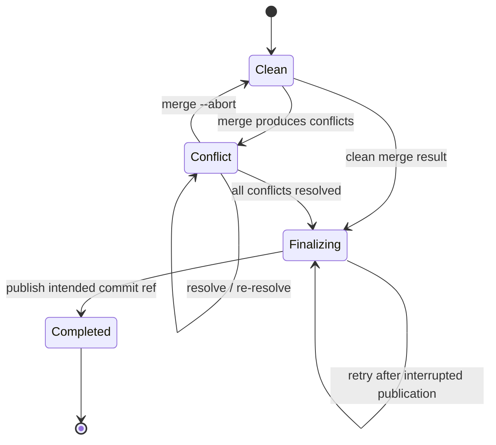

作者不是簡單地「重新執行 merge --continue 再產一個 commit」，而是先記錄 intended merge commit ID，讓 retry 可以重用同一個 commit。

這種設計很像真正 storage system 才會考慮的 state-machine 問題。

問題在於：**state machine 的邏輯比它底下的 persistence primitive 更強。**

這會在後面的 durability 問題再看到。

---

# 4. 風險不是平均分散，而是集中在 Windows / failure boundary

下面這張圖比較能代表本次 review 的核心結論：

```mermaid
flowchart LR
    A[核心資料模型<br/>objects / trees / commits] -->|整體可信| B[Snapshot / graph / merge]
    B -->|整體可信| C[CLI semantics]

    C --> D{碰到 Windows / failure boundary}

    D --> E[Path / UNC]
    D --> F[Reparse / symlink]
    D --> G[Enumeration error]
    D --> H[Atomicity vs durability]
    D --> I[File ↔ Directory transition]
    D --> J[Unicode case identity]
    D --> K[Corruption verifier]
    D --> L[Large diff memory]

    E --> E1[CRITICAL: heap OOB + malformed UNC path]
    F --> F1[CRITICAL: init 可寫穿 .cvc reparse]
    F --> F2[HIGH: directory symlink materialization / rollback]
    G --> G1[HIGH: I/O failure 被當空目錄]
    H --> H1[HIGH: ref durability claim 過強]
    I --> I1[HIGH: file → directory transition 失敗]
    J --> J1[HIGH: Unicode identity 只做 ASCII fold]
    J --> J2[HIGH: ref namespace prefix case bug]
    K --> K1[HIGH: malformed loose object 可漏報]
    K --> K2[HIGH: nested branch refs 未遞迴驗證]
    L --> L1[HIGH: Myers trace O(N²) memory]
```

因此最精準的總結不是「這份 code bug 很多」。

而是：

> **它最難的核心演算法其實寫得不少；真正拖累可信度的是 operating-system boundary 與 failure semantics。**

---

# 5. 兩個 CRITICAL：先修，沒有討論空間

## CRITICAL-01 — UNC extended path 同時有 heap OOB 與 path 組裝錯誤

**位置：** `src/win32.c` → `w_extended()`

UNC 分支目前大意是：

```text
\\server\share\...
        ↓
\\?\UNC\server\share\...
```

但程式的 allocation / copy 邏輯有兩個獨立問題：

1. allocation 只有 `n + 8` UTF-16 units，最後卻寫到 `r[n + 8]`；
2. copy 從錯誤 offset 開始，會形成多一個 `\` 的 malformed extended UNC path。

結果不是單純「UNC 不支援」。

它包含真正的 **heap out-of-bounds write**。

### 風險鏈

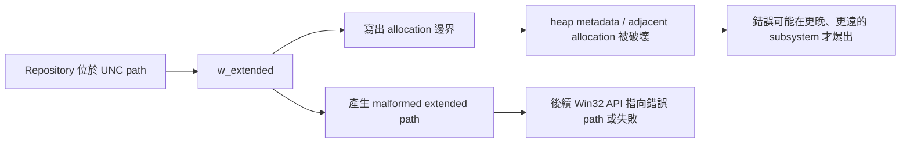

### 為什麼要放最高優先

因為它是 memory-safety bug，而且發生在最底層 path helper。

底層 helper 一旦寫壞記憶體，上層任何 behavior 都不能再被可靠推理。

---

## CRITICAL-02 — `cvc init` 可以對既存 `.cvc` reparse point 寫穿

**位置：** `src/repo.c` → `is_cvc_dir_entry()`, `repo_init()`

目前 preflight 對 `.cvc` 的判斷會把 reparse directory 排除在「已存在 repo dir」之外。

接著 `CreateDirectoryW(.cvc)` 如果得到 `ERROR_ALREADY_EXISTS`，又被當成可接受。

於是：

```text
working-dir\.cvc  -> junction / symlink -> other-target
```

這種情況下，後續建立：

```text
.cvc\refs
.cvc\objects
.cvc\state
.cvc\HEAD
.cvc\config.json
.cvc\lock
```

可能全部實際寫到 reparse target。

### 風險鏈

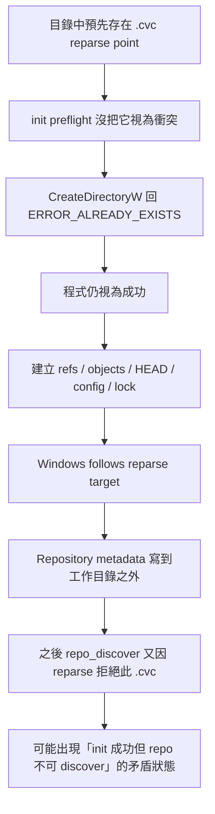

這不是只有 spec compliance 問題，而是**filesystem trust-boundary 問題**。

---

# 6. 九個 HIGH：它們如何影響真實使用

## H1 — 讀不到目錄 ≠ 空目錄，但 scanner 把兩者混在一起

**位置：** `win32.c:wdir_list()` + `scan.c:scan_snapshot()`

`FindFirstFileW` 失敗時直接回傳「成功 / empty」；`FindNextFileW` 也沒有確認是否真的是 `ERROR_NO_MORE_FILES`。

更糟的是 root scan 還會忽略 `wdir_list()` 的 rc。

### 真正危險的地方

假設原本 commit 有：

```text
src/a.c
src/b.c
src/c.c
```

如果某次 save 時 `src/` 因 access denied / sharing problem 無法 enumerate，正確行為應該是：

```text
SAVE FAILED: cannot scan working tree
```

而不是：

```text
src 看起來沒有內容
→ snapshot 裡 src/* 全消失
→ 看起來像全部刪除
```

這種 bug 對 VCS 特別危險，因為它把「觀測失敗」誤編碼成「使用者真的刪了檔案」。

---

## H2 — Atomic rename 做得不錯，但 durability claim 過頭

**位置：** `win32.c:w_write_file_atomic()` / `w_write_file_durable()`

目前 object / materialized file：

```text
write temp
→ close
→ MoveFileExW(REPLACE_EXISTING)
```

但沒有先 `FlushFileBuffers` object 本身。

註解認為之後 durable ref write 可以把同 volume 之前的 dirty data 一起保證落盤。

這個推論不能直接由使用的 Win32 primitives 保證。

### 最壞結果

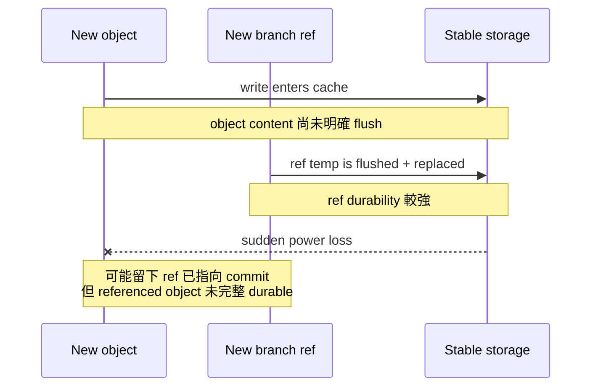

所以目前可以比較有信心地說：

- visibility atomicity：有做；
- full crash durability ordering：證據不足。

---

## H3 — regular file → directory subtree 的切換順序錯了

**位置：** `materialize.c:mat_materialize()`

例子：

```text
current revision:
  a            # regular file

target revision:
  a/b.txt      # a 必須變 directory
```

materializer 目前先：

```text
ensure target parent directories
```

之後才：

```text
delete old tracked leaves
```

所以它會先看到 `a` 還是一個 regular file，然後 `ensure_dir("a")` 直接失敗。

真正合理的流程應該是：

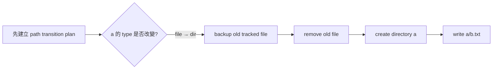

這是 operation ordering bug，不是 policy bug。

---

## H4 — directory symlink 在 VCS 語意上是 leaf，但 materializer 把它當 directory

**位置：** `materialize.c`

Windows directory symlink 通常同時有：

```text
FILE_ATTRIBUTE_DIRECTORY
FILE_ATTRIBUTE_REPARSE_POINT
```

而程式在一些刪除 / rollback 邏輯中只用 `st.is_dir` 判斷。

結果是：

- tracked directory symlink 該消失時可能沒刪；
- rollback 時新建立的 directory symlink 可能留在 working tree；
- file ↔ directory-symlink replacement 的 recovery 也可能失敗。

正確模型應該先問：

```text
是不是 reparse?
是不是 supported symlink?
```

再問：

```text
它的 target kind 是 file 還是 directory?
```

不能先用 generic `is_dir` 把它當 container。

---

## H5 — 所謂 Windows ordinal case-insensitive，其實只有 ASCII fold

**位置：** `utf8.c:utf8_ordinal_case_equal()`

目前只做：

```text
A-Z → a-z
```

然後 UTF-8 byte-by-byte compare。

這不等於完整 Windows Unicode case-insensitive identity。

因此可能出現：

```text
CVC 認為兩個 UTF-8 path 不同
Windows filesystem 卻認為它們 alias
```

最終可能造成：

- tree 可以 serialize，但無法無歧義 materialize；
- branch name 邏輯與 NTFS 真實 pathname identity 不一致。

---

## H6 — ref namespace 的 prefix collision 又另外用了 case-sensitive `strncmp`

**位置：** `cli.c:ref_case_collision()`

例如：

```text
existing: Feature/x
new:      feature/y
```

full branch name 不相同；namespace prefix 卻會在 Windows alias。

但程式的 prefix test 使用 raw `strncmp()`，因此可能漏掉。

這顯示目前 ref identity 有兩套判斷：

- full equality：一套；
- namespace prefix：另一套。

這種 invariant duplication 很容易出現 divergence。

---

## H7 — verifier 會對某些 malformed loose object 靜默 return

**位置：** `verify.c:verify_loose_object()`

部分 envelope corruption，例如：

- zero-length object；
- missing separator；
- missing NUL；
- malformed length；
- leading-zero length；
- payload length mismatch；

有些路徑只：

```text
free
return
```

沒有 `vreport()`。

所以 `verify` 有可能漏掉 repository 中存在的 malformed unreachable loose object。

這個問題的根本原因之一是：

> normal object reader 與 verifier 各自維護自己的 envelope parser。

兩份 parser 越久越容易語意漂移。

---

## H8 — nested branch refs 支援建立與 lookup，但 verifier 只看第一層

**位置：** `verify.c:verify_repo()`

正常 ref lookup 可以處理：

```text
refs/heads/feature/x
```

但 verifier 掃 branch 時只 enumerate：

```text
refs/heads/*
```

遇到 directory 就 skip。

因此 nested branch 的 ref file / target relationship 不會拿到跟 top-level branch 一樣的驗證。

這又是一個典型的「同一個 namespace 有多份 traversal implementation」造成的 divergence。

---

## H9 — Myers diff 一開始就配置 O(N²) trace memory

**位置：** `diff.c:diff_myers()`

它不是「edit distance 很大才會很吃 RAM」。

目前 implementation 在知道實際 D 之前，就直接配置完整 trace matrix。

約略量級：

| total lines | trace memory 約略量級 |
|---:|---:|
| 10,000 | ~0.8 GB |
| 100,000 | ~80 GB |
| 200,000 | ~320 GB |

也就是一個合法、未超過 8 MiB 的短行文字檔，就可能把 `diff` / text merge 推向 OOM。

這是 algorithm engineering 問題，而不是 Windows-specific bug。

---

# 7. 為什麼「202 PASS / 0 FAIL」仍不能推翻上述問題

這份 run 的 test evidence 本身其實有價值。

它代表：

- 大量 happy path 是真的；
- core commands 確實有被跑過；
- implementation 不是只靠 README 宣稱完成。

但測試結果是：

```text
202 PASS
0 FAIL
20 SKIP
```

而 SKIP 集中的區域包含：

- symlink / reparse；
- case collision；
- durability / fault injection。

這跟靜態 review 找到的高風險區域高度重疊。

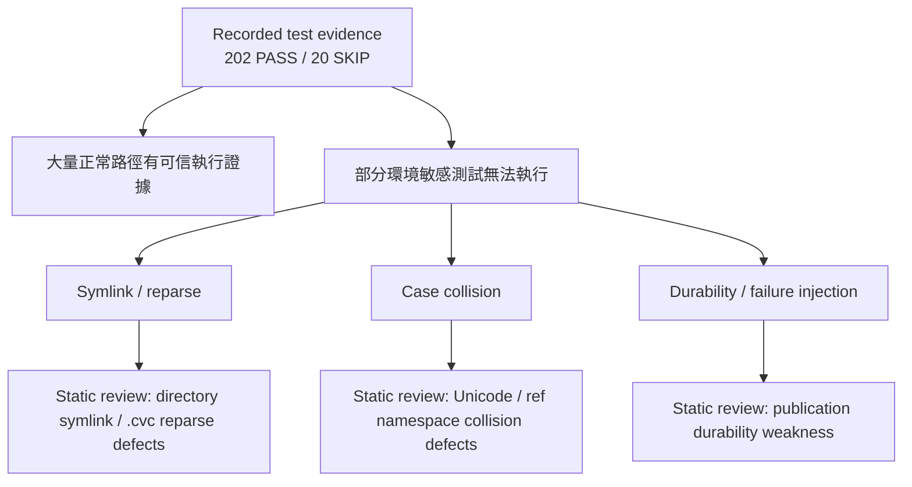

所以比較合理的解讀是：

> **測試證明了 breadth；靜態 review 揭露的是 tests 沒有充分覆蓋的 failure boundaries。**

不是「測試沒用」，也不是「static review 比測試高級」。

兩者剛好互補。

---

# 8. 我會怎麼修：依風險而不是依檔名排序

如果要把這份 code 從「功能完整」推到「storage semantics 值得信任」，不建議照 `win32.c → repo.c → materialize.c` 一個檔案一個檔案修。

應該依 invariant 修。

## P0 — 先關掉 memory / trust-boundary 風險

1. 修 `w_extended()` UNC allocation 與 path formula。
2. `repo_init()` 對任何 existing `.cvc` pathname 一律先 non-following classify。
3. 新增 `.cvc` file / symlink / junction / directory-reparse 測試。

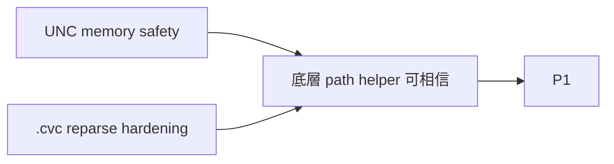

---

## P1 — 建立真正可靠的 filesystem observation / mutation primitives

1. `wdir_list()` 明確區分：
   - empty / no more files；
   - actual I/O error。
2. `scan_snapshot()` 不得丟棄 traversal rc。
3. 統一 tracked leaf classification：
   - regular file；
   - file symlink；
   - directory symlink；
   - directory container；
   - unsupported reparse。
4. materializer 改成先產生 transition plan，再依 dependency order 執行。

理想上可以變成：

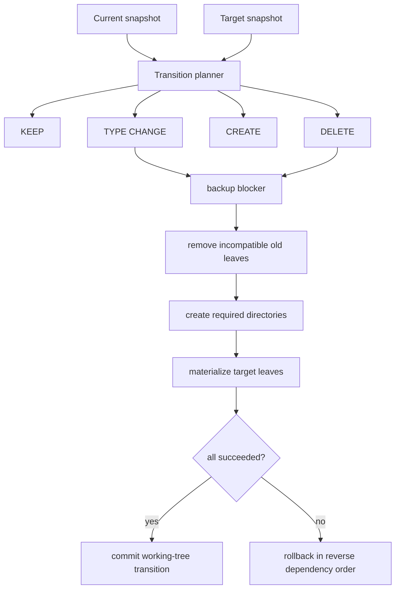

---

## P2 — 把「atomic」升級成明確、可測的 durability contract

對每種 publication 分開定義：

- immutable object；
- branch ref；
- HEAD；
- merge state；
- working-tree file。

不要只共用一個「atomic write」概念。

推薦至少拆成：

```text
write_atomic_visible(...)
write_durable_object(...)
write_durable_metadata(...)
```

每一種 helper 都要能回答：

1. temp file 是否同 volume？
2. byte count 是否全部寫完？
3. file content 是否 flush？
4. rename 是否 write-through？
5. caller 可以宣稱哪一級 crash guarantee？

---

## P3 — 收斂 identity / parser / traversal 的重複實作

目前多個高嚴重度 bug 的共同來源是：

> **同一套 invariant 被不同 module 各自重新實作。**

例如：

### Object envelope

```text
objects.c parser
verify.c parser
```

應該收斂成 canonical decoder。

### Branch traversal

```text
repo exact lookup traversal
CLI branch gathering traversal
verify branch traversal
```

應該收斂成一個 recursive ref enumerator。

### Windows pathname identity

```text
ASCII fold helper
full ref equality
prefix collision raw strncmp
```

應該收斂成 component-level Windows identity abstraction。

---

## P4 — 大輸入與 maintainability

1. 改 Myers trace reconstruction，避免 upfront O(N²) allocation。
2. 把近 100 KB 的 `cli.c` 按 command family 拆開。
3. state decoder 做 canonical validation：
   - UTF-8；
   - boolean/enums；
   - snapshot type；
   - sort / uniqueness；
   - trailing bytes。
4. 初始化與 metadata write 全面檢查 exact byte count / flush return。

---

# 9. 最值得注意的設計反差

這份 code 有一個很有意思的特徵：

## 高階邏輯有時比低階 primitive 更成熟

例如 merge finalization：

```text
persist intended commit id
→ retry must reuse same id
→ avoid second timestamp / second merge commit
```

這是很好的 recovery state-machine 思維。

但是底下儲存 merge state 的 primitive，durability 又不夠強。

同樣地：

- object store model 很完整；
- verifier 卻有 parser divergence；
- branch exact spelling 有特別處理；
- namespace prefix 又回去用 case-sensitive `strncmp`；
- symlink readback 很正確；
- materialization 卻把 directory symlink 當普通 directory。

可以用一張圖概括：

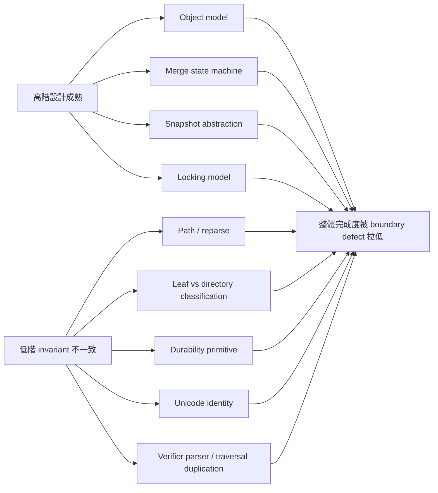

這也是為什麼我不會把這份 submission 評成「差」。

更合理的評價是：

> **作者已經成功跨過「會不會寫一個 VCS」這關；現在卡的是「能不能把它做到像 storage software 一樣可信」。**

而後者通常比把功能寫出來更難。

---

# 10. 如果只想看五分鐘版

## 做得好的

- 真正的 content-addressed object model；
- canonical tree / commit format；
- snapshot abstraction；
- `LockFileEx` reader/writer lock；
- symlink non-dereferencing readback；
- real commit graph / three-way merge；
- persisted merge conflict / FINALIZING state；
- 不是 mock，工程量與 subsystem breadth 都很可觀。

## 最嚴重的

1. **UNC path heap OOB**。
2. **`init` 可透過 `.cvc` reparse point 寫出工作目錄**。
3. directory enumeration error 會被當成 empty/success。
4. object/ref crash durability 保證比實際 primitive 強。
5. file → directory subtree transition ordering 錯。
6. directory symlink deletion / rollback 不完整。
7. Windows Unicode case identity 實作不足。
8. nested ref / malformed object verifier 有 false negative。
9. Myers diff 對大量短行可能直接 O(N²) RAM 爆炸。

## 一句話 verdict

**核心架構值得肯定，但目前不應把它視為已完成 failure-safe hardening 的 Windows VCS。**

如果下一輪實作者把 P0–P3 系統性修掉，我會預期這份專案的可信度提升會非常大，而且不需要推翻現有 object/merge/snapshot architecture。

---

# 11. 閱讀完整報告的建議順序

如果要進一步看細節，不需要從英文 `REVIEW.md` 第一行一路讀到最後。

建議順序：

1. 先看 `REVIEW.md` 的 **Architecture** 與 **What the implementation does well**；
2. 接著直接看 **CRITICAL-01 / CRITICAL-02**；
3. 再看 **HIGH-01 ~ HIGH-09**；
4. 如果要實際修 code，再看 MEDIUM 與 remediation roadmap；
5. 最後才看測試證據與 quality observations。

本中文導讀的目的，就是先建立這個 mental model，再讓完整英文報告變得容易閱讀。
