# C17 / Win32 Markdown Editor 靜態程式碼審查 — 中文重編摘要

**Reviewer:** GPT-5.6 Sol（Chat，High reasoning）  
**審查日期:** 2026-09-02  
**審查性質:** 獨立、以程式碼本身為中心的靜態 Code Review  
**對應完整報告:** [`README.md`](README.md)  
**Reviewed snapshot:** `233ae1ffcd22fb9cd49ecbbf56aceb78a5bcfd27`  
**Run:** `runs/c17-win32-markdown/2026-09-01-deepseek-v4-pro-1m-workbuddy-code-development`

> 這份文件**不是英文完整報告的逐段翻譯**。  
> 它重新安排閱讀順序，目的在於讓讀者先建立「這份實作到底完成到哪一層、為什麼看起來規模很大但實際使用仍不可靠」的整體模型，再進入最重要的 root cause、風險傳播與修復優先順序。

---

## 0. 一頁結論

這份 WorkBuddy / Deepseek V4 Pro 的 C17 Win32 Markdown Editor 並不是只有畫面或 mock。

它確實寫了大量真實底層工程：

- 自製動態 buffer；
- UTF-8 驗證與 grapheme helper；
- SHA-256、Base64、LZSS；
- JSON / YAML parser；
- Markdown block / inline AST 與 source mapping；
- literal search；
- Myers-style diff；
- document transaction / undo / redo；
- persistent version history；
- Win32 Unicode file I/O 與 safe-save；
- WIC 圖片 decode / encode；
- application-owned framebuffer UI；
- 原生 Win32 message loop；
- 自製 tests / fixture / evidence tooling。

所以若只用「程式碼量」或 Repomix token 數來看，它是一份相當有工程量的交付。

但它最大的問題不是底層模組缺乏，而是：

> **底層做了很多，真正把底層接成可靠產品的 integration layer 明顯沒有收斂。**

很多功能停在以下狀態之一：

1. 有資料結構，但沒有 runtime producer；
2. 有 render，但沒有 input hit-test；
3. 有 command 名稱，但沒有完整 command 行為；
4. 有 parser / engine，但 UI 根本沒正確使用；
5. 有 screenshot state，但不是靠正常使用者操作走到那個 state；
6. 有 transaction abstraction，但 caller 違反 abstraction 自己的 invariant；
7. 有 tests，但最關鍵的 vertical interaction path 沒被覆蓋。

因此這不是「再補幾個 UI polish 就完成」的程度。

目前可直接從 source 確認的問題包含：

- 新建空白文件第一次輸入可直接 NULL dereference；
- composite edit 與 undo transaction 的 position invariant 自相矛盾；
- Replace All 會在 replacement 長度不同時使用 stale offsets；
- version-history delta encoder 可能保存錯誤的 inserted line；
- history pruning 可以破壞 delta dependency chain；
- 合法 padded Base64 會被 production decoder 拒絕；
- dirty-document close modal 沒有真正的 Save / Discard / Cancel semantics；
- `WM_CLOSE` 可以完全繞過 dirty-tab protection；
- Find / Replace 的輸入狀態與 Enter 行為混線；
- Preview 沒有接上正確的 preview scroll；
- Rendered Editing 的 hit-test 實際仍是 stub；
- workspace tree 畫得出來但 click explicitly “not wired”；
- IME state 有欄位但沒有完整 Win32 IME message handling；
- DPI state 有欄位但沒有完整 per-monitor DPI lifecycle；
- drag/drop handler 存在，但 top-level window initialization 沒看到完整 `DragAcceptFiles` lifecycle；
- screenshot / evidence machinery 某些畫面是直接注入 application state，而非證明完整 interaction path 可用。

整體評價可濃縮成一句：

> **這是一份「底層工程實力高於產品整合完成度」的巨大 partial implementation。真正危險的不是少幾個功能，而是幾個核心 state / edit / persistence invariant 已經被應用層踩破。**

---

# 1. 先看整體：程式架構其實有邏輯，品質斷層出現在 Integration

從目錄與 responsibility 來看，架構大致合理：

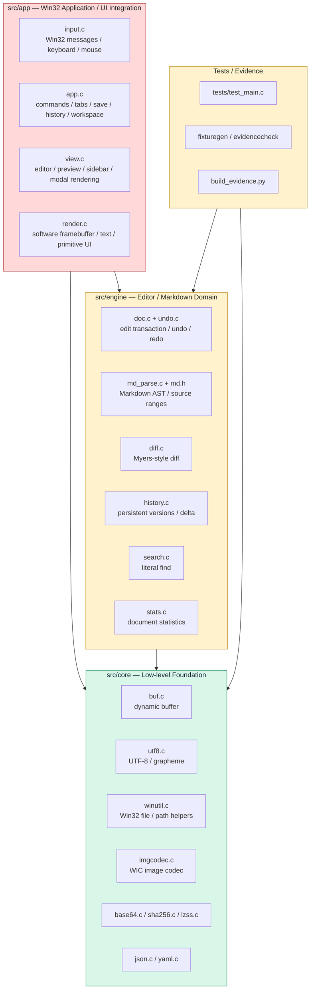

這張圖最重要的不是「有哪些檔案」，而是品質梯度：

- **Core：**不少模組是真的、而且方向合理；
- **Engine：**有實質設計，但開始出現 invariant / persistence correctness 問題；
- **App：**整合落差最大，很多功能只做了一半；
- **Tests / Evidence：**有大量工作，但沒有成功攔下最致命的 vertical bugs。

因此這份專案不能簡單評為「code 很少所以沒完成」。

更準確的說法是：

> **它已經花了大量工作把水平方向的模組鋪開，但垂直方向從滑鼠 / 鍵盤 → app state → domain engine → persistence → UI feedback 的完整閉環沒有被逐條打通。**

---

# 2. 為什麼人工體驗會明顯差？——因為很多 Vertical Slice 沒閉環

用產品功能來看，可以把完成度分成四層：

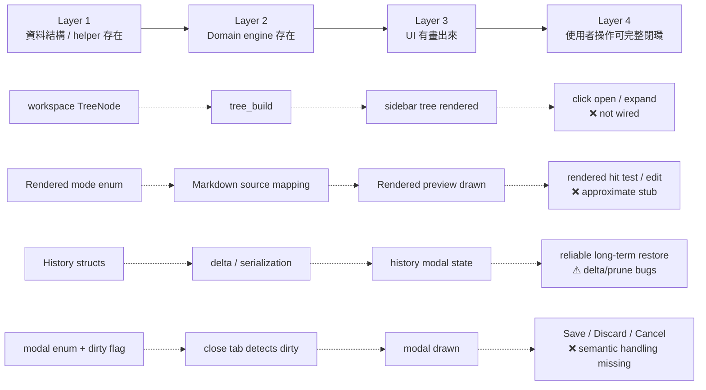

這就是這個 run 很值得分析的地方：

它「看起來」擁有很多 feature，因為 enum、struct、render function、menu command 都存在。

但真正決定產品是否可用的是最右邊：

> 使用者能不能從真實 input 進入這個 feature，完成 operation，得到一致 state，再安全地 undo / save / reopen？

很多功能沒有到這一層。

---

# 3. 最關鍵 Root Cause #1：為什麼 New Document 第一個字就閃退？

這是本次 review 最乾淨、最能直接由 source 證明的 defect。

## 3.1 實際呼叫鏈

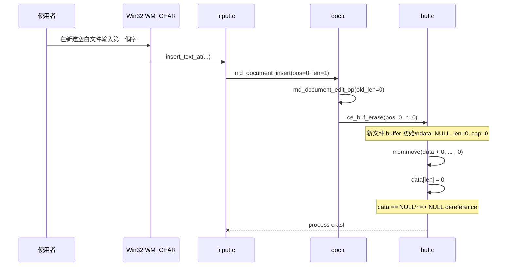

## 3.2 為什麼「開 existing file」反而可能沒事？

新 tab 的 document source buffer 初始狀態是：

```text
data = NULL
len  = 0
cap  = 0
```

但 existing file 走 `md_document_set_source()` 後，source 已有 allocation。

因此 bug 很有欺騙性：

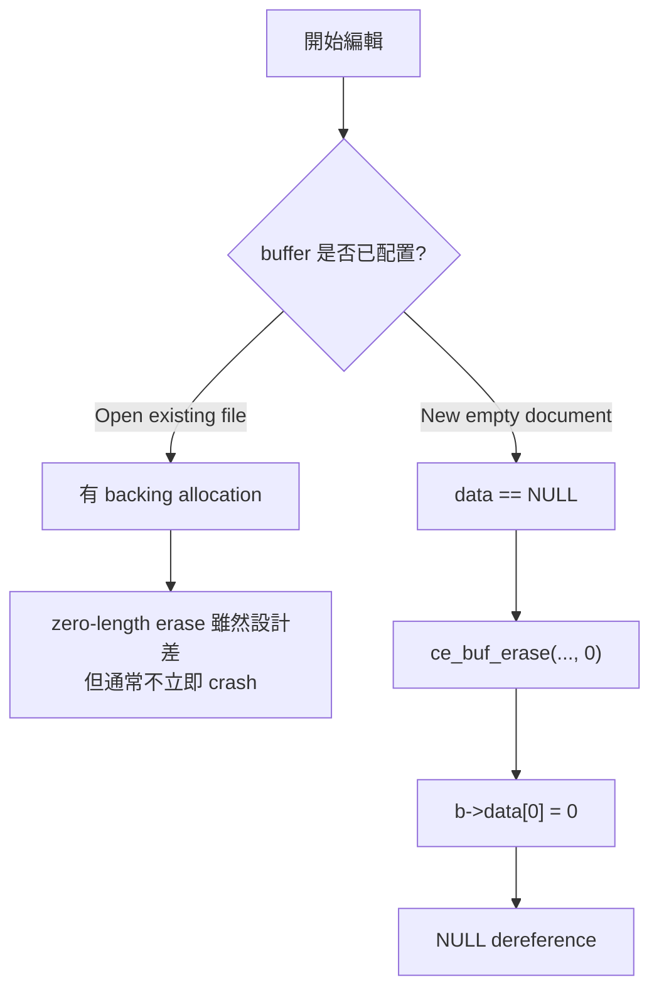

這與人工觀察「新 tab 建成功，但第一個字就整個消失」高度一致。

## 3.3 為什麼這種 bug 很嚴重？

因為它不是 obscure edge case。

這是文字編輯器最基本的 happy path：

```text
New Document → type one character
```

只要最基本 vertical smoke test 有跑，就應該立刻暴露。

因此這個 finding 同時反映：

1. buffer abstraction 的 empty-state invariant 不夠安全；
2. document edit API 沒有對 zero-length erase 做防護；
3. app-level smoke test coverage 不足。

## 3.4 建議修法

修復不應只在 UI caller 加 if。

應至少同時保護：

- `ce_buf_erase()`：`n == 0` 時直接 return；
- buffer invariant：明確規範 empty buffer 是否永遠擁有一個 `\0` backing allocation；
- `md_document_edit_op()`：純 insert 不需要先 erase；
- tests：新增 empty-doc first insert + undo + redo。

---

# 4. 最重要的架構矛盾：Edit Transaction 的座標系統沒有統一

這是比單一 crash 更值得修的核心問題。

`doc.c` 自己註明 transaction operation 必須依 position ascending：

```text
ops must be added in ascending pos order
```

原因很合理：undo/redo 需要一個固定的 canonical order。

但 app caller 在 formatting 時又必須從高 offset 往低 offset 做，否則先插入前面的 delimiter 後，後面的 offset 會漂移。

於是出現架構上的互斥需求：

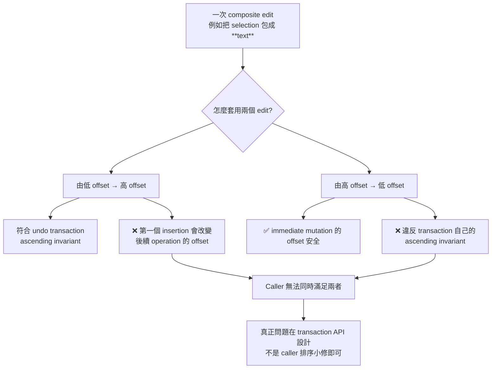

這也解釋了為什麼 release report 提到 composite undo crash 時，不能只把它當作單一 undo implementation bug。

真正的問題是：

> **transaction operation 到底使用「edit 前座標」還是「每次 mutation 後座標」沒有被系統性定義。**

## 4.1 Formatting 只是第一個受害者

`app_apply_fmt()`：

```text
先在 selection end 插 closing delimiter
再在 selection start 插 opening delimiter
```

這對 immediate mutation 是自然的。

但對 undo transaction canonical ordering 是反的。

## 4.2 Replace All 是同一個設計問題的第二種表現

Replace All 先對 original document 找出：

```text
match[0].pos
match[1].pos
match[2].pos
...
```

接著從左到右直接 mutation。

假設：

```text
source  = "a a a"
find    = "a"
replace = "LONG"
```

原始 match positions 可能是：

```text
0, 2, 4
```

第一個 replacement 後：

```text
"LONG a a"
```

後面的 `2`、`4` 已經不再是原本 match 的位置。

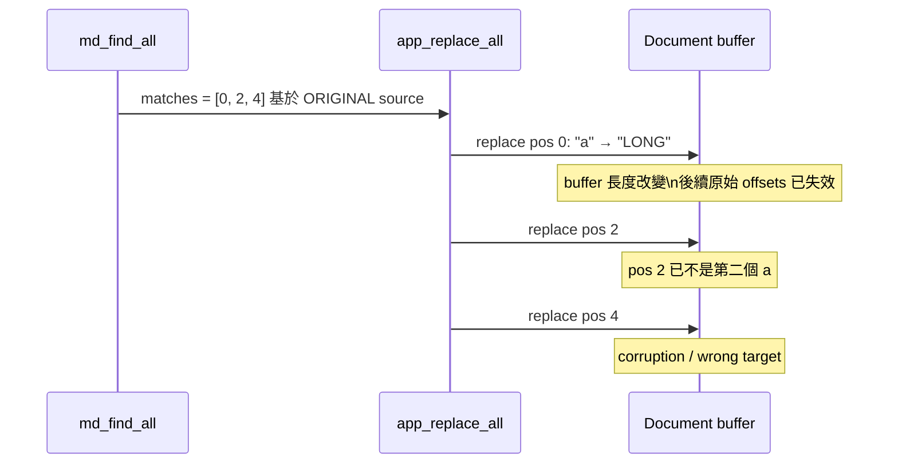

最直覺的修法是「從右往左 replace」。

但一旦右往左，又再次違反目前 transaction ascending order。

所以 formatting 和 Replace All 其實是同一個 root cause 的兩個症狀。

## 4.3 正確方向

比較健全的 transaction model 應該是：


也就是：

- caller 不應自己考慮 offset shift；
- transaction API 收集 operations，不要邊收邊直接 mutation；
- engine 對 pre-edit coordinate space 做 validation；
- 真正 apply 時統一 descending；
- undo storage 維持 canonical ascending。

這樣才能一次修掉 formatting、Replace All 與其他未來 composite edits。

---

# 5. Persistent History：看起來完整，但有資料完整性等級的風險

Version history 是這份實作比較有企圖心的區塊。

它不是單純把每一版全文複製，而是：

- periodic snapshot；
- 中間版本存 line-based delta；
- optional LZSS compression；
- serialization；
- SHA-256 record verification；
- version pin / prune。

設計方向本身值得肯定。

但目前有兩個會直接破壞歷史資料可靠性的問題。

---

## 5.1 Delta encoder 用錯 child line index

`md_diff_script()` 已經為 edit 提供 `b_idx`。

但 `history.c` 的 delta encoder 沒有直接使用 `b_idx`，而是自己維護一個 `bi`，並且只在 `INS` 時增加。

這會導致：

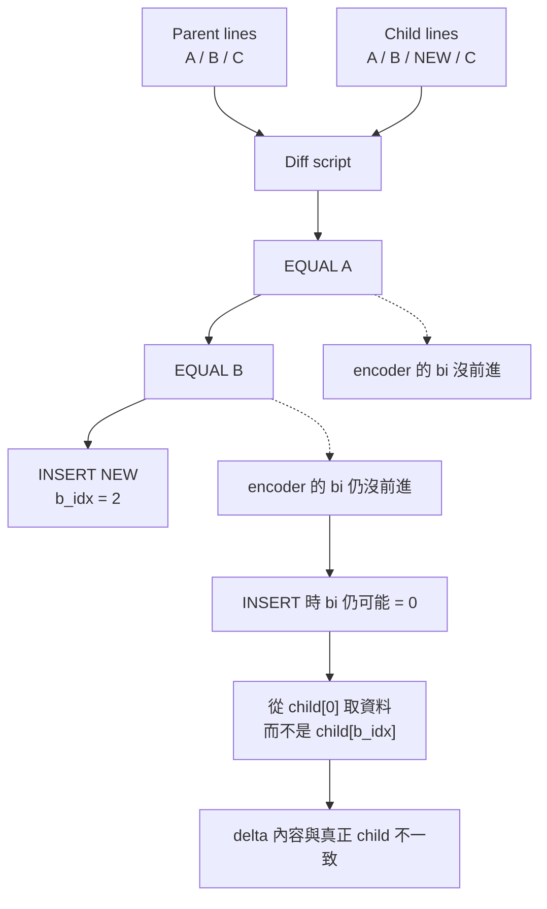

只要 insertion 前有 equal lines，這個 bookkeeping 就非常危險。

這不是「版本 UI 顯示不漂亮」，而是：

> **歷史記錄本身可能保存錯誤內容。**

---

## 5.2 Prune 可以把 delta chain 的基礎拆掉

History 又支援 max versions / max payload pruning。

問題是目前 prune 的概念接近：

```text
找到最舊未 pinned version → delete
```

但 delta version 並不是全部獨立。

它們可能依賴前一個 snapshot / delta chain。

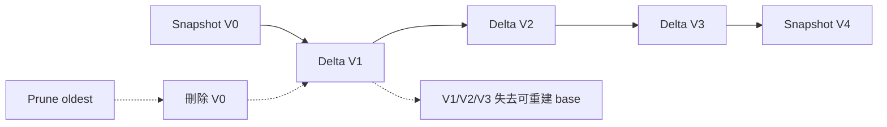

安全 pruning 至少需要其中一種策略：

1. 只刪完整 snapshot segment；
2. 刪 base 前，先把第一個 surviving delta materialize 成新 snapshot；
3. 或改成 content-addressed independent chunks / snapshots。

目前直接 memmove 掉 version record 並不足以維持 dependency invariant。

---

## 5.3 History loader 的 record bounds 驗證也需要強化

序列化格式包含：

```text
id
 timestamp
 parent
 flags
 payload_len
 payload
 sha256
```

loader 雖然有檢查 outer record length，卻還需要在 memcpy payload 前，嚴格確認：

```text
29 + payload_len + 32 <= record_length
```

否則 crafted / corrupted history file 可能使內部 field length 與 record boundary 不一致。

對一個 recovery / history system，corruption handling 本身就是核心 correctness，不應只假設自己寫出的檔永遠正常。

---

# 6. Base64：Release Report 對根因判斷反了

這是另一個很有價值的 review finding。

release report 把 failing Base64 test 主要歸因成 test bug。

但 production decoder 本身就有錯。

對合法：

```text
aGVsbG8=
```

共有 8 個 non-whitespace Base64 characters，其中一個 `=` padding。

程式做：

```text
n = 8
pad = 1
data_len = n - pad = 7
```

接著：

```text
if(data_len % 4 != 0) return -1;
```

結果 `7 % 4 != 0`，合法 padded Base64 直接被拒絕。

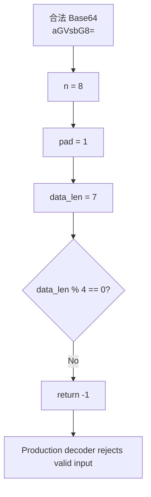

因此實際狀況是：

- test code 的某些 error-path handling 確實也不漂亮；
- **但 failing test 並不是 false alarm；它真的打中了 production bug。**

這會影響 embedded-image / data URI 等需要 decode Base64 的路徑。

---

# 7. UI 為什麼「看得到，但用起來怪」？

這份 app layer 有一個非常明顯的 pattern：

> render code 的完成度高於 interaction code。

下面是幾個典型例子。

---

## 7.1 Start Surface 的 New Document：畫出來 ≠ 有接線

人工觀察提到起始頁藍色 New Document 沒反應。

Source review 顯示：start surface 可以畫出 button，但主要 mouse handler 在沒有 active document 時，editor-area interaction 沒有對這顆 button 做對應 hit-test。

因此這不是單純 hover feedback 不佳，而是：

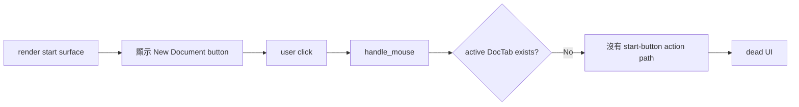

頂部 nav bar 的 `New` 是另一條路徑，所以可能可以建立 tab；這更容易讓 UI 呈現「同樣叫 New，但一顆能用、一顆不能用」的不一致體驗。

---

## 7.2 Source / Split / Preview / Rendered capsule 為什麼會飄？

`capsule_anim` 同時扮演了兩種意義：

- renderer 把它當 normalized interpolation fraction；
- mode click 又直接寫入 `0 / 1 / 2 / 3` mode index。

這等於把：

```text
animation fraction ∈ [0,1]
```

和：

```text
mode index ∈ {0,1,2,3}
```

混成同一個變數。


這和 README 的人工觀察是非常漂亮的 source-level 對應。

正確設計應拆成：

```text
current_mode
animation_from
animation_to
animation_progress  // 0..1
```

而不是讓一個 double 同時表示 index 與 progress。

---

## 7.3 Workspace tree：是真的有 tree model，但 interaction 沒完成

這區並非完全 fake。

它有：

- directory enumeration；
- reparse directory avoidance；
- deterministic sorting；
- `TreeNode` hierarchy；
- recursive draw。

但 mouse path 甚至直接留下註解：

```text
open file not wired here
```

所以目前狀態是：


這類 feature 最容易被 screenshot 誤判成已完成。

---

## 7.4 Rendered Editing：目前更接近 Preview mode 的另一個外殼

`app_hit_test_rendered()` 本身就寫：

```text
approximate
```

而實作實際上沒有真正從 click position 映射到 source byte range，只是維持既有 caret。

所以目前缺的是最核心的 Rendered Editing loop：

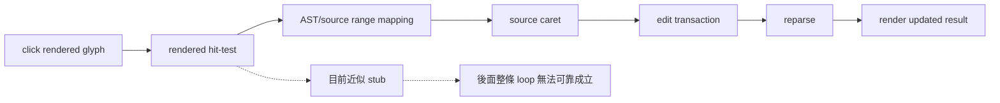

也就是 parser 的 source mapping 基礎雖然已經做了，但 app layer 尚未真正把它用起來。

---

## 7.5 Preview scrolling 與 source scrolling 沒有真正分離

`DocTab` 明明有：

```text
scroll_y
preview_scroll_y
```

preview renderer 也讀 `preview_scroll_y`。

但 `WM_MOUSEWHEEL` 的一般路徑主要修改 `scroll_y`。

因此 Preview mode 可能畫得出來，卻沒有完整 vertical scrolling lifecycle。

這種 bug 很典型：

> state 已經設計好了，但 input producer 沒接到正確 state。

---

# 8. Dirty document / Close：目前具有資料遺失風險

`app_close_tab()` 至少知道 dirty tab 不應直接關閉：

```text
if dirty → show modal 8 → unsaved_idx = idx
```

問題在於 modal 的實際 mouse handling 幾乎把所有 modal 都當成：

```text
click → modal = 0
```

沒有真正依 button identity 執行：

- Save；
- Discard；
- Cancel。

更嚴重的是 top-level `WM_CLOSE`：

```text
running = false
DestroyWindow(hwnd)
```

沒有逐 tab dirty check。

因此現在有兩條不同問題：

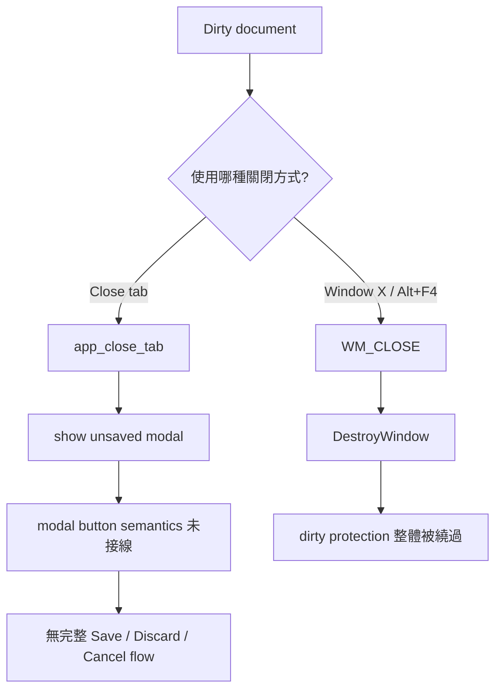

對文字編輯器來說，這應視為高優先級 correctness / data-loss issue，而不是 UX enhancement。

---

# 9. Find / Replace：狀態模型混在一起

Find UI 目前主要只有一個 `WM_CHAR` path。

當 `find_open` 時，文字輸入會一直寫到：

```text
find_query
```

但 `find_repl` 沒有同等完整的 focus/input state。

同時 Enter 的處理會呼叫 replacement logic，即使只是 ordinary Find mode。

結果是 Find / Replace 缺少最基本的 focus model：

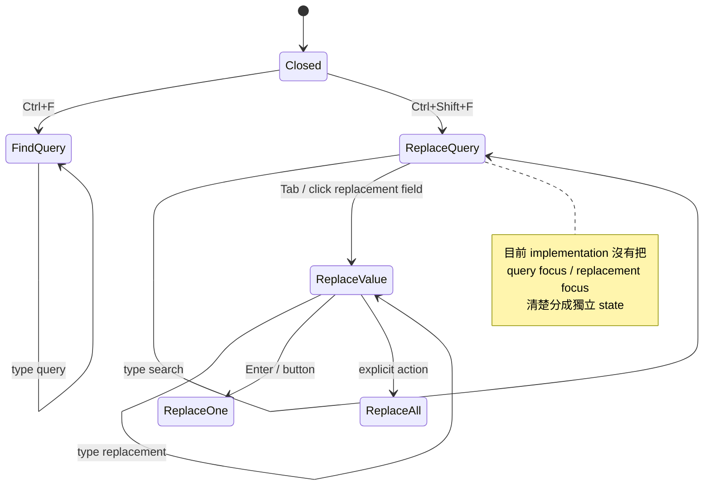

所以真正該修的不是多畫一個 replacement textbox，而是：

- explicit focus target；
- input routing；
- action routing；
- disabled behavior；
- selection ownership。

---

# 10. Unicode / IME：UTF-8 core 不錯，但 Windows text-input boundary 沒做完

這份 code 的 UTF-8 core 是值得肯定的。

它有：

- invalid sequence rejection；
- overlong rejection；
- surrogate rejection；
- `> U+10FFFF` rejection；
- grapheme-ish navigation；
- combining marks；
- ZWJ emoji handling 的嘗試。

但 Win32 input boundary 不夠完整。

目前 `WM_CHAR` 把 `WPARAM` cast 成一個 `wchar_t`，再直接呼叫 UTF-8 encoder。

Windows UTF-16 supplementary-plane character 會以 surrogate pair 抵達。

如果沒有明確組 pair：

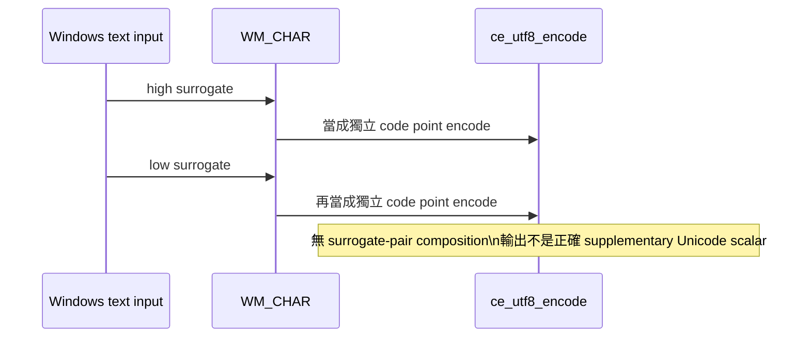

另外 `App` 裡雖然有：

```text
ime_composing
ime_comp_len
ime_comp[]
```

但沒有看到完整 `WM_IME_STARTCOMPOSITION / WM_IME_COMPOSITION / WM_IME_ENDCOMPOSITION` production lifecycle。

所以這又是典型的：

> **資料結構表示「有打算支援」，但 Win32 integration 還沒落地。**

---

# 11. DPI：App 有 dpi / scale 欄位，但這不等於 Per-Monitor DPI 支援

`App` 裡已經有：

```text
dpi
scale
```

但真正的 Win32 DPI correctness 通常至少要形成：

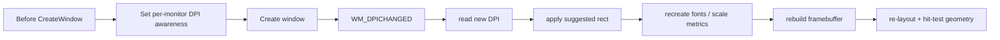

目前 source 並沒有看到這條完整 lifecycle。

因此 `dpi` / `scale` struct fields 本身不能當作 DPI support 已完成的證據。

---

# 12. Rendering：不是完全假的，但 fidelity 與 semantics 還很初階

Preview renderer 真的會走 Markdown AST，而不是單純把 source 原字串貼上。

這點是正面的。

但幾個實作細節會限制真實 Markdown fidelity：

### Inline flow wrapping

目前比較接近：

```text
整個 text run 太寬 → 整 run 換行
```

不是依可斷詞 / grapheme / word boundary 做 line breaking。

很長的單一 inline run 仍可能 overflow。

### Strong / emphasis nesting

某些 branch 對 child 直接拿 `.text`，沒有一致遞迴 render nested inline tree。

因此像 nested strong/emphasis/link 組合可能遺失 styling 或 content semantics。

### Strikethrough

AST 有 `MD_INL_STRIKE`，但 renderer 沒真正畫 strike line。

### Inline code

code path 傳入 `code=true`，但 comment 仍是：

```text
/* draw inline code background */
```

也就是 style semantics 未完成。

### Blockquote rule

存在一個明顯可疑呼叫：高度為 `0` 的 rule rectangle。

### Images

Markdown parser 有 image inline node，WIC codec 也真的存在；但 preview inline path 主要只 render alt child，而不是把 image decode/display 統整到 Markdown render flow。

因此可以說：

> **Markdown parser 的能力大於目前 preview renderer 實際消費的能力。**

---

# 13. Save path 是少數我認為方向明顯正確的 Application-level 實作

雖然 app layer 整體問題很多，safe-save 值得特別肯定。

它不是直接：

```text
open original → truncate → write
```

而是：

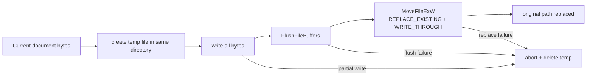

這是正確的工程方向：

- staging 在同 directory；
- 完整 write loop；
- flush；
- replace；
- failure 不直接破壞 original file。

雖然 external-conflict detection / metadata update 尚未完整接上，但 save primitive 本身不是草率實作。

---

# 14. External-change tracking：欄位齊全，但 producer 幾乎不存在

`DocTab` 有：

```text
file_exists
file_mtime
file_hash
external_conflict
external_missing
```

這組資料結構看起來像是要做：

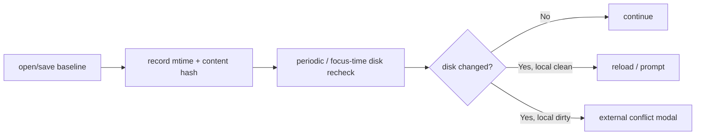

但 source 內 production path 看不到完整 baseline + watcher + conflict transition。

所以這是一個很典型的「state fields 已經先設計好，但 state machine 還沒實作」。

---

# 15. Autosave / Recovery：會寫 recovery record，但 recovery lifecycle 沒閉環

`app_autosave()` 確實能構造 recovery record，包含：

- magic/version；
- original path；
- document content；
- SHA-256。

這是實作，不是 placeholder。

但一個完整 recovery system 至少還需要：

```mermaid
flowchart LR
    DIRTY["dirty edit"] --> TIMER["autosave timer"]
    TIMER --> WRITE["write recovery record"]
    WRITE --> CRASH["process killed / crash"]
    CRASH --> NEXT["next startup"]
    NEXT --> SCAN["scan recovery records"]
    SCAN --> VERIFY["verify digest + parse metadata"]
    VERIFY --> OFFER["offer restore / discard"]
    OFFER --> RESTORE["recover document"]
    OFFER --> DISCARD["remove stale record"]
```

目前最大問題不是 record writer 完全沒有，而是：

- 沒看到可靠 timer producer；
- startup recovery scan / modal flow 不完整；
- successful save / close 後 stale recovery cleanup lifecycle 不清楚。

因此「有 app_autosave() function」不能等同「autosave/recovery 已完成」。

---

# 16. Tests：數量不少，但測試層級配置失衡

`tests/test_main.c` 的確測了很多 horizontal units：

- UTF-8；
- Base64；
- SHA-256；
- LZSS；
- JSON / YAML；
- Markdown parser；
- stats；
- search；
- diff；
- history；
- image codec；
- failure cases；
- performance smoke。

這代表實作者不是完全沒有測試意識。

但關鍵問題是：

> **最危險的 bug 都落在 horizontal unit tests 之間的接縫。**

例如第一字 crash：

```mermaid
flowchart LR
    U["buf unit"] --> D["document unit"] --> I["input integration"] --> GUI["new-doc interaction"]

    U -.->|"各自可能看起來合理"| GAP["沒有測完整 vertical chain"]
    D -.-> GAP
    I -.-> GAP
    GAP --> BUG["New → first character crash 沒被攔下"]
```

同理：

- formatting + undo；
- Replace All + different-length replacement；
- history create → prune → reopen → reconstruct；
- dirty close via tab X vs window X；
- preview mode wheel scrolling；
- workspace tree click；
- real rendered-mode click/edit；

都需要 vertical tests，而不是只測單一 helper。

---

# 17. Evidence / Screenshot：可作視覺證據，但不能證明 Interaction 完成

Screenshot automation 本身有價值：

- 可以固定 state；
- 捕捉畫面；
- 產生 evidence metadata；
- 做 image/digest verification。

但要注意一件重要的 benchmark interpretation：

> screenshot state 有時可以由 test/screenshot setup 直接注入，不代表使用者真的能透過正常 UI 操作走到同一狀態。

這也是為什麼本次 review 特別把：

```text
「畫面存在」
```

和：

```text
「interaction path 完整」
```

分開評價。

```mermaid
flowchart TD
    S["Screenshot looks correct"] --> Q{"這個 state 怎麼產生?"}
    Q -->|"normal user input path"| STRONG["較強的功能證據"]
    Q -->|"automation 直接 mutate App fields"| WEAK["只能證明 renderer 能畫\n不能證明 interaction wiring"]
```

---

# 18. 我認為做得好的地方

即使最終判斷偏負面，這份 code 有幾個值得保留的設計。

## 18.1 專案分層是合理的

`core / engine / app / tools / tests` 比把所有東西塞進一支巨大 Win32 `.c` 好很多。

這讓後續修復有機會在 abstraction boundary 做，而不是繼續堆 local patch。

## 18.2 Markdown parser 是實質成果

AST 不是單一 regex renderer。

它有：

- block types；
- inline types；
- source byte ranges；
- nested child tree；
- table metadata；
- heading collection；
- link/image data；
- blockquote/list containers。

這對 rendered editing / outline / stats / mapping 都是一個有價值的 foundation。

## 18.3 Diff / History 的方向有工程野心

雖然 history correctness 有 bug，但「Myers diff + snapshot/delta + compression + checksums」的方向本身不是敷衍。

## 18.4 Win32 Unicode file boundary 是用 wide API

file dialogs / paths / filesystem interaction 大量使用 `W` 版 API，這比 ANSI Win32 path handling 好。

## 18.5 Safe-save primitive 值得保留

前面已說，temp + flush + replace 是對的方向。

## 18.6 WIC 作為 PNG / JPEG / BMP codec 很合理

Windows native app 使用 WIC 避免引入第三方 image codec，是一個合理的 platform choice。

---

# 19. 問題不是平均分布：真正該修的 dependency graph

如果要把這份 project 從「大型 partial」推向可靠 editor，我不建議平均修 feature。

應先解 dependency root。

```mermaid
flowchart TD
    P0A["P0: Empty-buffer crash invariant"]
    P0B["P0: Transaction coordinate model"]
    P0C["P0: Dirty-close / WM_CLOSE data loss"]
    P0D["P0: History delta + prune integrity"]

    P1A["P1: Replace All"]
    P1B["P1: Formatting + undo/redo"]
    P1C["P1: Recovery lifecycle"]
    P1D["P1: External-change conflict state machine"]
    P1E["P1: Base64 decoder"]

    P2A["P2: Find/Replace focus model"]
    P2B["P2: Rendered hit-testing/edit"]
    P2C["P2: Preview scrolling/layout"]
    P2D["P2: Workspace tree interaction"]
    P2E["P2: Unicode surrogate + IME"]
    P2F["P2: Per-monitor DPI"]

    P3A["P3: Markdown rendering fidelity"]
    P3B["P3: animation / hover / polish"]
    P3C["P3: evidence completeness"]

    P0A --> P1A
    P0B --> P1A
    P0B --> P1B
    P0D --> P1C
    P0C --> P1C

    P1A --> P2A
    P1B --> P2B
    P1C --> P2B

    P2B --> P3A
    P2C --> P3A
    P2E --> P3A

    P2A --> P3B
    P2D --> P3B
    P2F --> P3B

    P3A --> P3C
    P3B --> P3C
```

這張圖的核心意思：

**不要先修漂亮。**

如果 transaction model 還錯，先把 formatting toolbar 做得再漂亮也沒有意義。

如果 dirty close 還會丟資料，先做 modal animation 也沒有意義。

如果 rendered hit test 還是 stub，先把 Rendered mode screenshot 做得很像完成品反而會增加誤判。

---

# 20. 建議的修復階段

## Phase A — 先建立「文字不會被弄壞」的最低可信核心

### A1. Buffer invariants

- empty buffer behavior；
- insert / erase zero length；
- NUL termination；
- bounds；
- allocation failure policy。

### A2. 重做 document transaction coordinate model

所有 composite operation 必須以同一 source snapshot 座標描述。

### A3. Undo / Redo regression suite

至少覆蓋：

- single insert；
- single delete；
- replace；
- selected formatting；
- formatting toggle off；
- multi-match Replace All；
- UTF-8 / emoji；
- repeated undo/redo cycles。

### A4. Dirty close lifecycle

統一：

```text
tab close
Ctrl+W
window X
Alt+F4
session shutdown
```

全部走同一個 close coordinator。

---

## Phase B — 修 Persistent State

### B1. History delta encoder

直接使用 diff script 的 `b_idx` 或重新設計 canonical delta format。

### B2. Safe prune

prune 前 materialize surviving base snapshot。

### B3. Loader hardening

所有 internal length 都做 overflow / boundary validation。

### B4. Autosave recovery state machine

建立真正：

```text
write → crash → startup scan → verify → offer restore → cleanup
```

### B5. External-change baseline

在 open / save 時記錄 identity，並在 focus/timer 時重新檢查。

---

## Phase C — 把 UI 從「畫得出來」變成「真的能用」

依序建議：

1. start surface button wiring；
2. workspace tree row hit-test；
3. Find / Replace focus state；
4. Preview wheel + scrollbar；
5. Rendered hit-test/source mapping；
6. rendered caret / selection / task checkbox；
7. image rendering；
8. drag/drop acceptance；
9. IME；
10. per-monitor DPI。

---

## Phase D — 最後才做 fidelity / evidence polish

- nested inline style；
- proper line breaking；
- inline code background；
- strikethrough；
- blockquote rule；
- table alignment；
- image sizing；
- animation normalization；
- hover / pressed states；
- screenshot / evidence regeneration。

---

# 21. 如果只能新增少量 tests，我最想先加這 12 個

| 優先 | Regression test | 原因 |
|---|---|---|
| 1 | New empty doc → first ASCII char | 直接攔截目前最明顯 crash |
| 2 | New empty doc → CJK / emoji input | 同時檢查 allocation + Unicode boundary |
| 3 | Bold selected text → undo → redo | composite transaction invariant |
| 4 | Toggle formatting off → undo → redo | descending edit path |
| 5 | Replace All shorter → longer | stale offsets |
| 6 | Replace All longer → shorter | stale offsets另一方向 |
| 7 | history insertion after equal prefix → reload | delta child-index bug |
| 8 | history > prune threshold → reopen oldest surviving | delta-chain integrity |
| 9 | dirty tab → close tab → Cancel | data-loss protection |
| 10 | dirty tab → window X → Cancel | `WM_CLOSE` bypass |
| 11 | Preview mode wheel scroll | state producer / consumer wiring |
| 12 | Workspace tree click file → tab opens | renderer vs interaction gap |

如果這 12 個測試一開始就存在，本次 review 裡很大一部分高嚴重度 defect 都不會活到 release snapshot。

---

# 22. 這份 run 的「工程量」與「完成度」應該怎麼同時評價？

這裡最容易落入兩種極端：

### 極端 A

> 「打開就 crash，所以整份都是垃圾。」

這不準確。

底層確實有大量實作，而且一些選擇是合理甚至值得保留的。

### 極端 B

> 「有 30k+ 行 / 很多 modules / screenshots，所以大部分完成了，只差小 bug。」

這也不準確。

因為文字編輯器的價值不是 module count，而是 vertical interaction correctness。

我會把它放在這個位置：

```mermaid
quadrantChart
    title 工程量 vs 產品整合可靠度（本 review 的定性位置）
    x-axis 低實作規模 --> 高實作規模
    y-axis 低整合可靠度 --> 高整合可靠度
    quadrant-1 成熟大型實作
    quadrant-2 小而可靠
    quadrant-3 原型 / 雛形
    quadrant-4 大型但未收斂
    "本次 WorkBuddy Win32 Markdown": [0.82, 0.34]
```

也就是：

> **高實作規模，低於其程式量應有的整合可靠度。**

這也是這個 benchmark run 最值得保留的分析價值。

---

# 23. 最終評語

如果只看 source authorship 與模組數量，這是一份令人印象深刻的長時間 agent implementation：

- scope 很廣；
- 自製元件很多；
- 沒有簡單逃成 webview 或第三方 editor；
- 有實際 Win32 code；
- 有 parser / diff / history / image / persistence / testing infrastructure。

但真正的軟體品質問題是：

> **agent 把大量時間用在「把功能構件建出來」，卻沒有足夠強地做 integration closure。**

結果就是：

```mermaid
flowchart LR
    MANY["很多真實模組"] --> FEATURES["很多 feature 名稱 / UI state"] --> LOOKS["screenshots 看起來接近完整"]
    LOOKS --> REAL["真實人工操作"]
    REAL --> CRASH["crash"]
    REAL --> DEAD["dead controls"]
    REAL --> WRONG["wrong edit offsets"]
    REAL --> LOSS["data-loss risks"]
    REAL --> STUB["stubbed interactions"]

    CRASH --> ROOT["Integration invariants 未收斂"]
    DEAD --> ROOT
    WRONG --> ROOT
    LOSS --> ROOT
    STUB --> ROOT
```

所以最終我不會把它描述成「假實作」。

我會描述成：

> **一份相當大的真實實作，但缺少最後也是最重要的整合工程。它已經證明模型能快速鋪出大量底層能力；同時也非常清楚地展示，若沒有強制 vertical E2E、state-machine 與 invariant-driven testing，大型 agentic coding 很容易產生『每一塊看起來都有，接起來卻不可靠』的結果。**

對 benchmark 而言，這其實比單純「做不出來」更有分析價值。

---

## 延伸閱讀

若要查每個 finding 的完整 code path、檔案與更細的 implementation analysis，請閱讀同目錄的：

- [`README.md`](README.md) — 完整英文 static code review；
- 本文件 — 重新編排的繁體中文技術摘要與架構視覺化。

完整英文報告保留更細緻的逐 finding 證據；中文版則刻意以 architecture、root-cause relationship、risk propagation 與 repair ordering 為主。
