# Pinball Sandbox 靜態 Code Review — 中文技術導讀、失效鏈與證據可信度分析

> 這不是 [`REVIEW.md`](./REVIEW.md) 的逐段翻譯。  
> 本文把同一輪 source audit 重新編排成更容易閱讀的中文版本：先重建這份作品真正的系統架構，再分別看 physics、editor、scene parser、replay 與 evidence pipeline；最後說明為什麼「722 / 722」仍會漏掉非常嚴重的問題，以及最值得先修的順序。

---

# 0. 一句話結論

這份 Hy3 / WorkBuddy 交付的 Pinball Sandbox **工程量很大，而且不是假的**。

它真的有：

- C17 Win32 editor / playable app；
- 自製 framebuffer renderer；
- fixed-step physics；
- `.pbt` scene format；
- 15 種 object；
- flipper / bumper / spinner / kickout / drain / sensor；
- event/action system；
- replay；
- determinism fingerprint；
- headless simulator；
- 自製 PNG writer；
- validation / diagnostics；
- 722 個 assertion 等級的自動驗證；
- 一整套 release / evidence tooling。

所以它最值得肯定的地方就是：

> **這是一份真的有「系統工程」內容的 submission，不是把 UI 畫出來就說完成。**

但是這次靜態 review 也發現一個非常鮮明的反差：

> **headless core / format / tooling 看起來很完整，真正 Stateful 的 desktop editor 與 runtime boundary 卻遠沒有同等成熟。**

而且最嚴重的問題不是單一「物理參數不精準」，而是四種更根本的失效：

1. **Malformed `.pbt` 可以造成 memory corruption。**
2. **Editor 的正常操作就有 crash / data loss 路徑。**
3. **Play / Preview 會直接修改 authored Scene，runtime 與編輯資料混在一起。**
4. **release/evidence JSON 很多 PASS 是 hard-coded / synthesized，而不是從 raw execution 自動聚合。**

因此我對這份作品的總評是：

> **「開發野心與實作量很高，但 state ownership、transaction safety、physics contact lifetime 與 evidence provenance 明顯落後。」**

---

# 1. 我實際看的是什麼

這次不是照 spec 一項一項打勾，而是從 source 本身重建產品：

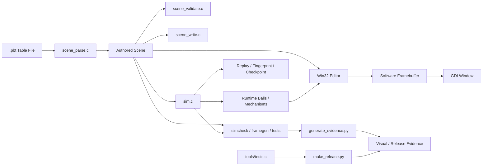

我特別追的是：

- Scene 進來後能不能安全 parse？
- authored data 與 runtime state 有沒有分開？
- collision 真的是 finite geometry 嗎？
- 每個 object schema 欄位是不是 runtime 真的有用？
- reset / preview / play 後是不是回到同一個 table？
- editor 一個正常使用者會怎麼 crash / lose data？
- replay fingerprint 到底綁了哪些 state？
- `722/722` 是什麼等級的證據？
- release JSON 到底是「讀測試結果」還是「寫死 PASS」？

---

# 2. 先講值得肯定的地方

## 2.1 Headless 與 GUI 真的共用 core

這很重要。

不是：

```text
GUI 用一套假的 physics
headless test 又用另一套比較容易 PASS 的 physics
```

而是兩邊都有 link `src/core`。

這代表作者至少有抓到 deterministic simulator 最重要的工程方向。

---

## 2.2 Fixed timestep 設計是合理的

Simulator 用固定 `1 / 240 s` step。

這種做法對：

- deterministic replay；
- physics debugging；
- headless comparison；
- frame-independent simulation；

都很適合。

---

## 2.3 Scene format 不是很薄的 parser

`.pbt` 裡面真的定義了：

- table settings；
- layers；
- objects；
- groups；
- events；
- actions；
- migration；
- references；
- typed fields；
- diagnostics。

Writer 也有 canonical ordering 與 `%.17g` double round-trip。

這部分是實質工程量。

---

## 2.4 Flipper / Spinner collision math 有認真做

雖然 spinner 後面有很嚴重的 state bug，但碰撞 response 並不是「撞到就 vel *= -1」。

Flipper 有考慮 rotating surface velocity；spinner 有 effective angular mass；ball-ball 有 inverse mass impulse。

這說明核心不是純 placeholder。

---

## 2.5 自製 renderer / PNG / replay / tooling 也都有實作

我不會因為後面找到很多 defect 就否定這些實作量。

尤其是：

- clipping；
- alpha blend；
- primitive raster；
- dependency-free PNG stored DEFLATE；
- logical edge replay recorder；
- headless JSON；
- deterministic fingerprint；

這些都是有內容的。

---

# 3. 整體風險地圖

這輪最後整理為：

| 嚴重度 | 數量 | 主要類型 |
|---|---:|---|
| **Critical** | **9** | parser memory corruption、editor crash/data loss、runtime 污染 authored data、evidence provenance |
| **High** | **28** | physics / gameplay / editor / replay 核心 correctness |
| **Medium** | **24** | validation、OOM、API contract、portability、resource/UX |
| **Low / Quality** | **12** | dead state、文件漂移、maintainability |

如果只想先記住五件事：

1. `.pbt` parser 有真實 stack / struct OOB。
2. 新 editor 第一次建 object 就可能 NULL write。
3. runtime 會修改 authored Scene。
4. spinner / launcher / target-reset / tilt 等很多 schema feature 沒有真正完成 runtime semantics。
5. release/evidence pipeline 會自行 hard-code PASS / synthetic test IDs。

---

# 4. Critical #1：Parser 的 malformed input 並不是 memory-safe reject

這部分我認為是非常重要的發現。

交付報告有一個類別叫：

> malformed-input safety

而且 28 / 28 PASS。

但 source 本身仍有多條可以越界的 parser path。

---

## 4.1 Vec2 多一個值，就會先寫出 array 才發現錯

概念上是：

```c
double vals[2];
int n = 0;

vals[n++] = parsed;
...
if (n != 2) return error;
```

問題在於：

```text
(1, 2, 3)
```

第三個 value 會先寫：

```text
vals[2]
```

才在最後發現 `n != 2`。

所以流程其實是：

```mermaid
flowchart TD
    A[輸入 world_size = (1,2,3)] --> B[parse value 1]
    B --> C[vals 0]
    C --> D[parse value 2]
    D --> E[vals 1]
    E --> F[parse value 3]
    F --> G[寫 vals 2]
    G --> H[Stack OOB 已經發生]
    H --> I[最後才檢查 n != 2]
    I --> J[回傳 parser error]
```

也就是：

> **「有回傳 error」不代表「沒有 memory corruption」。**

`tuple4` 同樣問題，五個元素即可超出 `double vals[4]`。

---

## 4.2 `action_count` / `member_count` 可以讓後續 loop 直接跑出 struct

兩個固定容量都是 256。

但 parser 只檢查：

```text
>= 0
```

沒有檢查：

```text
<= 256
```

所以：

```text
action_count = 10000
```

後面會照 10000 去走：

```c
ev->actions[a]
```

這不是單純「超過規格」，而是 out-of-bounds read。

---

## 4.3 64-byte ID 的 NUL terminator 會多一格

buffer 是：

```c
char id[64];
```

但 helper 允許：

```text
strlen == 64
```

然後用 `strcpy`。

實際需要：

```text
64 bytes content + 1 byte NUL = 65
```

所以是經典 off-by-one。

---

# 5. Critical #2：Editor 新場景第一次新增物件就可能 crash

這是一條非常乾淨的 normal-user failure chain。

App startup：

```text
scene.objects = NULL
obj_count = 0
obj_cap = 0
```

但 palette create 沒走 `scene_add_object()`。

而是：

```c
int idx = obj_count++;
objects[idx] = o;
```

所以：

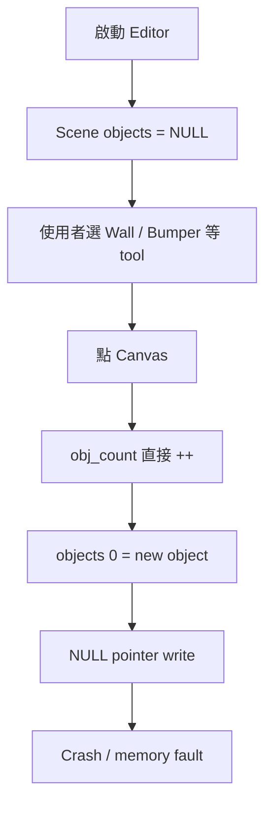

這也是為什麼「GUI gate NOT_RUN」在這份 submission 不能看成只是缺 screenshots。

因為沒有跑 GUI，漏掉的是**最基本 editor happy path**。

---

# 6. Critical #3：Play / Preview 會修改你的 authored table

這是我認為整個 architecture 最根本的問題。

理想模型應該是：

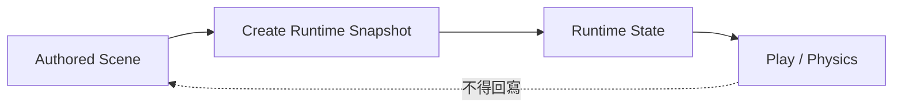

但目前其實是：

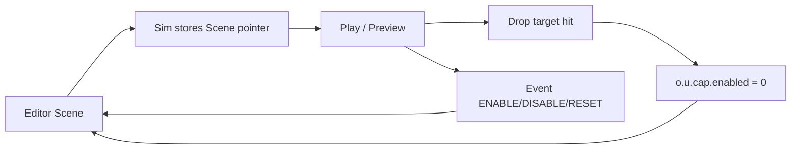

也就是 runtime 直接改 editor model。

後果非常多：

- Preview 一次，table 可能被改。
- target 掉下去，`sim_reset()` 不一定讓 authored state 回來。
- event action 改 object，不會建立 editor undo command。
- dirty flag 不知道 table 被 simulation 改了。
- 如果接著 Save，可能把 transient runtime 狀態寫回 `.pbt`。

這種問題比單一 feature missing 更嚴重，因為它破壞的是「誰擁有 state」這個工程邊界。

---

# 7. Critical #4：ENABLE / DISABLE 會寫錯 union member

`Obj` 用 union 儲存不同 object type。

例如：

```text
Wall       -> u.cap
Bumper     -> u.bumper
Flipper    -> u.flipper
Sensor     -> u.sensor
Spinner    -> u.spinner
Kickout    -> u.kickout
```

但 event action 實作直接：

```c
o->u.cap.enabled = 1;
```

完全不看 type。

所以：

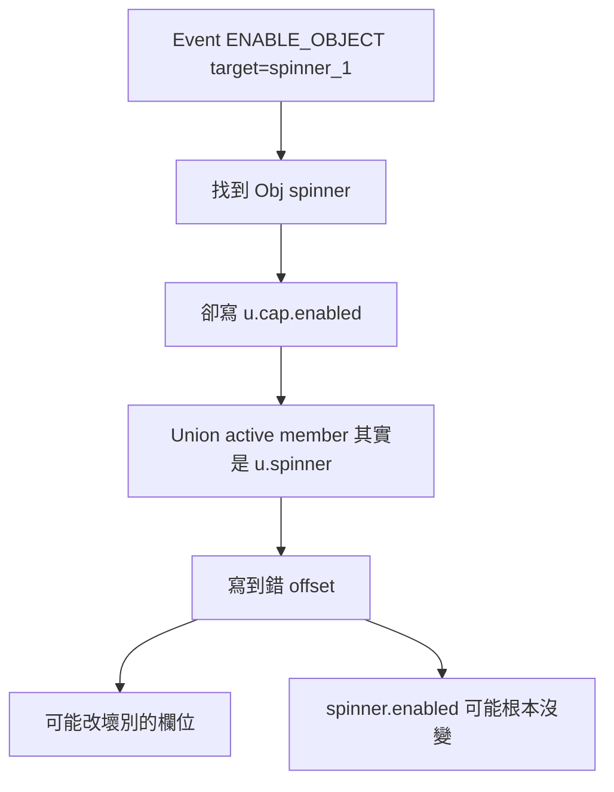

更糟的是 simulator 又沒有一致檢查所有 type 的 `enabled`。

所以現在的情況是：

> **Event language 看起來支援 generic ENABLE/DISABLE，但 runtime 對不同 object type 並沒有一個真正一致的 enabled abstraction。**

---

# 8. Physics 核心：有真實實作，但 contact lifetime 有根本錯誤

---

## 8.1 Spinner 根本不會真的旋轉

目前：

```text
collision -> ang_vel 改變
step      -> ang_vel damping
```

但是缺：

```text
angle += ang_vel * dt
```

所以：

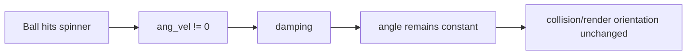

而 `tick_angle_deg` / `score_per_tick` 也沒有真正使用。

目前的 `SPINNER_TICK` 比較像：

> 「撞到 spinner 一次」

而不是：

> 「spinner 每轉過某個角度產生一個 tick」。

---

## 8.2 Segment CCD 實際上撞的是「無限延長線」

Wall authored geometry應該是：

```text
A ---------------- B
```

但 sweep 只看 supporting line，沒有檢查 contact projection 是否落在 A～B。

所以 ball 在：

```text
                       O ball

A -------- B ................................. infinite line
```

仍可能被判為撞到這面 wall。

正確 capsule CCD 至少要拆成：

```text
segment body + endpoint A circle + endpoint B circle
```

---

## 8.3 Penetration correction 的 sign 反了

Corrector 要的是：

```text
penetration > 0
```

例如：

```text
R - distance
```

但 caller 傳的是：

```text
distance - R
```

重疊時反而是負數。

於是 correction 條件：

```text
pen > slop
```

幾乎不會成立。

Ball-ball 那條 path 則用了正確的 convention，反而可以看出 static/mechanism caller 是不一致的。

---

## 8.4 `t = 0` contact 可以讓同一 step 卡住

每次 hit 後：

```c
remain *= 1 - t;
```

如果：

```text
t = 0
```

那：

```text
remain 完全不變
```

如果 ball 剛好在 boundary 並且其實已經正在離開：

- collision finder 還是找到 t=0；
- response 看到 separating velocity 可能不施 impulse；
- penetration correction 又沒有效；
- remain 不變；
- 下一輪又選到同一 contact。

最後只靠 impact loop cap 結束。

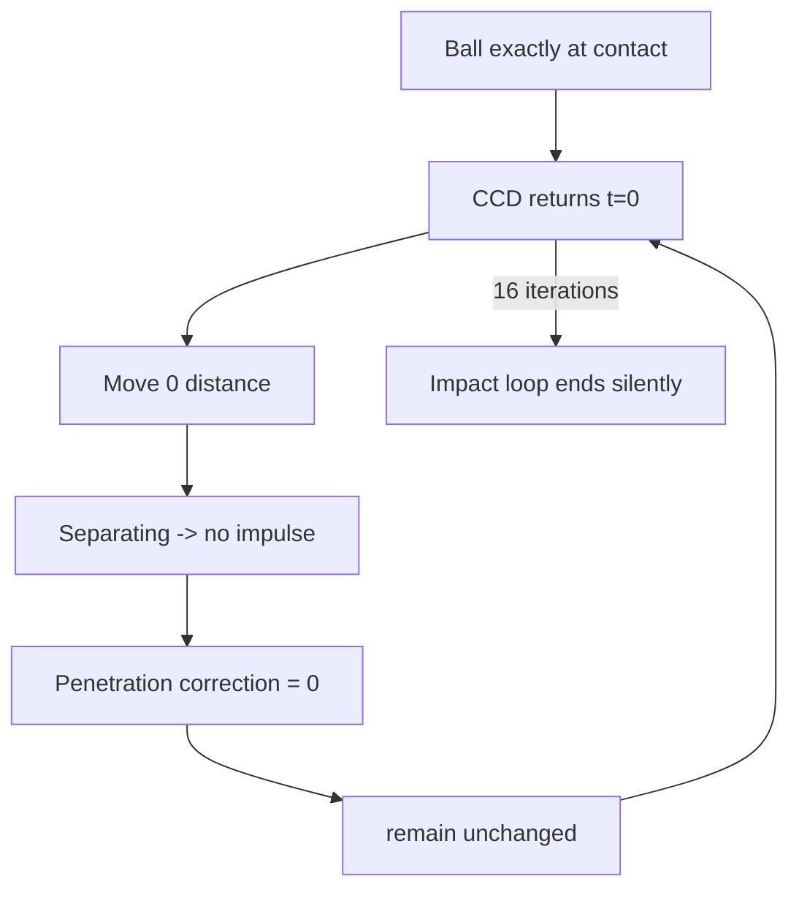

Sensor / rollover / drain 又更危險，因為它們本來就沒有 physical response，可能同一 crossing 在一個 step 內觸發多次。

---

# 9. Schema 有 feature，不代表 runtime 真的有 feature

這份 submission 很常出現：

```text
Parser 有欄位
Writer 有欄位
Validator 有欄位
=> 文件就看起來像「已支援」
```

但 runtime 沒有完整 semantics。

最典型：

| Feature | Schema | Runtime |
|---|---|---|
| Launcher | 有 position/spawn/speed/charge | `launch` input 被直接丟掉 |
| Spinner | 有 inertia/damping/tick angle | angle 不 integrate，tick threshold 不實作 |
| Drop target AFTER_DELAY | 有 | 沒 timer |
| Drop target ON_NEW_BALL | 有 | 沒 new-ball reset |
| Nudge cooldown | 有 | 沒 enforcement |
| Tilt decay | 有 | 沒 decay |
| Tilt suppression | 有 tilted flag | flipper/gameplay 照常 |
| max_active_balls | 有 | spawn 只看 compile-time 256 |
| Slingshot/target cooldown | 有 | 沒 runtime cooldown |
| Layer visibility | 有 | renderer 不看 layer |
| Locks | 有 | editor move/delete 不 enforce |

所以我很建議未來定義 completion gate 為：

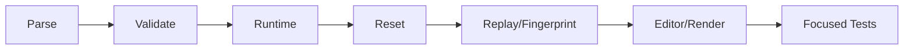

**整條都通，才叫一個 feature 完成。**

---

# 10. Editor 除了 create crash，還有多條真實資料風險

---

## 10.1 Close → Yes 居然不 Save

UI 問：

```text
Save changes before closing?
```

使用者按 Yes。

程式裡：

```c
if (r == IDYES) {
    /* trigger save dialog simplified */
}
DestroyWindow(hwnd);
```

沒有 save。

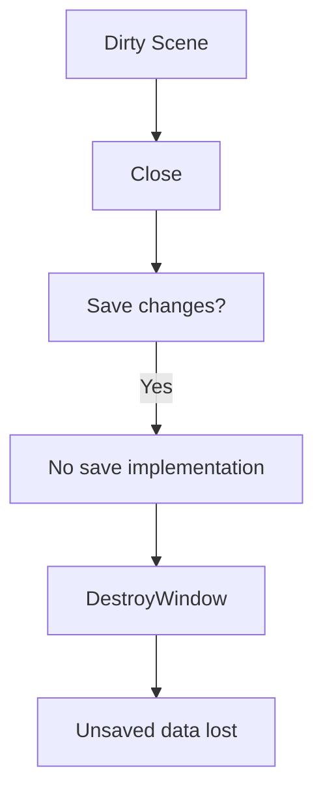

這是非常典型的 Critical/High user-trust bug。

---

## 10.2 GUI `save_scene()` 直接 `"wb"` truncate

也就是：

```text
先把舊檔截成 0
再開始寫新資料
```

如果中途：

- disk full；
- crash；
- short write；
- I/O failure；

舊版本已經沒了。

而且 GUI 根本沒有使用另外那個 nominally atomic 的 `scene_write_file()`。

---

## 10.3 Ctrl+N / Ctrl+O 不管 dirty state

所以：

```text
編輯很久
-> Ctrl+O
-> table 被換掉
```

沒有 Save / Discard / Cancel transaction。

Ctrl+N 還直接 `scene_init()` 蓋掉舊 pointers，造成 leak。

---

## 10.4 Preview input 送錯 Sim

Preview：

```text
sim_tick -> preview_sim
```

但 keyboard：

```text
sim_input -> a->sim
```

所以你看到的 preview 在跑，按鍵卻餵給另一個 hidden sim。

---

## 10.5 Flipper key state 不是獨立的

按左：

```text
left=1 right=0
```

按右：

```text
left=0 right=1
```

所以即使實體左鍵還按著，按右會把左放掉。

任一 keyup 又可能一次把兩邊都清零。

---

## 10.6 Undo ring 超過 256 後 chronology 會壞掉

目前有 modulo slot，但沒有真正 tail/base sequence。

所以它不是一個完整 circular history data structure。

---

## 10.7 Multi-selection delete 沒真的按照 descending index

它只是「selection list 反著跑」。

如果使用者 Ctrl 點選順序是：

```text
1, 9, 4
```

反著是：

```text
4, 9, 1
```

刪 4 後，原本 9 已 shift 成 8，但程式仍拿 9。

可能刪錯 object。

---

# 11. Replay / determinism：最大的問題是「fingerprint 不完整」

Determinism fingerprint 是好設計。

但 fingerprint 能證明什麼，完全取決於它有沒有 hash 所有 future-relevant state。

目前 Scene fingerprint 對 capsule 系列漏掉很多欄位，例如：

- gate allowed direction；
- slingshot impulse / score / cooldown；
- rollover width / score；
- target min hit speed / score / cooldown；
- drop target reset mode / delay / initially raised。

所以：

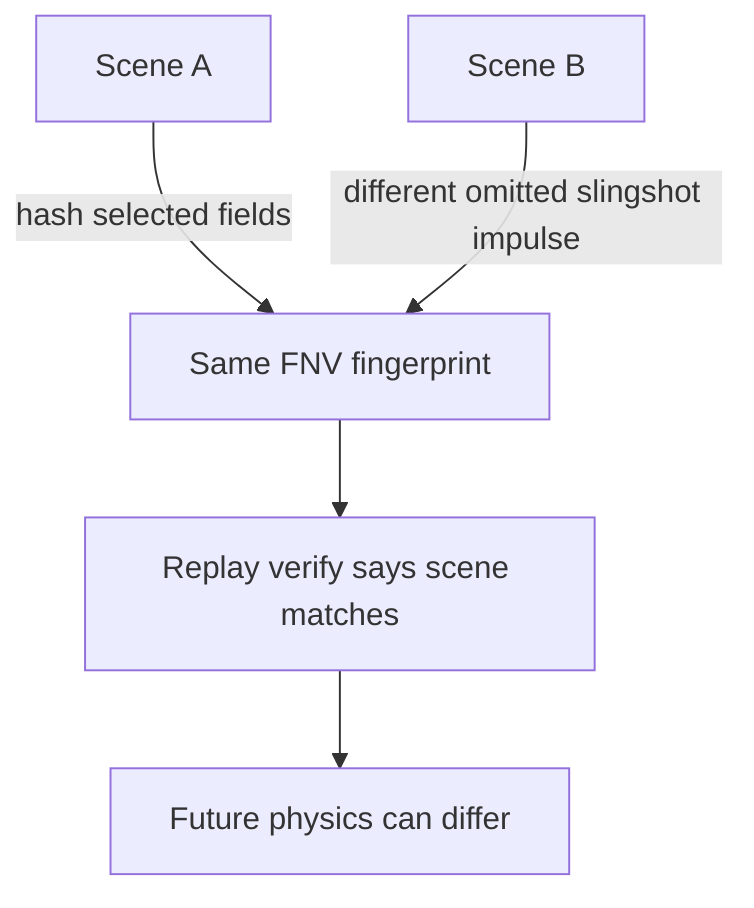

Runtime fingerprint 也沒有涵蓋所有：

- cooldown；
- kickout hold timing；
- runtime object mutations；
- some mechanism state；
- override duration；

因此：

> **same fingerprint 比較接近「我 hash 的欄位相同」，不是「完整 simulator state 等價」。**

---

# 12. 為什麼 722 / 722 沒抓到這些？

這是本次 review 很值得看的地方。

---

## 12.1 722 其實是 CHECK assertions 數

`tools/tests.c` 每個 `CHECKF` / `CHECKC` 就加一。

不是 722 個獨立 test function。

報告自己也列：

```text
parse / round-trip = 502
```

也就是超過 2/3 都是 parser/fixture 各種 assertion 累積。

這不是說這些 assertion 沒價值。

而是：

> **「722」這個數字的 breadth 容易被高估。**

---

## 12.2 Deterministic bug 一樣會 10/10 一致

例如 spinner 永遠不轉。

Run 1：不轉。  
Run 2：不轉。  
...  
Run 10：不轉。

Fingerprint 完全一致。

所以 deterministic test 回答的是：

> 「同一個實作重跑會不會一樣？」

而不是：

> 「這個實作是不是物理語意正確？」

---

## 12.3 1M step 用 free-flight fixture

這是一個很好用來抓：

- NaN；
- runaway memory；
- 基本 integration；

的壓力測試。

但它自然不會抓：

- spinner ticks；
- launcher；
- editor；
- drop reset；
- generic enabled action；
- history；
- save transaction。

---

## 12.4 Malformed tests 是 28 個 curated files，不是 structural fuzzing

所以沒有剛好打到：

```text
Vec2 第三個值
Rect 第五個值
count = 257 / 10000
ID boundary = 64
allocation failure at every realloc
```

這就是 parser memory bug 可以活著通過 28/28 的原因。

---

## 12.5 GUI gate NOT_RUN 真的很重要

此次最直接的 normal-workflow bugs 幾乎都在 GUI：

- 新建 object crash；
- Close Yes 不 save；
- preview input 錯 sim；
- small window OOB；
- history 256；
- dirty Open/New；
- native save。

所以「GUI NOT_RUN」不是：

> 少幾張 screenshot 而已。

而是：

> **產品最重要的一大塊沒有接受真實 behavior execution。**

---

# 13. Evidence pipeline 是這次另一個非常大的問題

Release JSON 看起來非常漂亮：

```text
physics_core PASS
gameplay PASS
mechanisms_tilt PASS
reliability_recovery PASS
persistence PASS
determinism PASS
...
```

但產生它的 `make_release.py` 不是把 raw tests aggregation 起來。

而是概念上：

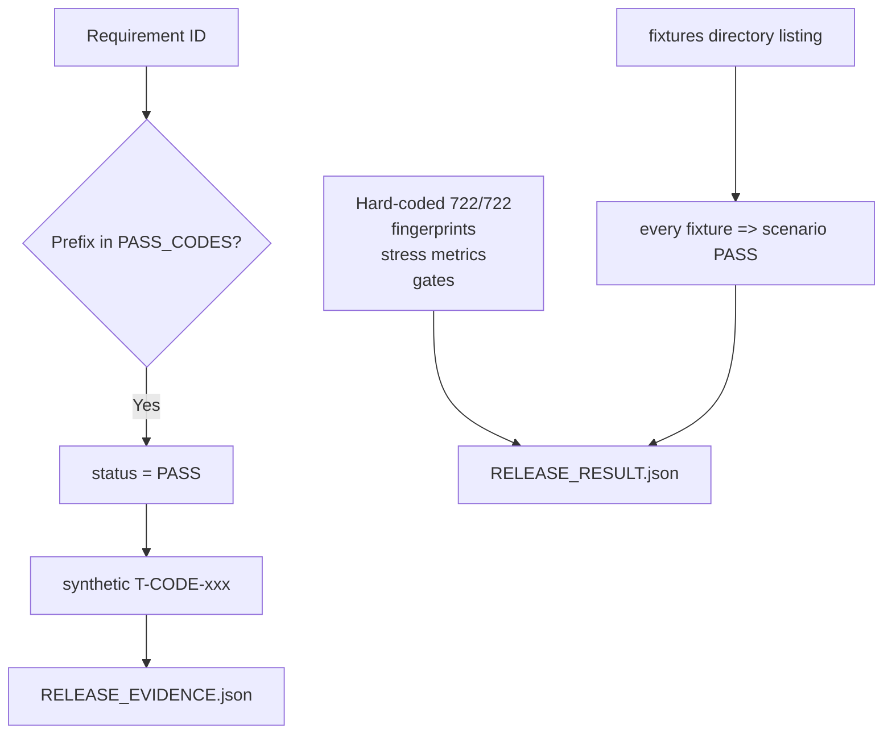

也就是 output 的「內部一致性」可以很好，但 provenance 不夠強。

---

## 13.1 `gui_headless_match = true` 特別能看出矛盾

同一個 release JSON 同時寫：

```text
main_ui = NOT_RUN
editor = NOT_RUN
desktop_interaction = NOT_RUN
```

但 deterministic 區塊又：

```text
gui_headless_match = true
```

這個 true 是 script literal。

共用 core 可以證明：

> 「GUI 和 headless link 同一套 simulator」。

但不能證明：

> 「GUI 實際 routing 出來的 input 跟 headless 一樣」。

因為這次我們就找到：

```text
Preview advances preview_sim
keyboard feeds sim
```

這正是一個 shared core 仍然無法阻止的 GUI/headless mismatch。

---

# 14. Visual evidence IDs 也有語意錯置

`VISUAL_EVIDENCE.md` 會把 A/V ID 描述成：

- hover；
- ripple；
- modal blur；
- sidebar；
- DPI；
- focus traversal；
- autosave recovery；
- command palette；
- spinner rotation；
- tilt suppression；

可是 `generate_evidence.py` 實際做的是：

```text
framegen.exe
+ physics fixture
+ different simulation step
+ different image width
```

例如 transition A01/A02/A03 等其實是：

```text
flipper_strike physics frames
gravity_drop physics frames
perfect_bounce physics frames
```

不是「hover / click ripple / modal animation」。

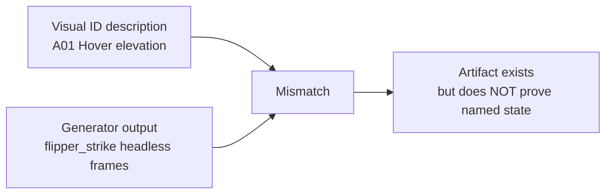

這種問題在一般 app repo 可能只是文件錯。

但這是一個 benchmark archive，所以 evidence semantics 本身就很重要。

---

# 15. 我會怎麼看這份作品的成熟度

可以切成兩層：

## A. 比較成熟

- scene format；
- basic parser structure；
- canonical writer idea；
- basic semantic validator；
- fixed-step architecture；
- shared headless core；
- basic collision impulse；
- software rendering；
- headless tooling；
- repeatability infrastructure。

## B. 明顯未成熟

- malformed memory safety；
- runtime vs authored state；
- object feature completeness；
- editor object ownership / capacity；
- save/dirty transactions；
- undo history；
- live input state；
- Unicode/DPI desktop integration；
- full replay-state identity；
- evidence provenance。

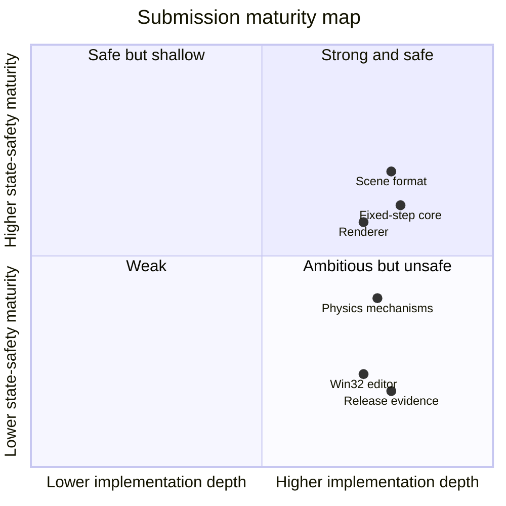

這張圖最接近我的實際感受：

> **不是沒做，而是做很多之後，跨狀態與跨 subsystem 的 safety 沒跟上。**

---

# 16. 修正優先順序

## P0 — 先把會 crash / corrupt / lose data 的拿掉

- Vec2 / tuple arity OOB；
- member/action count bounds；
- ID off-by-one；
- editor create / duplicate allocation；
- narrow resize framebuffer bounds；
- all malloc / size overflow checks；
- Close → Yes 真正 save；
- sanitizer parser fuzz。

---

## P1 — 重做 runtime ownership

把現在：

```text
Sim -> Scene * -> modify authored object
```

改成：

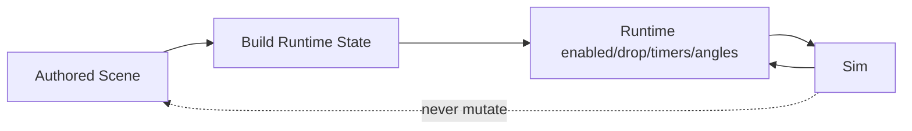

這一改可以一起解掉：

- preview 污染 table；
- target reset；
- event enabled corruption；
- repeated-run initial-state mismatch；
- dirty/undo 不知道 runtime 改了 table；
- save 把 transient state 寫回去。

---

## P2 — 再修 contact / physics

- true swept circle vs capsule；
- endpoint CCD；
- penetration sign；
- `t=0` progress；
- impact budget diagnostics；
- trigger enter/stay/exit；
- spinner angular integration；
- ball-ball CCD。

---

## P3 — 把 schema feature 真正完成

- launcher；
- target AFTER_DELAY；
- target ON_NEW_BALL；
- nudge cooldown；
- tilt decay；
- tilt suppression；
- max_active_balls；
- cooldowns；
- enabled for every object type。

---

## P4 — Editor transaction model

- preview input；
- independent key states；
- 256+ history；
- sorted destructive delete；
- New/Open/Close dirty flow；
- Unicode Win32 save；
- true atomic replace；
- layer / lock enforcement；
- TOOL_MOVE 行為。

---

## P5 — 最後把 evidence pipeline 變成 fail-closed

理想流程：

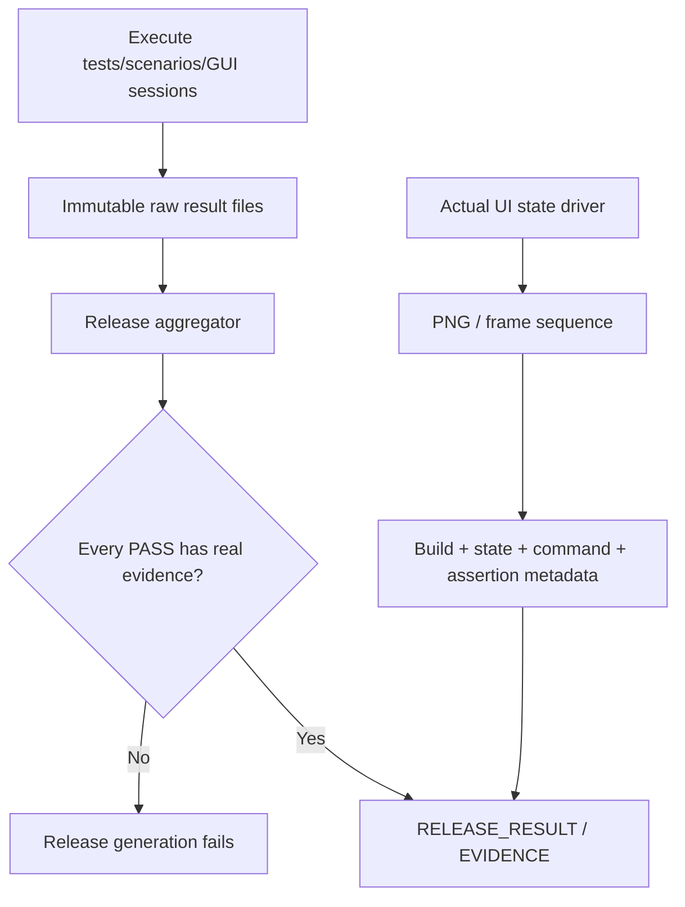

而不是目前：

```text
Requirement prefix -> PASS constant
Fixture exists -> scenario PASS
Description ID -> generic headless image
```

---

# 17. 最值得補的 regression tests

如果只允許我補 25 個，我會優先這些：

1. `(1,2,3)` Vec2 under ASan。
2. 5-value rect under ASan。
3. `action_count=257`。
4. `member_count=257`。
5. 63/64-byte ID boundary。
6. fresh editor first Wall create。
7. minimum/narrow window resize。
8. Close → Yes → relaunch bytes match。
9. Preview target hit does not change authored scene hash。
10. Reset twice gives identical runtime start。
11. generic enable/disable all 15 object types。
12. ball past wall endpoint does not collide。
13. t=0 separating contact makes forward progress。
14. sensor exactly one ENTER + one EXIT。
15. spinner angle changes after hit。
16. spinner tick threshold test。
17. launcher charge speed curve。
18. AFTER_DELAY target reset。
19. ON_NEW_BALL reset。
20. nudge cooldown / tilt decay / suppression。
21. max_active_balls hard cap。
22. scene hash changes when slingshot impulse changes。
23. malformed replay strict reject。
24. 257 history states exact order。
25. release generator with missing failed raw results must not output PASS。

---

# 18. 最終評價

如果把它跟一般「LLM 做的 C 大作業」相比，這份確實是相當有份量的。

它有很多地方能看出實作者不是只想過 happy path：

- typed diagnostics；
- deterministic ordering；
- canonical serialization；
- replay edges；
- fixed timestep；
- headless verification；
- multiple mechanisms；
- tooling；
- stress run；
- custom renderer。

但也正因為工程量很大，這份作品反而很適合看一個更高階的問題：

> **「feature surface 很大」和「system invariant 很成熟」完全是兩件事。**

這份 Pinball 現在比較像：

```text
功能表面          ██████████
headless engineering █████████
deterministic tooling ████████
physics semantics     ██████
editor transaction    ███
runtime state safety  ███
evidence provenance   ██
```

我不會把它評為「低品質 submission」。

比較準確的評語是：

> **它是一份很有企圖、核心也有真材實料，但還停在「大型 prototype / benchmark implementation」而不是可信任 v1.0 desktop tool 的作品。**

尤其 `722 / 722` 不能被解讀為「722 個獨立 end-to-end 行為都通過」。

真正最重要的下一步不是再把 test count 從 722 增加到 1000，也不是再加新的 pinball object。

而是：

1. 先修 memory safety；
2. 分離 authored/runtime state；
3. 修 contact lifetime；
4. 完成已宣告 mechanism semantics；
5. 重建 editor transaction；
6. 讓 release/evidence 完全從 raw execution 派生。

做到這些之後，這份 codebase 才會從「很有工程量的 benchmark submission」真正升級成「可以相信資料與行為的桌面應用」。
