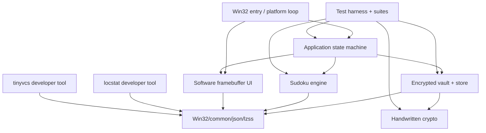

# Sudoku for Windows — Independent Static Code Review

**Reviewer:** GPT-5.6 Sol (Chat, high reasoning)  
**Review date:** 2026-09-02  
**Review target:** `runs/c17-win32-sudoku/2026-08-20-hy3-192k-workbuddy-code-development/project/0820-sudoku-workbuddy_curated/`  
**Run context:** Tencent WorkBuddy / Hy3 / 192K context / high reasoning, as recorded by the run README.  
**Review mode:** independent static source audit of the archived Windows implementation and its authored developer tools, using the submission's own tests/results as supporting evidence. I did **not** execute the Windows binaries in this review environment.  
**Scope note:** this is intentionally **not** a requirement-by-requirement spec checklist. The primary question is what the submitted code actually does, where its invariants are strong, where they break, and what behavior follows from those breaks.

---

# 1. Executive assessment

## Overall judgment: **an unusually substantial C17/Win32 implementation whose core algorithms are credible, but whose encrypted persistence and several transaction boundaries are not safe enough to trust yet**

This submission is much larger and more ambitious than the word “Sudoku” suggests. The authored project contains:

- a native Win32 desktop application with a custom software framebuffer renderer;
- a UI-independent Sudoku board/validator/search solver;
- a deterministic human-logic engine implementing techniques T1–T8;
- a seeded puzzle generator and difficulty classifier;
- hint and auto-solve paths;
- an encrypted local vault with a handwritten binary persistence format;
- handwritten SHA-256, HMAC-SHA-256, PBKDF2, ChaCha/HChaCha, Poly1305 and XChaCha20-Poly1305;
- shared Win32 path/file/atomic-write/fault-injection utilities;
- a custom JSON implementation and LZSS codec;
- a reusable test harness;
- a sizeable `locstat` developer tool with its own JSON parser;
- a content-addressed `tinyvcs` developer tool with objects, trees, commits, index, refs, checkout and verification.

The architecture is not a façade. There is real algorithmic and systems work here, and several components are thoughtfully designed.

The decisive problem is that a few failures sit at **high-value state boundaries** rather than at cosmetic edges. The most important example is the vault: `sdk_vault_open()` authenticates/decrypts correctly, then wipes the derived key and never copies it into the returned vault handle. A later ordinary `sdk_vault_save()` therefore encrypts with the handle's zero-initialized key. The application saves its open vault on shutdown, so a completely normal sequence — **open an existing vault with the right password, then exit** — can replace the current vault with data encrypted under an all-zero key. The next open with the user's real password fails authentication. This is simultaneously a persistence-integrity failure and a confidentiality failure.

The second critical defect is a one-byte heap overwrite in application startup: copying a 512-byte-or-longer `--vault` path writes the terminating NUL one byte beyond `sdk_app.vault_path[512]`.

The run's own final report records **82 / 82 automated cases passing** and zero open defects. That is valuable evidence that many happy paths and primitives work, but static review shows that the test count materially overstates end-to-end safety. Most notably, `test_vault.c` literally comments that it tests “open, save, reopen,” but the implementation performs only **open → save → close**; it never reopens the post-save file, so the zero-key regression passes the suite. The failure suite's “bak recovery” similarly opens the `.bak` path explicitly; the application itself contains no automatic fallback from a bad `current` vault to the retained backup.

The main Sudoku logic is actually one of the stronger areas. The T1–T8 logic engine, candidate derivation, deterministic ordering, parser, solver structure and generator are substantial. The serious Sudoku-specific defects are mostly **invariant and guard-contract** problems: board setters/validation do not reject values outside 0–9; the search counter silently stops after a hard-coded 20 million nodes without reporting that the count is inconclusive; and generator parameters documented as controlling search bounds are not actually honored consistently.

The two authored developer tools also deserve to be treated as production code because they form a large fraction of the submission. `tinyvcs` has a real content-addressed design but important transactional and integrity bugs; `locstat` is feature-rich but contains a dangerous OOM reallocation pattern and several reporting/parser semantic inconsistencies.

### Severity summary

| Severity | Count | Meaning in this review |
|---|---:|---|
| **CRITICAL** | **2** | memory-safety or persistence/security failure reachable from ordinary/external input |
| **HIGH** | **21** | major correctness, state-integrity, recovery, security-boundary or core-tool reliability defect |
| **MEDIUM** | **18** | real robustness/semantic/platform defect with narrower trigger or consequence |
| **LOW / QUALITY** | **9** | maintainability, diagnostics, edge-format or lower-impact behavioral debt |

The most important pattern is not the raw count. It is that defects cluster around **state transitions**:

- encrypted vault open → save;
- running → paused → resumed;
- hint/auto-solve → completion metadata;
- in-memory game → persisted game;
- tinyvcs working tree → index → HEAD/ref;
- object pathname → content identity;
- parser input → canonical model.

Those transitions should become the center of the remediation and regression-test strategy.

---

# 2. Architecture reconstructed from the code

The implementation can be understood as seven cooperating systems.



## 2.1 Application layer

`src/app/sdk_app.c`, `src/app/sdk_pages.c`, `src/app/entry/sdk_entry.c`

The app owns a clear state machine (`BOOT`, `MENU`, `PLAYING`, `COMPLETED`, `QUIT`) and keeps the active puzzle, solution, player board, undo/redo stacks, selection state, timer state, vault state and completion summary in one `sdk_app` object. Page rendering/input is separated from the core app state transitions.

## 2.2 Sudoku engine

`src/sudoku/sdk_sudoku_board.c`, `sdk_sudoku_solver.c`, `sdk_sudoku_logic.c`, `sdk_sudoku_gen.c`, `sdk_sudoku_hint.c`

This layer is UI-independent and mostly deterministic. It implements:

- formal board representation and parsing;
- conflict validation;
- MRV-style search;
- solution counting/uniqueness;
- derived candidates;
- deterministic T1–T8 logic steps;
- logic traces and scoring;
- difficulty classification;
- seeded puzzle generation;
- hint preview/application and auto-solve.

## 2.3 Vault/storage layer

`src/storage/sdk_vault.c`

The persisted store includes settings, in-progress games, notes, origins, elapsed time, hint/assist metadata, undo/redo transactions and completed records. The vault uses PBKDF2-HMAC-SHA-256 plus XChaCha20-Poly1305, authenticates the header as AAD and attempts atomic replacement with a retained backup.

## 2.4 Crypto layer

`src/crypto/*`

Cryptographic primitives are handwritten rather than delegated to a third-party library. The only system RNG dependency is BCrypt. The code includes explicit key wiping and constant-time tag comparison helpers.

## 2.5 Win32/common + renderer

`src/common/*`, `src/platform/*`, `src/ui/*`

This includes UTF conversion, path/file helpers, atomic write/fault injection, timing, random bytes, framebuffer allocation/resizing, font drawing, theme rendering, blur/ripple effects and the Win32 message loop.

## 2.6 Developer tool: locstat

`dev_tools/locstat/*`

This is a real scanner/report generator with exclusions, categories, per-file/per-category statistics, a separate handwritten JSON parser, canonical JSON output and tests.

## 2.7 Developer tool: tinyvcs

`dev_tools/tinyvcs/*`

This is itself a sizeable version-control system with a content-addressed object store, LZSS-compressed object envelopes, CRC, trees, commits, index, refs/branches, ignore rules, status, checkout/reset/restore and repository verification.

This breadth is a strength, but it also means “82 passing tests” is relatively sparse coverage for the number of independent state machines and persistence formats present.

---

# 3. What is genuinely well engineered

Before the defect list, several aspects deserve explicit credit.

## 3.1 The submission is not a mock or a thin wrapper

The project contains real algorithms and real Win32 code. There is no evidence that the core Sudoku solution path delegates to an external Sudoku library, that the crypto delegates to a prohibited package, or that the developer VCS shells out to Git. The code volume corresponds to actual mechanisms.

## 3.2 The Sudoku logic engine is substantial and reasonably decomposed

`sdk_sudoku_logic.c` implements a deterministic technique hierarchy rather than using the search solver and fabricating human-facing explanations after the fact. Candidate derivation, technique discovery and step application are separate concepts. The fixed scan order makes generated traces reproducible, which is valuable for both tests and difficulty scoring.

## 3.3 The search solver is cleanly isolated from UI state

The board is copied into local search state; solver calls do not mutate the caller's board. The MRV/candidate-mask approach is appropriate for a 9×9 solver, and the separation between `solve_one`, `count_solutions`, uniqueness and logic-solving is a good API shape.

## 3.4 Generator reproducibility is a good design choice

Explicit seeds, reported seeds, versioned generator/difficulty constants and batch generation make the generator auditable. The recorded run reports 150 accepted puzzles across three requested difficulties, which is meaningful positive evidence for normal generation paths even though guard handling has defects discussed below.

## 3.5 AEAD verification happens before plaintext parsing

The vault does not parse unauthenticated plaintext. It derives the key, verifies/decrypts XChaCha20-Poly1305, and only then feeds plaintext to the store parser. That is the correct security boundary.

## 3.6 The primitive-level crypto test coverage is much stronger than average

The run reports 40 crypto tests covering SHA-256, HMAC, PBKDF2, ChaCha20, HChaCha20, Poly1305 and XChaCha20-Poly1305, including tamper cases. Static inspection did not reveal an obvious primitive-level algorithm error comparable in severity to the vault lifecycle defect. The main security failure is **how the derived key is retained and reused**, not the AEAD primitive itself.

## 3.7 Sensitive buffers are deliberately wiped

The code has a central secure-wipe helper and uses it on derived keys, plaintext and file buffers in several paths. That intent is correct. Ironically, CRITICAL-01 exists because the open path wipes the *only* correct copy of the key before storing it in the handle; the wiping discipline itself is not the problem.

## 3.8 The framebuffer/UI split enables headless visual evidence

The application logic/rendering is separated enough that `visrender` can generate screenshots without a real desktop. This is a strong testing-oriented architecture for a GUI benchmark, even though it cannot replace actual DPI/input/window-manager testing.

## 3.9 The test harness itself is structurally sound

The shared harness derives pass/fail totals from the registered case list, rejects duplicate test names/missing requirement IDs, resets fault injection between cases, preserves failed fixtures and emits structured JSON. There is no obvious “always return success” test-harness cheat. The problem is coverage selection, not summary arithmetic.

## 3.10 tinyvcs is a real content-addressed system

It has typed objects, canonical envelopes, SHA-256 identities, trees, commits, an index, refs and a verifier. It attempts explicit checkout rollback and uses atomic file replacement. The high-severity findings there are exactly the sort of bugs that appear when a real transactional tool is implemented; they are not evidence that the tool is fake.

## 3.11 locstat is far beyond a line-count shell script

It includes path/category exclusion policy, C lexical classification, per-category aggregation, warnings/errors, config hashing and JSON output. The implementation effort is substantial even though several semantic and parser edge cases are wrong.

---

# 4. CRITICAL findings

## CRITICAL-01 — Opening an existing vault loses the derived key; the next save re-encrypts with an all-zero key

**File:** `src/storage/sdk_vault.c`  
**Functions:** `sdk_vault_open()`, `sdk_vault_save()`  
**Contract:** `sdk_vault` is documented as an opaque handle that “holds derived key + path for re-save.”

The successful open path derives the password key and uses it correctly to authenticate/decrypt:

```c
uint8_t key[SDK_VAULT_KEY_LEN];
if (derive_key(password, salt, iter, key) != SDK_OK) ...

sdk_status st = sdk_xchacha20poly1305_decrypt(
    key, nonce, file, aad_len, ciphertext, ctlen, tag, plain);

wipe(key, sizeof key);
```

After parsing succeeds, it allocates the returned handle with `calloc`:

```c
sdk_vault *v = (sdk_vault *)calloc(1, sizeof *v);
...
v->path = _wcsdup(wpath);
memcpy(v->salt, salt, SDK_VAULT_SALT_LEN);
v->iterations = iter;
```

There is **no** `memcpy(v->key, key, ...)` in `sdk_vault_open()`. The key was already wiped. Because the handle is zero-initialized, `v->key` remains 32 zero bytes.

`sdk_vault_save()` later does:

```c
build_vault_file(v->salt, v->iterations, v->key, ...)
```

so it encrypts with the all-zero key while keeping the original salt and iteration count in the header.

### Ordinary failure chain

```text
existing vault encrypted with password P
        ↓
sdk_vault_open(P) authenticates successfully
        ↓
derived key K is wiped
        ↓
returned handle contains key = 00...00
        ↓
normal save / application shutdown
        ↓
current vault replaced with ciphertext under zero key
        ↓
next sdk_vault_open(P) derives K again
        ↓
tag verification fails → SDK_ERR_AUTH
```

### Security consequence

This is not only “data becomes inaccessible.” The newly saved current vault is encrypted under a **known constant key**. An attacker who obtains that file and knows the implementation can decrypt it without the user's password. Thus the bug breaks both:

- **availability/integrity:** the user's password no longer opens the current vault;
- **confidentiality:** the current file is no longer protected by the user's secret.

The retained `.bak` may still contain the previous password-encrypted file, but the application does not automatically recover it (HIGH-10).

### Why the 82/82 suite missed it

`tests/unit/test_vault.c` contains this comment:

```c
/* re-save idempotency: open, save, reopen -> still parses */
```

but the actual sequence is:

```c
sdk_vault_open(...);
sdk_vault_save(v, &s);
sdk_vault_close(v);
```

There is **no reopen after the save**. The test description names exactly the regression that should have caught this bug, but the final assertion is missing.

### Fix

Keep the derived key alive until after successful plaintext parsing and handle allocation, copy it into `v->key`, then wipe the stack copy. Add a regression test that literally performs:

1. create with password P;
2. close;
3. open with P;
4. modify store;
5. save;
6. close;
7. reopen the newly saved current file with P;
8. verify the modification;
9. verify that a wrong password still fails.

Also consider a test that ensures decrypting the post-save file with an all-zero key fails.

---

## CRITICAL-02 — A long `--vault` path causes a one-byte heap out-of-bounds write

**Files:** `src/app/sdk_app.c`, `include/app/sdk_app.h`  
**Function:** `sdk_app_create()`

The app object contains:

```c
char vault_path[512];
```

The copy loop is:

```c
size_t n = 0;
while (vault_path[n]) {
    a->vault_path[n] = vault_path[n];
    if (++n >= sizeof a->vault_path) break;
}
a->vault_path[n] = 0;
```

If the input string has at least 512 bytes, the loop writes indices `0..511`, increments `n` to 512, breaks, then executes:

```c
a->vault_path[512] = 0;
```

which is one byte beyond the buffer.

The path is externally controllable through the application command line.

### Expected negative impact

- heap memory corruption at startup;
- possible corruption of the next field in the `sdk_app` allocation;
- nondeterministic crashes or later state corruption;
- a security-relevant memory-safety primitive reachable from command-line input.

### Fix

Use a bounded copy that reserves the last byte for NUL:

```c
size_t n = strlen(vault_path);
if (n >= sizeof a->vault_path) return/fail;
memcpy(a->vault_path, vault_path, n + 1);
```

or explicitly truncate at `sizeof - 1` if truncation is an intentional contract. Add 511-, 512- and 513-byte tests under ASan/guard-page instrumentation where possible.

---

# 5. HIGH findings

## HIGH-01 — Board APIs do not enforce the documented 0–9 value invariant; validation can declare an illegal board valid and complete

**Files:** `src/sudoku/sdk_sudoku_board.c`, `src/sudoku/sdk_sudoku_solver.c`, `include/sudoku/sdk_sudoku.h`

The public cell model documents `value` as `0..9`, but `sdk_board_set()` validates the cell index and does not reject an out-of-range value or origin.

The validator counts only zero as empty and only digits 1–9 in duplicate masks. An out-of-range nonzero value therefore behaves as “filled but invisible to conflicts.” A board of illegal values can reach `empty_count == 0`, have no detected duplicate mask and be marked `valid_complete`.

The search solver has the same boundary weakness: it assumes the input board is already canonical. A board with no zero cells can be accepted as a solved terminal state without a final 1–9/uniqueness validation.

### Impact

- malformed persisted state can be treated as a solved Sudoku;
- forged or corrupted `sdk_logic_step` / vault data can inject invalid values;
- `sdk_board_serialize()` uses `'0' + value`, producing nonsensical output for invalid values;
- solver/hint/auto-solve guarantees are weaker than their API comments imply.

### Fix

Centralize board canonical validation: every value must be 0–9; filled origins must be a valid enum; empty cells should have `SDK_O_EMPTY` if that is the model invariant; notes must use only bits 0–8. Public mutators should reject invalid values before storage. Search entry points should validate the initial board rather than trusting all callers.

---

## HIGH-02 — Solution counting silently truncates at 20 million nodes and can report a non-exhaustive count as authoritative

**File:** `src/sudoku/sdk_sudoku_solver.c`  
**Functions:** `sdk_count_solutions()`, recursive counter, `sdk_is_unique()`

The counter has a hard-coded 20,000,000-node guard. When reached, recursion simply stops exploring. There is no “guard exhausted / inconclusive” result propagated to the caller.

The public header says `sdk_count_solutions()` returns `0` on a malformed/over-limit board. The implementation instead returns success with whatever count was accumulated before truncation.

`sdk_is_unique()` then treats `count == 1` as proof of uniqueness even if the remaining search space was never explored.

### Impact

A pathological puzzle can be incorrectly classified as unique. Because the generator calls uniqueness checks, this is also a generation-integrity issue.

### Fix

Return a tri-state/result structure: exhaustive count, limit reached, malformed. A uniqueness decision must never be true when the search guard was exhausted.

---

## HIGH-03 — Generator guard parameters are documented but not actually honored consistently

**Files:** `include/sudoku/sdk_sudoku.h`, `src/sudoku/sdk_sudoku_gen.c`, `src/sudoku/sdk_sudoku_solver.c`

`sdk_gen_params` exposes:

- `full_grid_nodes`;
- `uniqueness_nodes`;
- `candidate_attempts`;
- `wall_guard_ms`.

The header explicitly says `sdk_generate()` “Honors all guards in params.” Static inspection shows hard-coded values in key places instead: full-grid recursion uses a fixed node guard, solution counting uses its own 20M guard, and candidate attempts use a hard-coded loop bound rather than the parameter.

`generate_full_grid()` also does not robustly surface recursion failure before subsequent processing.

### Impact

- callers cannot reliably bound work using the documented API;
- failure-injection/guard tests can validate a different contract from the real search path;
- performance behavior is harder to reason about;
- future callers may assume a tight bound that is not enforced.

### Fix

Thread one explicit budget object through full-grid search, uniqueness search and candidate digging. Return guard-exhaustion distinctly from “no solution.” Test tiny guard values that force every budget to trip.

---

## HIGH-04 — Pause timing discards all elapsed time accumulated before each pause

**Files:** `src/app/sdk_app.c`, `src/app/sdk_pages.c`  
**Fields:** `play_start_ms`, `play_elapsed_ms`, `paused`

`play_elapsed_ms` is documented as “accumulated when paused,” but the pause transition does not add `now - play_start_ms` into it. Resume simply resets `play_start_ms`.

Rendering computes approximately:

```text
play_elapsed_ms + (paused ? 0 : now - play_start_ms)
```

so the first pause makes the display fall back to the still-zero accumulated value, and each resume starts a fresh segment.

### Impact

Completion times and persisted elapsed time undercount play sessions containing pauses; timing can visibly jump backward to zero at pause.

### Fix

On transition from running→paused, accumulate the current segment. On paused→running, only reset segment start. Use one helper for both UI and persistence calculations.

---

## HIGH-05 — “Paused” does not freeze gameplay; digits, hints and auto-solve remain actionable while the timer is stopped

**Files:** `src/app/sdk_app.c`, `src/app/sdk_pages.c`

Input handlers gate on app state but do not consistently gate gameplay mutations on `a->paused`. Digit placement, hint operations and auto-solve remain reachable while the rendered timer is stopped.

### Impact

A user can materially solve the puzzle while no active time is recorded. This makes elapsed-time metrics and completion history untrustworthy even after HIGH-04 is fixed.

### Fix

Define paused as a real state invariant: no board mutation, hints, undo/redo or auto-solve while paused, except explicit resume/menu actions. Enforce the invariant at the mutation functions, not only in visual controls.

---

## HIGH-06 — Hint usage is not wired into completion metadata, so hint-assisted solves are stored as `UNASSISTED`

**Files:** `src/app/sdk_app.c`, `src/app/sdk_pages.c`, `include/storage/sdk_vault.h`

The persistence model has:

- `hints_viewed`;
- `hints_applied`;
- `highest_hint_tech`;
- `used_auto_solve`;
- `completion_class` with `UNASSISTED`, `HINT_ASSISTED`, `AUTO_SOLVED` semantics.

The application hint path does not maintain the first three fields. Completion construction classifies based essentially on auto-solve only, leaving a hint-assisted completion as class 0 with zero hint statistics.

### Impact

Persisted history makes a false claim about how a puzzle was completed. Any analytics, UI badges or later research based on those records is corrupted at creation time.

### Fix

Promote assistance tracking into the live game state; increment preview/application counters at the actual actions, maintain maximum technique, and derive completion class from those recorded facts.

---

## HIGH-07 — The rich in-progress-game persistence schema is never connected to the application

**Files:** `include/storage/sdk_vault.h`, `src/storage/sdk_vault.c`, `src/app/sdk_app.c`

The vault defines `sdk_game_record` with original/current board, notes, origins, elapsed time, paused state, hints, generation counters, and full undo/redo transactions. `sdk_store_add_game()` exists and serialization/deserialization support the structure.

Static search of the application path finds no call that adds or updates the live game in `store.games`. The app only persists completed records.

### Impact

The implementation contains a sophisticated in-progress schema but the product path does not use it. Closing/restarting cannot restore the active Sudoku, notes, timer or undo/redo history from that model.

### Fix

Add explicit game lifecycle persistence: create record on new game, update it after every transaction or at well-defined checkpoints, resume it on unlock/startup, and remove/migrate it to completed history atomically on completion.

---

## HIGH-08 — Unauthenticated vault header controls PBKDF2 iteration count with no sane upper bound, enabling CPU denial of service

**File:** `src/storage/sdk_vault.c`  
**Function:** `sdk_vault_open()`

The file header provides a 32-bit PBKDF iteration count. Before authentication the code checks only:

```c
if (iter < 1) ...
```

and then derives the key using that attacker-controlled count. A malicious or corrupted vault can set the count near `UINT32_MAX`.

Although the header is included as AEAD AAD, authentication cannot be checked until after the expensive KDF; AAD does not protect the *cost before verification*.

### Impact

Opening a small hostile file can consume extreme CPU time and effectively hang the application.

### Fix

Version the KDF policy and reject iteration counts outside a narrow supported range before running PBKDF2. If migration is desired, define explicit accepted generations rather than trusting arbitrary 32-bit work factors.

---

## HIGH-09 — A crash that leaves the fixed `.tmp` file can permanently block future vault saves

**File:** `src/storage/sdk_vault.c`  
**Function:** atomic vault writer

The writer uses a deterministic `<current>.tmp` pathname with `CREATE_NEW`. If the process dies after creating that file but before replacement/cleanup, the next save sees an existing temp file and fails again. There is no startup stale-temp recovery protocol.

### Impact

A single interrupted write can turn into a persistent save failure requiring manual filesystem cleanup.

### Fix

Use a uniquely named temp file or a recoverable journal protocol. On open/save startup, validate and clean stale temp artifacts according to a documented state machine.

---

## HIGH-10 — The vault claims a retained known-good backup, but normal open never falls back to it

**Files:** `include/storage/sdk_vault.h`, `src/storage/sdk_vault.c`, `src/app/sdk_app.c`, failure tests

Atomic replacement produces a `.bak`, and documentation calls it a retained known-good backup. But `sdk_vault_open(current, ...)` does not attempt recovery from the backup if current is missing/corrupt/auth-failing, and the application does not orchestrate such a fallback.

The failure test named for backup recovery manually calls `sdk_vault_open()` on the backup pathname. That proves the backup can be opened when explicitly selected; it does not prove application recovery.

### Impact

The recovery artifact exists but is not part of the recovery behavior. After a broken current file — including CRITICAL-01 — users get an auth/data error rather than automatic or guided restoration.

### Fix

Define a recovery state machine: current → temp/backup validation → authenticated fallback → safe promotion, with user-visible diagnostics that do not silently discard the failed current file.

---

## HIGH-11 — Vault deserialization does not enforce enough semantic invariants on game/completion records

**File:** `src/storage/sdk_vault.c`  
**Functions:** game/completed record readers

The parser performs framing/bounds checks and some note/given consistency validation, but important fields are not fully range/cross-field validated, including board values/origins, several enums/booleans, difficulty and assistance/completion relationships.

One completion-class branch is effectively an empty conditional and enforces nothing.

### Impact

An authenticated but semantically corrupted store can inject illegal board values or contradictory state into the application. Combined with HIGH-01, malformed board data can then be treated as complete/valid by the Sudoku layer.

### Fix

Create one canonical validator for each persisted record type and run it after decoding but before insertion into the store. Treat every enum, boolean, digit, note bitset, counter relationship and completion classification as untrusted on-disk data.

---

## HIGH-12 — tinyvcs object reading validates the embedded hash but never verifies that it matches the requested pathname ID

**File:** `dev_tools/tinyvcs/tinyvcs_core.c`  
**Function:** `tv_read_object()`

The reader opens the object at the path derived from requested ID `id`. It decompresses, checks CRC, recomputes the logical object hash `calc`, and verifies:

```c
calc == embedded_id_in_file
```

but it never verifies:

```c
calc == requested_path_id
```

Therefore a self-consistent object file copied/renamed under the wrong 64-hex pathname can be accepted as the object requested by that wrong pathname.

### Impact

The central content-addressed invariant “path ID identifies these bytes” is broken. The verifier inherits the same blind spot because it derives an ID from the filename and calls this reader.

### Fix

Require both embedded ID and recomputed ID to equal the requested pathname ID. Ideally remove the redundant embedded ID or explicitly treat all three identities as a canonical equality invariant.

---

## HIGH-13 — tinyvcs treats any existing object pathname as valid and skips rewriting without verifying it

**File:** `dev_tools/tinyvcs/tinyvcs_core.c`  
**Functions:** `tv_object_exists()`, `tv_write_blob_for_entry()`

`tv_object_exists()` checks only that the path exists and is not a directory. `tv_write_blob_for_entry()` uses that result to skip object publication.

A corrupt/truncated/wrong object file already occupying the expected hash path is therefore trusted as “object present.”

### Impact

A commit can publish references to an object that was never verified and may later be unreadable. This amplifies HIGH-12 and makes corruption self-preserving.

### Fix

For immutable content-addressed stores, “exists” should mean “exists and validates as this ID,” or publication should use create-new semantics followed by byte/hash verification of races/existing content.

---

## HIGH-14 — tinyvcs checkout rollback never records newly created files, so failure leaves partial target files behind

**File:** `dev_tools/tinyvcs/tinyvcs_core.c`  
**Function:** `tv_apply_checkout()`

For an existing path, the code creates a backup entry with `created = 0`. For a nonexistent path it merely sets a local `created = 1`, writes the new file, and then discards the local flag:

```c
(void)created;
```

No rollback journal entry is appended for that new path.

The rollback loop contains logic to delete entries where `bk[i].created`, but no normal code path actually creates such an entry.

### Impact

If checkout later fails, overwritten old files may be restored but newly created target files remain, leaving a mixed old/new working tree despite the function contract promising rollback.

### Fix

Journal every mutation before performing it, including create operations, and rollback in strict reverse order.

---

## HIGH-15 — tinyvcs discards working-tree backups before index/HEAD/ref publication, so late metadata failures leave split revisions

**Files:** `dev_tools/tinyvcs/tinyvcs_core.c`  
**Functions:** `tv_apply_checkout()`, `cmd_switch()`, `cmd_reset()`

After mutating the working tree successfully, `tv_apply_checkout()` deletes all backups and frees the journal. Only **after that** does it write the new index.

Then `cmd_switch()` writes `HEAD` only after `tv_apply_checkout()` has returned. `cmd_reset()` updates the branch ref only after tree/index application.

### Failure examples

- index save fails → working tree already changed, backups gone, index old;
- switch HEAD write fails → working tree + index are target branch, HEAD remains old branch;
- reset ref write fails → working tree + index are target commit, branch ref remains old commit.

### Impact

A single I/O fault can produce a repository whose metadata layers describe different revisions. This is exactly the failure mode the explicit rollback machinery appears intended to prevent.

### Fix

Treat checkout/switch/reset as one recoverable transaction. Keep backups until all metadata publication succeeds, or persist a transaction journal that makes restart recovery deterministic.

---

## HIGH-16 — tinyvcs cannot correctly handle legitimate file ↔ directory path transitions

**File:** `dev_tools/tinyvcs/tinyvcs_core.c`  
**Functions:** switch preflight, `tv_apply_checkout()`

Examples:

```text
current: a        (tracked file)
target:  a/b.txt
```

The implementation tries to materialize target files before deleting tracked blockers. Parent creation/writing fails because `a` is still a file.

The reverse transition can be blocked during preflight because the existing directory `a` is not an exact tracked file and is treated as an untracked collision when target wants file `a`.

### Impact

Valid history transitions fail based solely on path type changes.

### Fix

Build a path-transition plan first: delete/move tracked blockers, create parent directories, write leaves, prune empty tracked directories, with all steps journaled for rollback.

---

## HIGH-17 — tinyvcs switch treats “could not read tracked file to verify cleanliness” as if it were clean

**File:** `dev_tools/tinyvcs/tinyvcs_core.c`  
**Function:** `cmd_switch()` preflight

Dirty detection sets `is_dirty` only when `tv_file_blob_id()` succeeds and the hash differs. If hashing fails because of access denial, sharing violation or another I/O error, the preflight does not convert that uncertainty into a conflict/failure.

The deletion preflight has the same shape.

### Impact

The tool can proceed toward overwriting/deleting a tracked pathname whose current contents it could not verify as clean.

### Fix

Failure to establish cleanliness must abort destructive operations. “Unknown” is not “clean.”

---

## HIGH-18 — tinyvcs cannot commit deletion of the final tracked file

**File:** `dev_tools/tinyvcs/tinyvcs_core.c`  
**Function:** `cmd_commit()`

The function counts only index entries with `stage_state == 0`. If `present == 0`, it returns “nothing to commit (empty staging).”

If a repository has one tracked file and that file is staged deleted, the staging area legitimately represents an **empty tree**, but the command rejects it.

### Impact

A normal history state cannot be represented: committing the deletion of the last file is impossible.

### Fix

Distinguish “index has no change from HEAD” from “resulting tree has zero leaves.” An empty tree is a valid commit tree.

---

## HIGH-19 — tinyvcs accepts nested branch names but branch listing and verification are not recursive

**File:** `dev_tools/tinyvcs/tinyvcs_core.c`  
**Functions:** `tv_branch_name_check()`, `tv_write_ref()`, `tv_list_branches()`, `tv_verify()`

Branch names may contain `/`, and ref writing creates parent directories. Direct `tv_read_ref("feature/x")` can address them.

`tv_list_branches()` enumerates only immediate files under `refs/heads` and skips directories. `tv_verify()` builds its root set from that incomplete list.

### Impact

- nested branches disappear from `branch` listing;
- verifier does not validate their ref files/targets equivalently;
- commits reachable only from nested refs can be reported as unreachable.

### Fix

Use one canonical recursive ref enumerator across listing, exact lookup and verification.

---

## HIGH-20 — tinyvcs trusts a `.tinyvcs` directory reparse point during discovery/open

**File:** `dev_tools/tinyvcs/tinyvcs_core.c`  
**Functions:** `tv_find_repo_root()`, `tv_open_repo()`

Both paths accept `.tinyvcs` when it exists and `is_directory` is true; they do not reject `is_reparse_point`.

A junction or directory symlink can therefore redirect repository metadata operations outside the working tree.

### Impact

Ref/index/object reads and later writes can traverse a metadata alias into an unrelated directory. This is a filesystem-boundary safety issue.

### Fix

Repository metadata roots should be opened/stat'ed without following reparses and explicitly require a real non-reparse directory.

---

## HIGH-21 — locstat's parallel-array `realloc` pattern can leave dangling pointers and trigger use-after-free on OOM

**File:** `dev_tools/locstat/locstat_core.c`  
**Function:** `jp_push_member()`

The object parser grows `keys` and `vals` independently:

```c
char **nk = realloc(obj->u.object.keys, ...);
loc_json **nv = realloc(obj->u.object.vals, ...);
if (!nk || !nv) return 0;
obj->u.object.keys = nk;
obj->u.object.vals = nv;
```

If the first `realloc` succeeds and moves the keys allocation, the old pointer has already been freed. If the second allocation then fails, the function returns without assigning `nk` back to the object. Cleanup calls `loc_json_free(obj)` through the stale old pointer. The symmetric failure is possible for `vals`.

### Impact

Heap use-after-free/double-free on memory-pressure paths while parsing JSON.

### Fix

Never independently `realloc` two coupled arrays without committing each successful pointer safely. Prefer a single array of `{key,value}` members or grow into separate new allocations and swap only after both succeed.

---

# 6. MEDIUM findings

## MEDIUM-01 — Stored `*_epoch_ms` timestamps are populated from a monotonic clock

**File:** `src/app/sdk_app.c`

Completion records contain fields explicitly named `created_epoch_ms`, `last_played_epoch_ms` and `completed_epoch_ms`. The app fills them using its `_now()` helper, which is based on monotonic/QPC timing, while the common layer already exposes `sdk_now_epoch_ms()` for wall-clock epoch time.

### Impact

Persisted timestamps are uptime-relative values rather than Unix epoch milliseconds. Sorting/history across sessions or converting them to dates is invalid.

---

## MEDIUM-02 — Redo history can survive a divergent edit when the undo stack is already full

**File:** `src/app/sdk_app.c`  
**Function:** undo push helper

The helper returns early when `undo_n >= SDK_UNDO_CAP`, before clearing `redo_n`. If the user undoes, fills the undo stack to capacity and then makes a new edit, stale redo entries can remain from the abandoned branch.

### Impact

Redo can replay state from a logically invalid history branch.

---

## MEDIUM-03 — Completed-record game ID generation ignores RNG failure and does not perform collision checking

**File:** `src/app/sdk_app.c`

The app calls `sdk_vault_new_game_id(rec->id)` without checking its status. The header describes collision retry responsibility, but the app does not search existing IDs.

### Impact

BCrypt RNG failure can leave an invalid/zero ID and an astronomically unlikely collision is not handled by product logic.

---

## MEDIUM-04 — Application entry uses narrow CRT argv and then interprets it as UTF-8

**File:** `src/app/entry/sdk_entry.c`

The Win32 app uses narrow `__argc/__argv` while the rest of the filesystem layer is Unicode-aware and later converts option bytes as UTF-8.

### Impact

Non-ASCII `--vault` paths or password text can be mis-decoded depending on the active Windows code page. This undermines the Unicode-native design at its first boundary.

### Fix

Use `wWinMain`/wide argv (for example `CommandLineToArgvW`) and convert to UTF-8 only at explicit internal boundaries.

---

## MEDIUM-05 — `--pw` places the vault password in the process command line

**File:** `src/app/entry/sdk_entry.c`

Command-line passwords are visible to process-inspection tooling and can be retained in shell/history/process telemetry.

This is especially unnecessary because the application already has an on-screen unlock flow.

---

## MEDIUM-06 — Initial DPI is hard-coded to 96 instead of querying the actual initial window/monitor DPI

**File:** `src/platform/sdk_platform.c`

The process enables per-monitor-v2 awareness, but the initial platform state starts at `g_dpi = 96`. Correct DPI is handled only later through messages.

### Impact

Initial size/layout can be wrong on a window first created on a high-DPI monitor. This is notable because the submission's own final report says real 125/150/200% display verification was blocked.

---

## MEDIUM-07 — Framebuffer resize failure is ignored while application dimensions are still updated

**File:** `src/platform/sdk_platform.c`

On `WM_SIZE`, framebuffer resize can fail (for example under OOM), but the app size is still advanced. Renderer/input state can then describe dimensions not backed by the actual framebuffer allocation.

### Impact

Subsequent drawing assumptions can diverge from allocation state; at minimum, rendering becomes inconsistent under memory pressure.

---

## MEDIUM-08 — The Win32 message loop treats `GetMessageW() == -1` as a normal message-loop iteration

**File:** `src/platform/sdk_platform.c`

The conventional safe form is `while ((r = GetMessageW(...)) > 0)`. A bare `while (GetMessageW(...))` also enters the body when the API returns `-1` for error.

### Impact

Message retrieval failure is not handled as an error condition.

---

## MEDIUM-09 — Vault handle allocation does not consistently validate `_wcsdup` / output-pointer contracts

**File:** `src/storage/sdk_vault.c`

After successful work, create/open can allocate a handle then assign `v->path = _wcsdup(wpath)` without checking that duplication succeeded. `sdk_vault_open()` also writes `*out_store` unconditionally although only some input pointers are validated.

### Impact

OOM or API misuse can turn an otherwise reported success into a handle that fails/crashes on save, or a NULL output pointer dereference.

---

## MEDIUM-10 — Deep-copy failure in `sdk_store_add_game()` can leak partially cloned undo/redo allocations

**File:** `src/storage/sdk_vault.c`

The nested game clone allocates variable-length transaction/change arrays. On failure before the destination count is committed, partially allocated nested members are not consistently reclaimed through normal store cleanup.

### Impact

Memory pressure while importing/persisting a large game record leaks heap allocations.

---

## MEDIUM-11 — `sdk_strip_longpath_prefix()` constructs the wrong ordinary form for `\\?\UNC\...`

**File:** `src/common/sdk_win.c`

The helper intends to turn an extended UNC path into ordinary `\\server\share...`, but the UNC branch returns an interior pointer around `path + 6`, producing a string beginning in the `UNC` prefix rather than reconstructing the two leading backslashes.

`locstat` uses this helper when producing its canonical report root.

### Impact

UNC roots can be reported with the wrong canonical path.

---

## MEDIUM-12 — Long UNC paths are not consistently converted to the extended Win32 form

**File:** `src/common/sdk_win.c`

The full-path helper adds `\\?\` for long local paths but explicitly avoids the same treatment when the path already begins with `\\`. Extended UNC requires the special `\\?\UNC\server\share...` representation.

### Impact

Long network paths can still hit traditional Win32 path-length failures even though the common layer otherwise advertises long-path handling.

---

## MEDIUM-13 — Shared JSON accepts raw invalid UTF-8 inside strings

**File:** `src/common/sdk_json.c`

The parser handles syntax and escaped Unicode but does not validate that raw multibyte string bytes are legal UTF-8 before accepting them into the model.

### Impact

A supposedly UTF-8 JSON configuration/state value can carry ill-formed byte sequences into later path/UI logic.

---

## MEDIUM-14 — tinyvcs revision resolution accepts unvalidated branch strings and can traverse outside `refs/heads`

**File:** `dev_tools/tinyvcs/tinyvcs_core.c`  
**Functions:** `tv_resolve_commit()`, `tv_read_ref()`

Branch creation validates names, but generic revision resolution treats any non-hex/non-`HEAD` string as a branch and passes it to `tv_read_ref()` without `tv_branch_name_check()`.

`tv_read_ref()` joins that string underneath `refs/heads`. Strings containing `../` or backslashes can therefore address files outside the intended ref namespace if they happen to contain parseable ref text.

### Impact

Read-only revision resolution escapes the canonical branch namespace and can produce confusing or unsafe behavior from crafted command arguments.

---

## MEDIUM-15 — Explicit tinyvcs `add <file>` can follow a reparse-point file even though recursive collection skips reparses

**File:** `dev_tools/tinyvcs/tinyvcs_core.c`

`tv_collect_working()` intentionally skips reparse points. The explicit add path checks whether the object is a directory/file but does not consistently reject `is_reparse_point` before `tv_file_blob_id()` opens and reads it.

### Impact

A file symlink can be explicitly staged as the bytes of its target, including a target outside the repository, while `add --all` would skip the same path. The two interfaces implement different confinement policies.

---

## MEDIUM-16 — tinyvcs verifier can descend directory reparse points inside the object store and object headers can request huge allocations

**File:** `dev_tools/tinyvcs/tinyvcs_core.c`

`verify_walk_objects()` recursively descends any directory without an explicit reparse guard. A malicious junction can redirect/cycle verification.

Separately, `tv_read_object()` trusts the 64-bit uncompressed-length field far enough to allocate it before applying a tight logical object-size bound.

### Impact

Corrupt repositories can drive verifier traversal outside the object directory or cause excessive allocation attempts.

---

## MEDIUM-17 — locstat applies C lexical analysis to non-C files despite its public record contract

**Files:** `dev_tools/locstat/locstat_core.h`, `locstat_core.c`

The header says `loc_file_record.lex` is zero for non-C categories. The scanner instead calls `loc_analyze_c()` for every non-binary file, including Markdown, JSON and text documents, and stores those C-lexical counters.

The run's final report even displays “code lines” for docs/config as a result.

### Impact

Per-file/per-category fields have misleading semantics and the tool's own public contract is violated.

---

## MEDIUM-18 — locstat's global file-count guard is applied to directory recursion but not ordinary files in the current directory

**File:** `dev_tools/locstat/locstat_core.c`  
**Function:** `scan_dir()`

The `SDK_LIMIT_LOCSTAT_FILES` check is in the directory-recursion branch. Regular files are processed without the same guard.

### Impact

A single huge directory can exceed the documented global scan-count bound, defeating the intended resource limit.

---

# 7. LOW / QUALITY findings

These are real issues, but they are lower priority than the state-integrity defects above.

## LOW-01 — locstat's “strict JSON” number grammar is not strict JSON

The separate locstat parser accepts forms such as leading-zero integers and incomplete decimal/exponent forms that RFC-style JSON grammar rejects. It also truncates very long number tokens into a 64-byte temporary buffer before `strtod`, so the parsed numeric value need not correspond to the complete token.

## LOW-02 — locstat `\uXXXX` decoding does not combine surrogate pairs

Escaped supplementary Unicode characters are emitted as independently encoded surrogate code units rather than one scalar value. This can create invalid UTF-8.

## LOW-03 — locstat JSON objects permit duplicate keys

Duplicate configuration keys are stored as multiple members rather than rejected. Scalar settings may be applied repeatedly and categories may be appended from duplicate sections, making canonical configuration semantics ambiguous.

## LOW-04 — locstat JSON error location reporting is unreliable

The parser computes line/column relative to the current parser pointer rather than a stable document start. For errors whose saved `start` precedes the current pointer, the unsigned offset calculation can also become nonsensical.

## LOW-05 — locstat warnings/errors arrays and aggregate counters can diverge

Directory-enumeration errors can be appended without incrementing `total_errors`; depth warnings can be appended without incrementing `total_warnings`; invalid UTF-8 increments a warning counter without necessarily adding an equivalent message. Machine-readable totals therefore need not match detailed records.

## LOW-06 — locstat's default maximum file size is not enforced through the same path when a custom config omits the key

The struct keeps a 64 MiB default value, but oversize exclusion checks depend on `has_max_file_bytes`. A custom config that omits the key can therefore attempt a bounded read and report the file as unreadable/limit failure rather than excluded for size.

## LOW-07 — locstat root-reparse resolution can silently fall back to traversing the original reparse path if final-path resolution fails

The scanner intends to resolve a root reparse once, but a failed resolver leaves the original path active rather than failing closed.

## LOW-08 — a BOM-only file is counted as one physical line

`loc_physical_lines()` skips the UTF-8 BOM for content, but still adds a final unterminated line when no bytes remain after the BOM. If “BOM ignored for content” is literal, BOM-only should behave like an empty file.

## LOW-09 — C lexical line classification does not model translation-phase line splicing

The scanner carries block-comment state across physical lines but resets string/character and `//` state. Backslash-newline splicing can therefore make classification differ from actual C lexical preprocessing on edge-case source.

---

# 8. Additional engineering observations that should be fixed while touching these areas

The following did not receive standalone severity slots above, but they are worth including in a hardening pass.

### 8.1 tinyvcs allocates/leaks temporary UTF conversions in object/ref path construction

Several helpers pass a freshly allocated `sdk_utf8_to_utf16(...)` result directly into `sdk_wpath_join()` without retaining/freeing the conversion buffer. Repeated object/ref operations can accumulate small leaks.

### 8.2 tinyvcs status ignores read-only attribute-only changes

Trees encode `file_flags`, but status comparisons focus on blob OID. A file whose bytes are identical but read-only bit changed can be underreported until explicitly re-added.

### 8.3 tinyvcs missing refs are represented as successful “unborn” reads

That convention is appropriate for the initial branch, but generic revision resolution does not always distinguish “named branch does not exist” from “existing unborn ref,” so failures can surface later as zero-object errors.

### 8.4 tinyvcs rollback restores bytes but not the prior read-only attribute

The backup structure stores file contents/path, not all tracked metadata. A failed checkout can restore old bytes with target/new attributes.

### 8.5 tinyvcs index save mutates a caller passed as `const`

`tv_index_save()` shallow-copies the struct then sorts `tmp.entries`, which is the same allocation as the caller's array. The `const` API surface is therefore misleading.

### 8.6 tinyvcs verifier is permissive about canonical hash spelling

Hash parsing accepts uppercase hex, so an object stored under noncanonical uppercase spelling can evade a “canonical pathname” claim on a case-insensitive filesystem.

### 8.7 UI ripple drawing is globally shared in a way that can redraw unrelated ripples per component

The ripple manager and button drawing path are not strongly keyed per widget. This is mainly a rendering artifact/maintainability concern rather than a data correctness issue.

### 8.8 blur scratch allocation appears redundant

A global blur scratch buffer is ensured while the frost/blur path also allocates separate temporary buffers. The retained allocation is not clearly used in the actual computation.

### 8.9 `sdk_remove_tree_w()` does not propagate every child cleanup error with full fidelity

Cleanup helpers can hide an earlier child failure and report only the final removal status. This weakens diagnostics in tests/temp cleanup.

### 8.10 common size conversions rely on narrow Windows API parameter widths in helpers whose public sizes are `size_t`

For current project limits this is unlikely to trigger, but calls such as BCrypt use narrower integer lengths. The boundary should be explicitly range-checked rather than relying on practical small inputs.

---

# 9. Why the reported 82 / 82 pass is useful but not sufficient

The run's final completion report records:

| Suite | Passed |
|---|---:|
| Sudoku unit | 6 / 6 |
| Crypto | 40 / 40 |
| Vault | 3 / 3 |
| Integration | 5 / 5 |
| E2E | 3 / 3 |
| Failure injection | 3 / 3 |
| Batch | 4 / 4 |
| locstat | 12 / 12 |
| tinyvcs | 6 / 6 |
| **Total** | **82 / 82** |

That evidence should not be discarded. It tells us:

- the project built in the submitter's recorded Windows toolchain;
- the primitive crypto vectors exercised by the suite passed;
- normal vault create/open parsing works;
- many Sudoku solver/logic/generator paths work;
- the headless renderer can produce coherent output;
- the developer tools support at least the scenarios encoded by their tests.

But the strongest static findings demonstrate several classic **test-oracle and transition-coverage gaps**.

## 9.1 The vault test names the missing assertion

The comment says “open, save, reopen,” but execution stops after save/close. This is a direct example of why test case names and high aggregate counts cannot substitute for reading the assertions.

## 9.2 Backup recovery is tested as manual path selection, not application recovery

Opening `*.bak` explicitly proves the backup file can be decrypted. It does not prove the product recognizes a broken current file and recovers.

## 9.3 Many defects require multi-step histories

Examples:

- pause → resume → pause → complete;
- hint preview/apply → complete → reopen history;
- undo → fill undo stack → divergent edit → redo;
- tinyvcs create new files → fail on later file → rollback;
- checkout succeeds → index write fails;
- index succeeds → HEAD/ref write fails;
- file path changes from leaf to parent directory;
- branch namespace becomes nested.

A suite can cover every individual operation while missing the transition composition.

## 9.4 Final report itself acknowledges Windows display/DPI coverage was blocked

G9/G13/G15 are partial/blocked for reduced-motion visual evidence, manual desktop acceptance and real DPI/Win-E2E display scenarios. Static findings in initial DPI handling therefore deserve extra weight.

## 9.5 The test harness is not the problem

Inspection of `dev_tools/test_harness/sdk_test.c` shows a reasonable harness: assertions set failure state, suite exit is nonzero on failed cases, totals are derived from cases, and fault state is reset. The evidence gap is in **what scenarios were authored**, not a fake pass counter.

---

# 10. Subsystem scorecard

This scorecard is qualitative and code-audit-oriented, not a spec grade.

| Subsystem | Assessment | Main reason |
|---|---|---|
| Sudoku parsing / ordinary validation | **Good foundation, invariant gap** | normal 0–9 inputs are handled; public model does not reject illegal values |
| Search solver | **Good algorithm, unsafe certainty boundary** | MRV/search is credible; silent node truncation can masquerade as exhaustive uniqueness |
| Logic T1–T8 | **Strong** | substantial deterministic technique engine, good separation |
| Generator | **Substantial but guard contract inconsistent** | reproducible seeded generation; advertised budgets not uniformly honored |
| App state machine | **Featureful but integration-incomplete** | menu/play/completion/undo exist; pause/assist/persistence semantics diverge |
| UI/rendering | **Good architecture, real-Windows verification incomplete** | framebuffer/headless split is strong; DPI/error paths need hardening |
| Crypto primitives | **Strongest security component** | broad KAT/tamper coverage; no equivalent primitive defect found |
| Vault protocol | **Not trustworthy yet** | key lifecycle critical, recovery and semantic validation weaknesses |
| Common Win32 layer | **Generally capable, UNC edge defects** | wide API/path helpers are substantial but not fully correct for UNC/long path cases |
| Test harness | **Good** | honest assertion/summary mechanics |
| locstat | **Substantial, needs parser/report hardening** | rich functionality; OOM UAF and semantic/report mismatches |
| tinyvcs | **Ambitious, transactionally unsafe** | real VCS design; identity and checkout/ref transaction invariants incomplete |

---

# 11. Cross-cutting root causes

## 11.1 Invariants are documented but not centralized at trust boundaries

Examples:

- board says `0..9`, but setter/validator/solver do not share one canonical checker;
- vault fields have semantic domains, but deserialize checks are partial;
- tinyvcs object IDs are content-addressed, but reader validates embedded ID without binding it to pathname ID;
- nested ref syntax is permitted, but traversal behavior differs between functions.

The solution is not more comments. It is one validator/helper per invariant, reused at every boundary.

## 11.2 Multi-stage operations are coded as sequences, not explicit transactions

Vault save and tinyvcs checkout both attempt atomic pieces but lack a complete transaction state machine that spans all required publications.

“Each file write is atomic” does **not** imply “the operation is atomic.”

## 11.3 Product state and persistence state have drifted apart

The vault model includes hint counters, assist classification, live games, undo/redo and timestamps; the application maintains a different smaller runtime model and only populates selected fields at completion.

That is why several records are syntactically valid but semantically false.

## 11.4 Guard/budget values are duplicated as constants

Generator and solver guards exist in API structs but are not threaded through the actual recursion. Duplicated constants create the appearance of configurability without the guarantee.

## 11.5 Tests emphasize individual feature success more than transition failure

The most valuable next tests are not another SHA vector or another normal puzzle seed. They are cross-boundary state-machine sequences with injected failure at every publication point.

---

# 12. Prioritized remediation plan

## P0 — Fix before trusting user data

1. **Fix `sdk_vault_open()` key retention.**
2. Add literal open→save→close→reopen regression test.
3. **Fix the 512-byte `vault_path` overflow.**
4. Add a maximum supported PBKDF iteration policy.
5. Add canonical persisted-record validation for all board/origin/enum fields.
6. Define and implement current/tmp/bak recovery behavior.

## P1 — Restore product-state correctness

7. Fix pause elapsed accumulation.
8. Block all gameplay mutation while paused.
9. Wire hint counters/technique/classification into live state and completed records.
10. Wire `sdk_game_record` into actual new-game/save/resume/completion lifecycle.
11. Use epoch time for persisted epoch fields.
12. Fix divergent edit / redo invalidation at undo capacity.
13. Check game-ID RNG result and collisions.

## P2 — Harden Sudoku certainty/budget contracts

14. Enforce board digit/origin/note invariants at all public entry points.
15. Make solution counting report “budget exhausted / inconclusive.”
16. Thread configured generator budgets through all recursion/search paths.
17. Add malformed-board and tiny-budget tests.

## P3 — Repair tinyvcs integrity and transactions

18. Bind requested object ID, embedded ID and recomputed ID.
19. Validate existing objects before treating them as present.
20. Journal newly created checkout paths.
21. Keep rollback state through index + HEAD/ref publication or use a persisted transaction journal.
22. Plan file↔directory transitions explicitly.
23. Fail destructive operations when cleanliness cannot be verified.
24. Permit valid empty-tree commits.
25. Use recursive ref enumeration and reject `.tinyvcs` reparses.
26. Validate all revision branch names before filesystem joining.
27. Reject explicit-add reparses consistently.

## P4 — Harden locstat and Windows edges

28. Replace the parallel `realloc` object-member layout.
29. Apply C lexical statistics only to C/test categories.
30. Enforce file-count limits on every file, not only recursion.
31. Make the locstat JSON grammar truly strict and Unicode-correct.
32. Make warning/error detail arrays and totals derive from one source of truth.
33. Fix UNC prefix stripping and extended UNC construction.
34. Query initial DPI explicitly and handle framebuffer-resize/message-loop failures.

## P5 — Regression strategy

For every fixed state machine, use a table-driven sequence with failure inserted after every durable/mutable step. At minimum:

- vault: create/open/save/backup/temp/promote/reopen;
- app: running/pause/resume/hint/undo/completion/restart;
- tinyvcs: preflight/backup/create/delete/write/index/HEAD/ref/rollback;
- locstat: parser allocation failure at each grow point + hostile JSON corpus;
- Windows: local, long local, UNC and long UNC paths, plus reparse roots.

---

# 13. Suggested new tests with very high defect-detection value

## Vault

- `vault-open-save-reopen-same-password`
- `vault-post-save-zero-key-must-not-decrypt`
- `vault-iteration-max-rejected-before-kdf`
- `vault-stale-tmp-recovery`
- `vault-corrupt-current-valid-bak-recovery`
- `vault-invalid-board-value-rejected-after-auth`
- `vault-invalid-origin-enum-rejected`

## App

- `pause-accumulates-two-running-segments`
- `pause-blocks-digit-hint-auto-undo`
- `hint-completion-is-hint-assisted`
- `hint-counters-survive-save-reopen`
- `in-progress-game-resumes-board-notes-time-undo`
- `undo-capacity-divergent-edit-clears-redo`
- `vault-path-511-512-513-bytes`

## Sudoku

- all cells = 10 must be invalid;
- one illegal value in an otherwise solved grid must be invalid;
- invalid origin/note bits rejected;
- counter budget exhaustion returns inconclusive;
- uniqueness must never return true after budget exhaustion;
- each generator guard forced to one/tiny budget and observed to trip.

## tinyvcs

- rename valid object file under wrong hash path → verify must fail;
- corrupt preexisting blob path → commit must not trust it;
- checkout creates file A then injected failure on B → A must disappear;
- index failure after working-tree apply → original complete state restored;
- HEAD/ref failure after index → original complete state restored or recoverable journal exists;
- file `a` ↔ directory `a/b` in both directions;
- unreadable dirty tracked file blocks switch;
- delete final tracked file and commit empty tree;
- nested branch `feature/x` lists/verifies/resolves;
- `.tinyvcs` junction rejected;
- revision `../...` rejected before path join;
- explicit file symlink add rejected consistently.

## locstat

- allocator-failure sweep across object member growth;
- JSON corpus: `01`, `1.`, `1e`, duplicate keys, surrogate pair, invalid UTF-8;
- Markdown does not accrue C `code_lines`/`comment_only_lines` fields;
- >file-limit entries in a single directory trips limit deterministically;
- directory enumeration error produces matching detail + total count;
- long UNC root renders canonical `//server/share/...` representation.

---

# 14. Interpretation of the submitter's own final declaration

The archived `FINAL_COMPLETION_REPORT.md` is actually conservative about release status: despite claiming all MUST functionality and 82 automated passes, it ultimately says the submission must not be treated as a passing v1.0 because G9/G13/G15 remain partial/blocked by real-display/manual evidence.

This review reaches a stronger conclusion for a different reason: **even ignoring those evidence-gate limitations, source inspection finds concrete product and tool correctness defects that should block a trusted release.**

In particular:

- CRITICAL-01 is reachable through normal vault usage;
- CRITICAL-02 is reachable from a long command-line path;
- HIGH-04 through HIGH-07 affect ordinary app semantics;
- HIGH-12 through HIGH-20 affect the integrity story of the authored VCS;
- HIGH-21 is a genuine memory-safety defect in the authored locstat parser.

Thus “manual/DPI evidence unavailable” is not the only remaining issue.

---

# 15. Final judgment

## Engineering ambition: **high**

The submission demonstrates real competence in C17, Win32, algorithm decomposition, deterministic logic, binary formats, software rendering, cryptographic primitive implementation, testing infrastructure and tooling. It is absolutely benchmark-worthy as an implementation artifact.

## Core Sudoku algorithm quality: **generally strong**

The logic solver and ordinary solving/generation architecture are among the best parts of the submission. They need stronger invariant and budget semantics, not a rewrite from scratch.

## Product integration quality: **incomplete**

Pause semantics, assistance telemetry and in-progress persistence show that the runtime app and rich persistence model were not fully reconciled.

## Persistence/security readiness: **not acceptable until P0 is fixed**

A password-protected vault that can be rewritten under an all-zero key after a successful normal open cannot be trusted with user data, regardless of primitive KAT success.

## Developer-tool quality: **substantial but not safely transactional yet**

`tinyvcs` is a real VCS implementation, but object identity, checkout rollback and metadata publication need hardening before it can be relied upon. `locstat` is useful and substantial, but its parser OOM path and reporting semantics require correction.

### Bottom line

> **This is a large, authentic and technically ambitious implementation with several genuinely strong subsystems. Its biggest weakness is not lack of features; it is failure to preserve invariants across subsystem boundaries. The vault key-lifecycle defect alone is sufficient to block trusted use. The next iteration should spend far less effort adding features and far more effort turning open/save, pause/resume, game/persistence and working-tree/metadata sequences into explicit, tested transactions.**

---

# 16. Review coverage inventory

The static audit directly inspected or traced behavior through the following authored areas:

- run README and final completion evidence;
- `include/app/sdk_app.h`;
- `include/sudoku/sdk_sudoku.h`;
- `include/storage/sdk_vault.h`;
- shared common/Win32 contracts;
- `src/app/sdk_app.c`;
- `src/app/sdk_pages.c`;
- `src/app/entry/sdk_entry.c`;
- `src/sudoku/sdk_sudoku_board.c`;
- `src/sudoku/sdk_sudoku_solver.c`;
- `src/sudoku/sdk_sudoku_logic.c`;
- `src/sudoku/sdk_sudoku_gen.c`;
- `src/sudoku/sdk_sudoku_hint.c`;
- `src/storage/sdk_vault.c`;
- crypto primitives and AEAD/KDF call structure;
- `src/common/sdk_common.c`;
- `src/common/sdk_json.c`;
- `src/common/sdk_lzss.c`;
- `src/common/sdk_win.c`;
- `src/platform/sdk_platform.c`;
- framebuffer/UI components;
- unit/integration/E2E/failure/batch evidence and representative test sources;
- `dev_tools/test_harness/sdk_test.c`;
- `dev_tools/locstat/locstat_core.[ch]` and CLI;
- `dev_tools/tinyvcs/tinyvcs_core.[ch]` and command paths.

This report intentionally prioritizes concrete source behavior over re-scoring the task-pack requirements. The Chinese companion summary reorganizes the same findings around architecture, failure chains and remediation order rather than translating this document paragraph-by-paragraph.
