# Windows Sudoku 靜態 Code Review — 中文技術導讀、失效鏈與修正地圖

> 這份文件**不是** [`REVIEW.md`](./REVIEW.md) 的逐段中文翻譯。  
> 它把同一輪 source audit 重新整理成更適合快速理解與決策的中文版本：先看整個作品到底做了多少東西，再把問題放回「資料怎麼流、狀態怎麼變」的脈絡中，最後用 failure chain 與修正優先序說明為什麼有些 bug 比單純功能缺漏嚴重得多。

---

# 0. 一句話結論

這份 Hy3 / WorkBuddy 產出的 Windows Sudoku **不是普通作業等級，也不是只有 solver 的小程式**。

它同時做了：

- Native Win32 desktop app；
- 自製 software framebuffer renderer；
- Sudoku validator / search solver；
- T1–T8 human-logic solver；
- difficulty classifier + seeded generator；
- hint / auto-solve；
- undo / redo；
- encrypted local vault；
- PBKDF2 + XChaCha20-Poly1305 等整套 handwritten crypto；
- binary persistence format；
- fault injection；
- headless visual rendering；
- 一套共用 C17 test harness；
- 一個自己寫的 `locstat`；
- 甚至還有一個超過 10 萬 bytes source 的 content-addressed `tinyvcs`。

所以這份 submission 最大的問題不是「沒做完功能」。

真正的問題是：

> **核心演算法與工程量很強，但跨 subsystem 的 state invariant 沒有同等成熟。**

最嚴重的例子甚至不是 Sudoku solver，而是 vault：

> **成功用正確密碼打開既有 vault 後，只要之後正常 save / 關閉程式，就可能把 vault 用「全 0 key」重新加密。**

這意味著：

- 下一次原密碼打不開 current vault；
- 新 current vault 反而可以由知道實作的人用公開可知的 zero key 解密；
- 同時破壞資料可用性與 confidentiality。

另外，`--vault` 路徑 ≥ 512 bytes 時還存在一個實際的 **1-byte heap out-of-bounds write**。

本次完整靜態 review 整理為：

| 嚴重度 | 數量 | 代表意義 |
|---|---:|---|
| **CRITICAL** | **2** | 正常／外部輸入可觸發的資料安全或 memory-safety 問題 |
| **HIGH** | **21** | 核心正確性、state integrity、recovery、security boundary 問題 |
| **MEDIUM** | **18** | 真實 robustness / platform / semantic 問題 |
| **LOW / QUALITY** | **9** | edge case、diagnostic、canonicality、maintainability debt |

而且其中最值得注意的是：**82 / 82 tests 全 PASS 仍然沒有抓到最嚴重的 vault bug。**

---

# 1. 先看懂：這其實是七個系統黏在一起

表面上它是一款 Sudoku，但 codebase 的真實結構比較像：

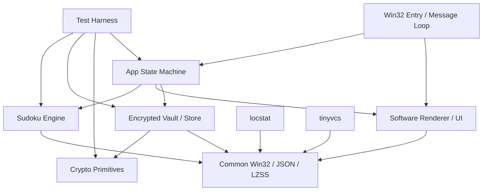

這也是為什麼只看「Sudoku unit tests 有沒有過」會低估整體風險。

真正會讓資料壞掉的地方，大多是在箭頭中間：

- app → vault；
- pause → resume；
- hint → completed record；
- working tree → index → ref；
- object filename → content identity；
- raw disk bytes → semantic model。

---

# 2. 哪些地方是真的做得很好？

先把優點講清楚，因為這份 submission 的確有不少值得肯定的工程設計。

## 2.1 Sudoku human-logic engine 是真的，不是假裝的

它不是先用 brute-force solver 解完，再編一段假的「人類推理步驟」。

`sdk_sudoku_logic.c` 真正把 candidate、technique detection、step application、trace 分開，做了 T1–T8，且有 deterministic scan order。

這代表：

- 相同盤面可以重現相同步驟；
- difficulty score 有穩定輸入；
- hint 可以建立在真正的 logic step 上；
- 測試可以比對 structured result，而不是只看最後答案。

這是整份 submission 很強的一塊。

## 2.2 Search solver 與 UI 解耦

solver 不直接改 UI board，而是 copy 到自己的 search state。

這個基本分層是正確的，而且 MRV + candidate mask 對 9×9 Sudoku 也很合理。

問題在於它**過度相信 caller 已經給它合法 board**，而不是 search algorithm 本身很差。

## 2.3 Generator 有 reproducibility 意識

有：

- explicit seed；
- seed report；
- generator format version；
- difficulty rules version；
- batch 150 題驗證。

這些都是做 benchmark / research 很有價值的特性。

## 2.4 Crypto primitive 層反而是安全設計比較完整的一層

整套是 handwritten：

- SHA-256；
- HMAC-SHA-256；
- PBKDF2；
- ChaCha20；
- HChaCha20；
- Poly1305；
- XChaCha20-Poly1305。

而且它有：

- known-answer tests；
- tamper tests；
- constant-time compare；
- verify tag before parse plaintext；
- secure wipe。

本次 static review **沒有看到一個像 vault key lifecycle 那麼明顯、嚴重的 primitive implementation error**。

所以最嚴重的 security bug 是：

> primitive 大致做對了，但 key 怎麼從 open 活到 save 這件事做錯了。

這就是典型的「演算法正確 ≠ 系統安全」。

## 2.5 framebuffer / app separation 很適合 GUI benchmark

UI 不完全綁死 Win32 device context，而是先畫到 software framebuffer。

所以同一套 renderer 可以：

- 真正顯示在 Win32 window；
- headless 產 screenshot；
- 做 visual evidence。

這是很好的架構選擇。

## 2.6 test harness 本身不是灌水器

我有直接看 `sdk_test.c`。

它會：

- assertion fail → case fail；
- failed case → suite nonzero；
- summary 從 cases derive；
- duplicate test name / missing requirement ID 會報錯；
- fault injection 每 case reset；
- 失敗 fixture 保留。

所以「82/82」不是因為 harness 偷偷永遠 return 0。

真正的問題是：**test case 沒有把最重要的 transition 真的跑到底。**

---

# 3. 最大的問題：不是 crypto 壞，是 vault 的 key 生命週期壞了

先看正常設計應該是什麼：

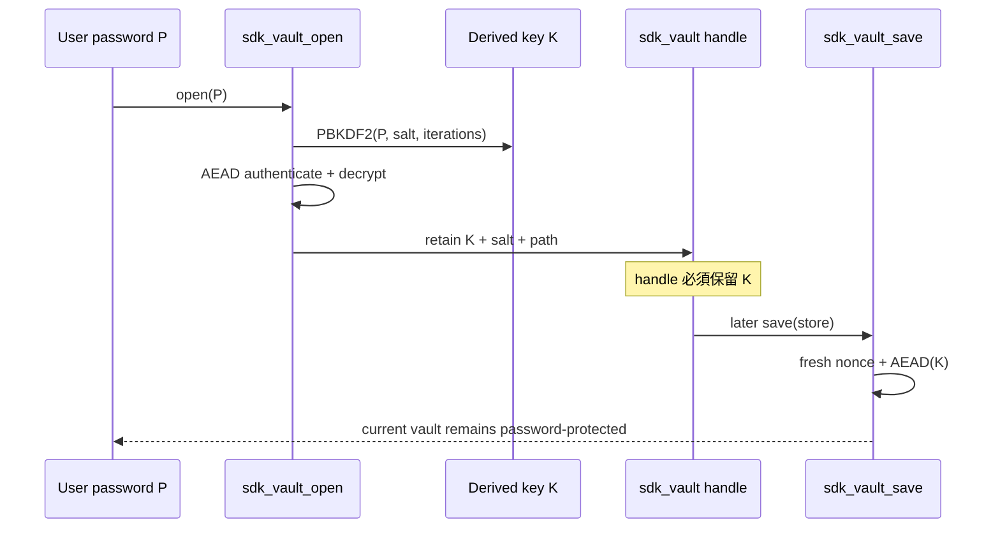

實際 code 做成：

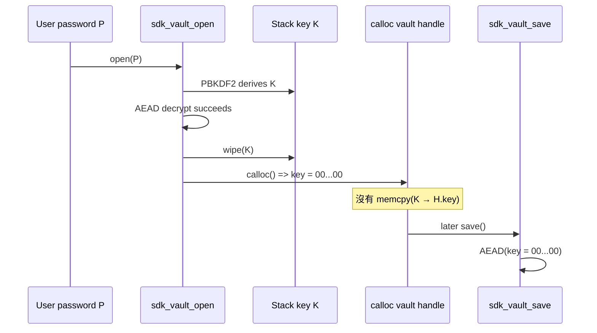

這就是 **CRITICAL-01**。

## 3.1 正常使用即可觸發

不需要 attacker，不需要 corrupt file，也不需要特殊 race。

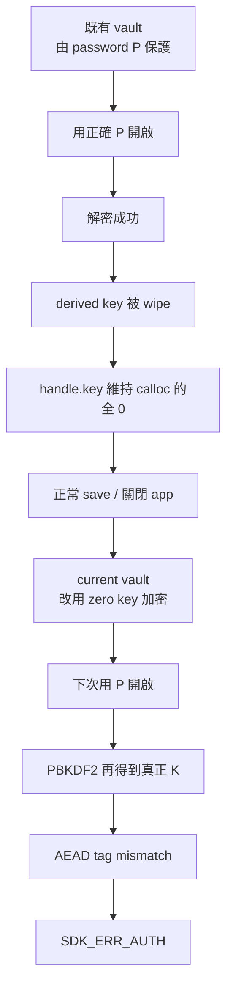

## 3.2 它甚至同時是 confidentiality bug

如果只是「密碼之後打不開」，可以理解成 availability/data corruption。

但這裡更糟：

> 新 current file 的 key 是一個大家都知道的常數：32 bytes 全 0。

所以知道這個 implementation 的人不需要 password，就知道應該拿什麼 key 解密那個 post-save current file。

因此同時破壞：

- **Availability**；
- **Integrity**；
- **Confidentiality**。

---

# 4. 為什麼 82 / 82 tests 沒抓到這個 Critical？

這是整份 review 最值得看的地方之一。

`test_vault.c` 裡甚至寫著：

```c
/* re-save idempotency: open, save, reopen -> still parses */
```

照註解，測試理論上應該：

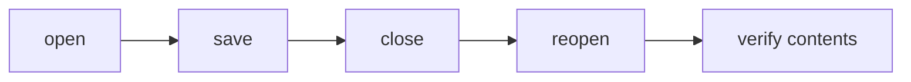

但實際執行到：

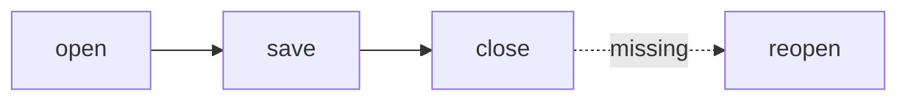

也就是最關鍵的 assertion 根本沒發生。

所以 zero-key save：

- `open` 當下正確；
- `save` 本身也成功寫檔；
- `close` 當然成功；
- test 就 PASS 了。

只有「再開一次」才會把 bug 揪出來。

這不是 test harness 假，而是**scenario 少了一步**。

---

# 5. `.bak recovery` 也是類似的 coverage illusion

vault writer 會留下 `.bak`，這個設計本身很好。

submission 也有一個 failure test 驗證 backup recovery。

但 static inspection 後實際語意是：

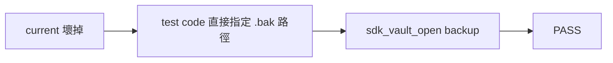

而不是：

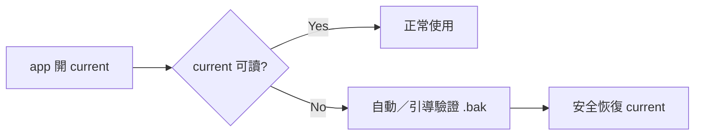

app 沒有這條 fallback state machine。

因此「有 backup」與「產品會 recovery」是兩件不同的事。

---

# 6. 第二個 Critical：`--vault` 路徑 512 bytes 會寫出 buffer

`sdk_app` 裡：

```c
char vault_path[512];
```

copy code 的邏輯是：

```c
while (vault_path[n]) {
    a->vault_path[n] = vault_path[n];
    if (++n >= sizeof a->vault_path) break;
}
a->vault_path[n] = 0;
```

如果 input 至少 512 bytes：

```mermaid
flowchart LR
    A[n=0] --> B[copy index 0..511]
    B --> C[++n => 512]
    C --> D[break]
    D --> E[a->vault_path[512] = 0]
    E --> F[1 byte heap OOB]
```

有效 index 只有 `0..511`。

而這個 input 可以從 command line 進來，不是只能由內部 malformed struct 觸發。

所以列 **CRITICAL-02**。

---

# 7. Sudoku core：真正的問題不是 solver 太弱，而是「非法 board 被當成合法」

`value` 的 contract 寫得很清楚：

```text
0..9
0 = empty
1..9 = digit
```

但 `sdk_board_set()` 沒有真的 enforce 0..9。

validator 又是：

- `0` 才算 empty；
- `1..9` 才進 conflict mask；
- 其他非零值既不是 empty，也不參與 duplicate detection。

所以可以得到很怪的狀態：

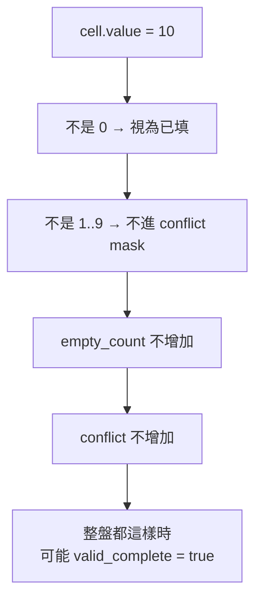

而 solver 也過度相信 caller。

如果 full board 沒有任何 0，search terminal path 可以把它當作 solved，沒有最後再做一次 canonical Sudoku validation。

## 7.1 為什麼這不是純 API 理論問題？

因為 vault deserialize 的 semantic validation 又沒有把所有 board value / origin enum 都完整限制住。

因此兩邊的弱點可以串起來：

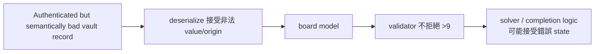

這就是為什麼 invariant 必須在**每個 trust boundary**集中驗證，而不是假設另一層會處理。

---

# 8. `count_solutions()` 的 20M node guard 會「靜默截斷」

這個設計原本想避免 pathological search 跑太久，方向沒錯。

問題是：guard 被觸發後，caller 不知道。

應該有三種結果：

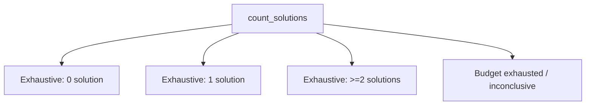

實際 API 把 D 壓回一個看起來正常的 partial count。

如果剛好目前只找到 1 個 solution：

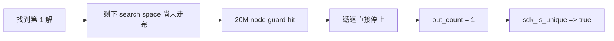

這是一個「certainty bug」：

> **不知道，不可以回報成唯一。**

---

# 9. Generator 的 guard API 與真正 runtime 不一致

`SDK_GEN_PARAMS` 看起來設計得很完整：

- `full_grid_nodes`；
- `uniqueness_nodes`；
- `candidate_attempts`；
- `wall_guard_ms`。

header 還直接寫：

> `Honors all guards in params`

但實際 code 裡有多個 hard-coded guard / loop bound。

因此目前比較像：

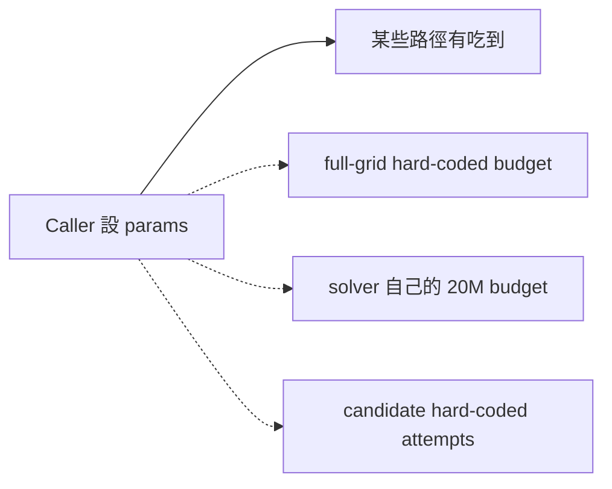

而不是所有 recursion 共享 caller budget。

這會讓 future caller 以為能精準限制 work，但其實不能。

另外 app 開新遊戲時把 `wall_guard_ms = 0`，generation 又是在 UI thread 同步跑，所以 pathological case 下仍有 freeze 風險。

---

# 10. App state machine：`PAUSED` 目前比較像「暫停顯示 timer」而不是真暫停

這裡其實有兩個獨立問題。

## 10.1 elapsed time 累積邏輯錯

設計上：

```text
play_elapsed_ms = 已完成 running segments
play_start_ms   = 目前 running segment 的起點
```

正確 pause 應該：

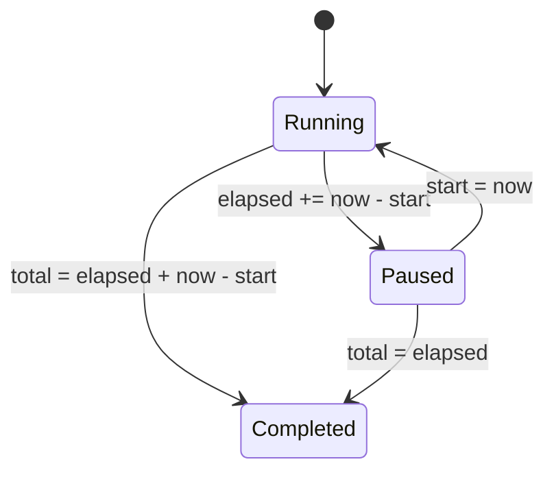

現在 pause 時沒有：

```text
elapsed += now - start
```

所以第一次 pause 時畫面甚至可能直接回到 0。

每次 resume 又重新設 start，前一段就丟掉了。

## 10.2 暫停時還能繼續解題

更嚴重的是 pause 沒有變成 mutation guard。

仍可：

- 輸入數字；
- Hint；
- Auto Solve；
- 部分 undo/redo path。

所以即便 timer 修好，仍然可能：

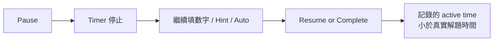

真正的 pause 應該是一個 invariant，不只是 UI boolean。

---

# 11. Hint 用了，但 completed history 仍會說你沒用

vault model 其實設計了：

- `hints_viewed`；
- `hints_applied`；
- `highest_hint_tech`；
- `used_auto_solve`；
- `completion_class`：
  - `UNASSISTED`
  - `HINT_ASSISTED`
  - `AUTO_SOLVED`

問題是 app 沒有把 hint action 寫回這套 metadata。

所以目前資料流類似：

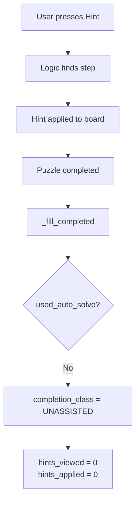

也就是 history 在語意上說謊。

這不只是統計小瑕疵，因為這些欄位顯然是設計來區分 completion type 的核心 model。

---

# 12. 更大的 integration gap：vault 有完整「未完成遊戲」格式，但 app 根本沒有接上

`sdk_game_record` 很完整：

- original board；
- current board；
- notes；
- origins；
- active elapsed；
- paused；
- hints；
- generation counters；
- undo transactions；
- redo transactions。

而且 storage layer 有：

```text
sdk_store_add_game()
serialize / deserialize game records
```

但是 app runtime path 找不到 `sdk_store_add_game()` 的實際使用。

所以目前比較像：

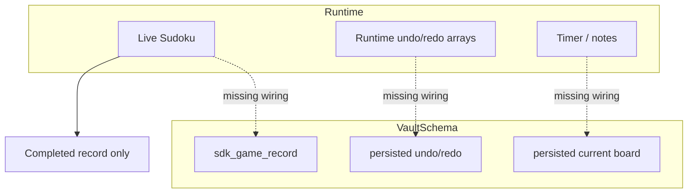

也就是 data model 比產品 wiring 完整很多。

這是一個很典型的「底層都寫好了，但 vertical slice 沒接完」。

---

# 13. Persisted timestamp 其實不是 epoch time

storage 欄位名字是：

- `created_epoch_ms`；
- `last_played_epoch_ms`；
- `completed_epoch_ms`。

common layer也真的有：

```text
sdk_now_epoch_ms()
```

但 app completion path 用的是 monotonic `_now()`。

所以存進去的是：

```text
process/boot relative monotonic milliseconds
```

不是 Unix epoch。

這會造成：


這是 medium，但非常值得順手修。

---

# 14. Vault 另外兩條高風險 failure chain

## 14.1 Header 的 PBKDF iteration 可以被惡意設到超大

vault header 的 iteration count 在 authentication **之前**就必須讀。

目前只檢查：

```text
iter >= 1
```

因此 hostile file 可以：

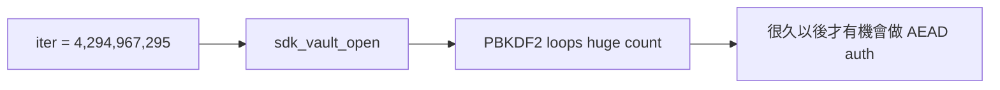

雖然 header 是 AAD，也沒用，因為：

> authentication 必須先有 key，而 key 又要先跑 KDF。

所以 work factor 本身必須有 unauthenticated upper bound。

## 14.2 固定 `.tmp` + `CREATE_NEW` 會讓一次 crash 變成永久 save failure

如果 crash 發生：

```mermaid
flowchart TD
    A[create current.tmp] --> B[process crash]
    B --> C[current.tmp 殘留]
    C --> D[next save]
    D --> E[CREATE_NEW current.tmp]
    E --> F[ERROR_ALREADY_EXISTS]
    F --> G[save fail]
    G --> D
```

沒有 cleanup/recovery state machine，就會一直失敗。

---

# 15. Win32 / Unicode 邊界還有幾個很典型的問題

## 15.1 Entry point 用 narrow argv

app 是 Unicode-aware Win32 程式，但入口用 CRT narrow `__argv`，後面又假設 bytes 是 UTF-8。

Windows narrow argv 受 active code page 影響，所以：

```text
非 ASCII vault path / password
  → narrow argv 可能先失真
  → 再當 UTF-8 解
  → path/password 可能錯
```

比較一致的做法應該是 `wWinMain` / `CommandLineToArgvW`。

## 15.2 初始 DPI 固定 96

雖然 process 有啟用 Per-Monitor V2，但 initial `g_dpi = 96`，要等後續 DPI message 才修正。

而 submission 自己的 final report 也承認真實 125/150/200% display gate 沒跑。

因此這裡不是純理論。

## 15.3 Extended UNC path strip 是錯的

common helper 對：

```text
\\?\UNC\server\share
```

想轉回：

```text
\\server\share
```

但現在回傳 interior pointer 的 offset 不對，會留下 `UNC` 中間字元的殘片。

`locstat` canonical root 直接受影響。

---

# 16. tinyvcs：工程量很大，但真正的風險在 transaction integrity

這個 `tinyvcs_core.c` 本身就超過 10 萬 bytes source，不能把它當小工具忽略。

它真的有：

- content-addressed object；
- SHA-256；
- compressed framed object；
- CRC；
- index；
- tree；
- commit；
- branch/ref；
- checkout/reset/restore；
- verify。

所以它的問題也不是「功能是假」。

## 16.1 最核心 integrity bug：讀 object 時沒驗證「pathname ID = content ID」

理論上 content-addressed store 應該：

```mermaid
flowchart LR
    A[requested object ID X] --> B[path objects/xx/yyyy]
    B --> C[read payload]
    C --> D[hash payload => X]
    D --> E[accept]
```

現在驗的是：

```mermaid
flowchart LR
    A[requested pathname ID X] --> B[read file]
    B --> C[embedded ID = Y]
    B --> D[hash payload = Y]
    C --> E{Y == hash(payload)?}
    D --> E
    E -- Yes --> F[accept]
    A -. never compared .-> F
```

所以把一個合法 object Y 整包 copy/rename 到 X 的 pathname：

- embedded ID 仍是 Y；
- payload hash 仍是 Y；
- reader 認為它 self-consistent；
- 但它根本不是 X。

content-addressed identity 因此被切斷。

## 16.2 `object_exists()` 又只看「檔案存在」

publication path 發現 expected hash pathname 已經存在，就可能直接當 object 已存在，不重新 verify。

所以 corrupt object 可以被保留下來並被新 commit 繼續引用。

---

# 17. tinyvcs checkout rollback 看起來完整，但「新建檔案」根本沒進 journal

已有檔案會備份：

```text
old file → backup entry → overwrite
```

新檔案 path 則只有 local `created = 1`，最後甚至 `(void)created`。

沒有建立 rollback journal entry。

所以：

```mermaid
sequenceDiagram
    participant WT as Working Tree
    participant J as Rollback Journal
    participant C as Checkout

    C->>WT: create new A
    Note over J: A 沒有 journal entry
    C->>WT: modify existing B
    C->>J: backup B
    C->>WT: operation C fails
    C->>J: rollback
    J->>WT: restore B
    Note over WT: new A 還留著
```

最後就是 mixed revision working tree。

---

# 18. 更嚴重：working tree 成功後，backup 會太早被刪掉

`tv_apply_checkout()` 的 transaction boundary 大概是：

```mermaid
flowchart LR
    A[Preflight] --> B[Backup]
    B --> C[Mutate Working Tree]
    C --> D[刪除 backups]
    D --> E[Save Index]
    E --> F[Return]
```

然後 `switch` 外層再：

```mermaid
flowchart LR
    A[tv_apply_checkout] --> B[tree + index target]
    B --> C[write HEAD]
```

所以如果 failure 發生在：

### Case A — Index write fail

```text
Working Tree = target
Index        = old
HEAD         = old
Backup       = already deleted
```

### Case B — HEAD write fail

```text
Working Tree = target
Index        = target
HEAD         = old
```

### Case C — Reset ref write fail

```text
Working Tree = target
Index        = target
Branch Ref   = old
```

這些全部都是「每個 file operation 可能 atomic，但整個 operation 不 atomic」。

真正需要的是：

```mermaid
flowchart TD
    A[Prepare transaction] --> B[Persist rollback/journal]
    B --> C[Mutate tree]
    C --> D[Publish index]
    D --> E[Publish HEAD/ref]
    E --> F[Commit transaction]
    F --> G[Delete backups/journal]

    C -. any fail .-> R[Rollback / recover]
    D -. any fail .-> R
    E -. any fail .-> R
```

---

# 19. tinyvcs 還有幾個正常 VCS 一定會遇到的 path-state bug

## 19.1 file → directory

```text
current: a        (file)
target:  a/b.txt
```

target materialize 太早執行，所以 `a` 還是 file 時就想建立 `a/b.txt`。

自然失敗。

## 19.2 directory → file

```text
current: a/b.txt
target:  a        (file)
```

preflight 看到 `a` 是 directory，可能先當成 untracked collision，而不是理解它其實是 tracked path transition 的 container。

## 19.3 最後一個檔案刪除無法 commit

如果 index 裡所有 entry 都 staged deleted：

```text
present == 0
```

code 回：

```text
nothing to commit (empty staging)
```

但 VCS 的 empty tree 明明是合法 commit state。

也就是：

> 刪除 repo 最後一個 tracked file 反而不能 commit。

## 19.4 nested branch 支援只有一半

branch name 可以：

```text
feature/x
```

write ref 也會建立目錄。

但 list/verify 只掃：

```text
refs/heads/*
```

且 skip directory。

所以 branch 可以建立，卻：

- 不會正常列出；
- verifier 不會以同等方式驗證；
- 只由它 reachable 的 commit 甚至可能被算 unreachable。

---

# 20. tinyvcs 還有一個 Windows filesystem boundary：`.tinyvcs` reparse point

repo discovery 只確認：

```text
.tinyvcs exists && is_directory
```

沒有拒絕：

```text
is_reparse_point
```

所以：

```mermaid
flowchart TD
    A[working tree/.tinyvcs] --> B[junction / dir symlink]
    B --> C[external directory]
    C --> D[objects / refs / index operations]
```

metadata 可以被導到 repo 外。

這類問題在 Windows VCS 很重要，因為「directory」與「safe real directory」不是同一件事。

---

# 21. locstat：不是小腳本，也因此值得認真 review

它做了：

- recursive scanner；
- default excludes；
- custom config；
- categories；
- C lexical line classification；
- JSON output；
- config digest；
- warning/error reporting。

但有一個真正的 memory-safety 問題。

## 21.1 parallel `realloc` OOM path 會留下 dangling pointer

JSON object 同時有：

```text
keys[]
vals[]
```

grow 時：

```c
nk = realloc(keys, ...);
nv = realloc(vals, ...);
if (!nk || !nv) return 0;
keys = nk;
vals = nv;
```

假設：

```mermaid
flowchart TD
    A[realloc keys] --> B[成功，而且 moved]
    B --> C[舊 keys pointer 已被 free]
    C --> D[realloc vals]
    D --> E[失敗]
    E --> F[function return 0<br/>但 object.keys 還是舊 pointer]
    F --> G[cleanup loc_json_free]
    G --> H[use-after-free / double-free]
```

這是 OOM trigger，所以我列 HIGH，而不是跟一般外部 input 直接可穩定 trigger 的兩個 Critical 放同級。

更好的 data structure 應該直接是：

```c
struct member {
    char *key;
    loc_json *value;
};
```

一個 array 就不用維護兩個同步 capacity。

---

# 22. locstat 的統計語意也有一個很明顯的 contract mismatch

header 明確說：

```text
loc_file_record.lex = 0 for non-C categories
```

但實作只要不是 binary，就全部：

```text
loc_analyze_c(data)
```

所以 Markdown / JSON / TXT 也被拿去用 C lexer 算：

- code lines；
- comment-only；
- mixed。

這也解釋為什麼 final report 會出現類似：

```text
docs: 7587 physical lines / 5502 code lines
```

那個「code」其實是**拿 C lexical rules 套 Markdown**的結果，不應該被解讀成真正程式碼行數。

---

# 23. 82 tests 的可信度應該怎麼正確解讀？

不是「沒用」，也不是「證明一切 OK」。

比較精準的說法：

```mermaid
flowchart TB
    T[82 / 82 PASS]

    T --> A[證明很多 primitive / happy path 真能跑]
    T --> B[證明 test harness 不是假 PASS]
    T --> C[證明大量 source 有實際 wiring]

    T -.不能推出.-> D[所有 state transition 正確]
    T -.不能推出.-> E[所有 failure path 可 recovery]
    T -.不能推出.-> F[Windows DPI / reparse / Unicode 全實測]
    T -.不能推出.-> G[vault open-save-reopen 安全]
```

實際上 final report 自己也承認：

- G9 PARTIAL；
- G13 BLOCKED；
- G15 PARTIAL；

尤其真實 Windows desktop / DPI 驗證沒有完成。

這輪 static review 更進一步發現：

> 就算先完全忽略那些 evidence gate，source 本身也還有會 block trusted release 的 concrete defects。

---

# 24. 我會怎麼評價各 subsystem

| Subsystem | 評價 | 重點 |
|---|---|---|
| Sudoku parser / board | **基礎不錯，但 invariant 有洞** | 正常盤面沒問題，非法值沒被拒絕 |
| Search solver | **演算法不錯，certainty boundary 不安全** | silent node cap 不能當 exhaustive result |
| Logic T1–T8 | **強** | 真實 deterministic human-logic engine |
| Generator | **有規模，但 guard contract 漂移** | seed/reproducibility 好，budget wiring 不完整 |
| App state machine | **功能多，但 vertical integration 不完整** | pause/hint/persistence state 分裂 |
| UI / renderer | **架構好** | framebuffer/headless 設計好；DPI failure path 要補 |
| Crypto primitives | **整份 security 最強的一層** | KAT/tamper/wipe 方向正確 |
| Vault | **目前不能信任 user data** | key lifecycle Critical + recovery gap |
| Common Win32 | **有能力但 UNC edge 不完整** | wide API 很多，UNC/long path 尚有 bug |
| Test harness | **好** | summary/exit/assertion mechanics 健康 |
| locstat | **功能很多，但 parser/report 要 harden** | OOM UAF + semantic mismatch |
| tinyvcs | **很有企圖，但 transaction 不安全** | object identity + checkout/ref publication |

---

# 25. 這些 bug 的共同根因，其實非常一致

## 25.1 「某個 struct field 有註解」沒有變成「所有 boundary 都 enforce」

例如：

```text
Board value: 0..9
```

但 setter、deserialize、validator、solver 並沒有共享一個 canonical validator。

同樣地：

```text
Object ID = content hash
```

卻沒有在 read path 把 pathname ID 一起放進 equality invariant。

## 25.2 多步驟 operation 被當成多個 atomic file write，而不是 transaction

vault 與 tinyvcs 都有類似思維：

```text
某一個 replace 是 atomic
```

但：

```text
整個 user operation = 多個 mutable state publication
```

所以真正需要考慮的是：

```mermaid
flowchart LR
    A[Prepare] --> B[Write data]
    B --> C[Publish metadata A]
    C --> D[Publish metadata B]
    D --> E[Commit]

    B -. crash .-> R[recover]
    C -. crash .-> R
    D -. crash .-> R
```

而不是每一格單獨成功就宣稱 operation 安全。

## 25.3 Runtime model 與 persistence model 各自演進，最後 drift

最明顯就是：

- vault 有 `sdk_game_record`；
- app 有自己的 runtime board/undo/timer；
- 兩邊沒有真正同步。

Hint metadata 也是一樣。

## 25.4 test 更偏 feature checklist，而不是 transition matrix

例如：

```text
Open 有測
Save 有測
Reopen 有測
```

不等於：

```text
Open → Save → Close → Reopen
```

同理：

```text
checkout 有測
index save 有測
ref write 有測
```

不等於：

```text
checkout tree → index failure → rollback
```

---

# 26. 最優先修正順序

我會用這個順序，而不是照 source file 排。

```mermaid
flowchart TD
    P0[P0<br/>資料安全 / memory safety]
    P1[P1<br/>App state correctness]
    P2[P2<br/>Sudoku certainty / budgets]
    P3[P3<br/>tinyvcs transaction integrity]
    P4[P4<br/>locstat / Win32 edge hardening]
    P5[P5<br/>failure-transition regression suite]

    P0 --> P1 --> P2 --> P3 --> P4 --> P5
```

## P0 — 先讓資料不會壞

1. `sdk_vault_open()` 正確 retain derived key。
2. 新增真正的 `open → save → close → reopen` test。
3. 修 `vault_path[512]` OOB。
4. KDF iterations 加上限。
5. persisted record 做完整 semantic validation。
6. 定義 current / tmp / bak recovery state machine。

## P1 — 修 product state

7. 正確累積 pause elapsed。
8. pause 時禁止所有 gameplay mutation。
9. hint counters / highest technique / completion class 真正接上。
10. `sdk_game_record` 接上 live game lifecycle。
11. persisted timestamp 改用 epoch clock。
12. undo full 時 divergent edit 仍要清 redo。
13. game ID RNG status / collision 檢查。

## P2 — 修 Sudoku certainty

14. board value/origin/notes 集中 validator。
15. `count_solutions` 增加 `INCONCLUSIVE / BUDGET_EXHAUSTED`。
16. generator 所有 guard 真正由 params 驅動。
17. 加 malformed board + tiny-budget regression tests。

## P3 — 修 tinyvcs

18. `requested ID == embedded ID == hash(payload)`。
19. existing object 先 verify 再 reuse。
20. new files 也進 rollback journal。
21. backup 保留到 index + HEAD/ref 全部 publish 成功。
22. file↔directory type transition 做 dependency plan。
23. 無法驗證 clean 就 abort destructive switch。
24. empty tree commit 要合法。
25. nested refs recursive enumerate。
26. `.tinyvcs` reparse reject。
27. revision branch name 在 join filesystem 前 validate。

## P4 — locstat / Windows

28. JSON member 用單一 `{key,value}` array。
29. non-C categories 不要跑 C lexer。
30. file-count guard 每一個 file 都 enforce。
31. strict JSON grammar / surrogate / duplicate key 修正。
32. warning/error totals 從同一 source derive。
33. UNC strip / extended UNC 修正。
34. initial DPI query + resize/GetMessage error handling。

---

# 27. 最值得新增的 regression tests

與其再多加 100 個 ordinary Sudoku seeds，我更建議先加這些。

## Vault

```text
vault-open-save-reopen-same-password
vault-post-save-zero-key-must-not-decrypt
vault-max-iteration-rejected-before-kdf
vault-stale-tmp-recovery
vault-corrupt-current-valid-bak-recovery
vault-illegal-board-value-rejected
```

## App

```text
pause-two-segments-accumulate
pause-blocks-all-mutations
hint-completion-classification
hint-metadata-survives-reopen
in-progress-game-survives-restart
undo-cap-divergent-edit-clears-redo
vault-path-511-512-513
```

## Sudoku

```text
full-grid-all-value-10-is-invalid
one-illegal-value-invalidates-solved-grid
count-budget-exhaustion-is-inconclusive
uniqueness-never-true-after-budget-exhaustion
all-generator-guards-forced-to-trip
```

## tinyvcs

```text
wrong-hash-path-object-fails-verify
corrupt-existing-object-not-reused
checkout-new-file-rollback
checkout-index-failure-restores-original-state
switch-head-failure-restores-or-recovers
file-to-directory-transition
directory-to-file-transition
unreadable-tracked-file-blocks-switch
commit-last-file-deletion
nested-branch-list-and-verify
metadata-reparse-rejected
revision-path-traversal-rejected
```

## locstat

```text
allocator-failure-sweep-json-object-growth
strict-json-hostile-number-corpus
surrogate-pair-json
no-duplicate-config-key
markdown-has-zero-c-lexical-fields
single-directory-file-limit
error-details-equal-error-total
long-unc-root-canonicalization
```

---

# 28. 最後怎麼評價這份 Hy3 run？

如果只看工程量，我會給很高評價。

它不是那種：

> UI 長得像 Sudoku，solver 能跑，然後就結束。

而是有真正做系統：

- 自製 renderer；
- 自製 crypto；
- encrypted format；
- fault injection；
- visual harness；
- Sudoku logic/generator；
- 甚至自己寫兩個大型 dev tools。

這也是為什麼我不會因為找到大量 defect 就說它「很差」。

相反地，這是一個很典型的高企圖大型實作：

```mermaid
quadrantChart
    title 這份 submission 的工程特徵
    x-axis 低功能規模 --> 高功能規模
    y-axis 低系統性 --> 高系統性
    quadrant-1 成熟大型系統
    quadrant-2 小而嚴謹
    quadrant-3 小型原型
    quadrant-4 功能堆疊
    "Hy3 Sudoku submission": [0.88, 0.72]
```

它已經跨過「功能堆疊」進到有 architecture 的程度。

但要真正往右上角走，下一步不應該再拼 feature count。

應該把重點放在：

> **state invariants + transaction boundaries + failure recovery + transition-oriented tests**。

最核心的判斷是：

> **Sudoku 演算法本身比 persistence integration 更成熟；crypto primitives 比 vault lifecycle 更成熟；tinyvcs 的資料模型比 transaction recovery 更成熟；locstat 的 feature surface 比 parser/error semantics 更成熟。**

這四句其實就是整份 review 的濃縮版。

---

# 29. 最終結論

### 值得肯定

- 真實而龐大的 C17 / Win32 工程量；
- Human-logic Sudoku engine 有深度；
- Generator / seed / versioning 有 reproducibility 意識；
- Crypto primitives + KAT / tamper tests 很有誠意；
- Framebuffer + headless renderer 架構好；
- Test harness 本身健康；
- `tinyvcs` / `locstat` 都是實際完整功能，不是 placeholder。

### 目前不能忽略

- **Vault normal open→save 會掉 key，是 release-blocking Critical。**
- **512-byte vault path 有 heap OOB。**
- Sudoku model 沒有完整 enforce 0–9 invariant。
- uniqueness 在 search budget hit 時仍可能假裝有確定答案。
- pause/time/assist metadata 不可信。
- in-progress persistence schema 未接產品。
- tinyvcs object identity 與 transaction rollback 有實質缺口。
- locstat 有 OOM use-after-free path。
- 82/82 PASS 沒有涵蓋最重要的跨操作 transition。

### 我的整體評語

> **這是一份非常值得保留在 implementation archive 裡的 benchmark 成果，因為它確實展現了很高的實作企圖與大量真實工程內容；同時它也非常清楚地展示了「大量 feature + 全綠測試」與「系統真的 failure-safe」之間仍有多大的距離。它目前最需要的不是更多功能，而是把 subsystem 之間的 invariant 變成明確、可恢復、可 fault-inject 的 transaction。**

完整逐項 technical finding、函式層級說明、負面影響與修正建議請見 [`REVIEW.md`](./REVIEW.md)。
